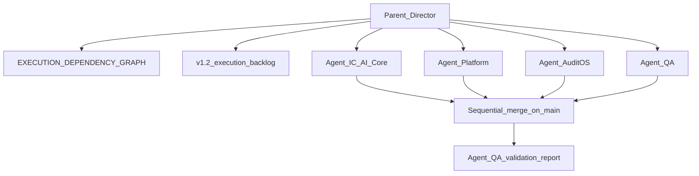

# AQLIYA Parallel Execution Director — خطة التثبيت

## قراراتك (من "a")

| السؤال | الاختيار |
|--------|----------|
| سياسة الفروع | **main فقط** — لا feature/experimental branches؛ كل commit على خط `main` الحالي |
| التسليم | **skill + قاعدة Cursor + قالب دورة** (دورة تنفيذ أولى اختيارية بعد الاعتماد — انظر §6) |

---

## 1. المشكلة التي يحلها البرومبت

Cursor لا يملك «mutex» حقيقي بين subagents. التضارب يُمنع بـ:

1. **مدير واحد (Parent)** يقرأ السلطة ويُسند المهام ويمنع تداخل المسارات.
2. **4 subagents** عبر `Task` — كل واحد بـ prompt يحتوي قائمة مسارات مسموحة/ممنوعة.
3. **تسلسل على main** — دمج يدوي من المدير بعد كل agent (لا commits متوازية من agents).



---

## 2. تصحيحات إلزامية قبل التثبيت (تعارضات في البرومبت الأصلي)

### 2.1 تسمية Agents vs Streams

في [EXECUTION_DEPENDENCY_GRAPH.md](docs/source-of-truth/EXECUTION_DEPENDENCY_GRAPH.md) و[v1.2-execution-backlog.md](docs/execution-backlog/v1.2-execution-backlog.md):

| Stream في الرسم | المعنى |
|-----------------|--------|
| A | Security hardening |
| B | Foundation IaC/HA/backup |
| C | AI readiness |
| D | Product UX |
| E | Product intelligence |

**لا تستخدم حروف A–D للـ Cursor agents** — استخدم أسماء ثابتة في المستودع:

| Cursor Agent | الاسم في الملفات | يقابل تقريباً Stream |
|--------------|------------------|----------------------|
| Agent A | `Agent-IC` | C (AI) + جزء من governance metrics |
| Agent B | `Agent-Platform` | A (security) + B (ops infra عند الحاجة) |
| Agent C | `Agent-AuditOS` | D/E لـ L1 فقط |
| Agent D | `Agent-QA` | A (اختبارات عزل) + CI |

### 2.2 مسارات الملكية — تصحيحات من الكود الفعلي

| في البرومبت | الواقع في المستودع | التصحيح |
|-------------|-------------------|---------|
| `src/actions/audit/*` | ملفات مسطحة: `audit-actions.ts`, `audit-export-actions.ts`, … | `src/actions/audit-*.ts` |
| `src/lib/auditos/*` | غير موجود | `src/lib/audit/*` (موجود — 26 ملف) |
| `src/lib/intelligence/*` | غير موجود كمجلد | `src/lib/ai/intelligence-runtime.ts` + بقية `src/lib/ai/*` |
| `src/lib/observability/*` | غير موجود كمجلد | `src/lib/ai/observability.ts` + `src/app/(dashboard)/monitoring/*` → **Agent-Platform** (ليس IC) |
| `src/app/api/ai/*` | 6 routes موجودة | **Agent-IC** — إضافة صريحة للملكية |
| `prisma/*` | ممنوع لـ IC و QA | **خارج الدورة المتوازية** — مدير فقط، تسلسلي |

### 2.3 سلطة المنتجات (تعارض مع «لا SalesOS»)

ترتيب السلطة في البرومبت يضع [PRODUCT_STATUS_MATRIX.md](docs/source-of-truth/PRODUCT_STATUS_MATRIX.md) أولاً — وهو يثبت SalesOS L4 ومسارات `/sales/*`.

**قاعدة موحّدة في الملف الجديد:**

- **لا توسيع** SalesOS / WorkflowOS / Organizations / Office AI (ميزات جديدة).
- **مسموح:** إصلاح bug، أو مهام صريحة في backlog مع تسمية `bugfix-only`.
- **أولوية التنفيذ:** L0 → L0.5 → L1 (AuditOS) كما في [L6_COMPLETION_PROGRAM.md](docs/source-of-truth/L6_COMPLETION_PROGRAM.md) Phase 1–2 المفتوحة.

### 2.4 main-only vs AGENTS.md

[AGENTS.md](AGENTS.md) يذكر PR branches في سياق `gh pr create`. سياسة **Director mode**:

- Subagents **لا ينشئون branches**.
- Parent يعمل على `main` محلياً؛ إن احتجت PR لاحقاً، ذلك قرار منفصل خارج وضع Director.

### 2.5 التحقق الثقيل

البرومبت يطلب `npm run build` + full test. [AGENTS.md §33](AGENTS.md) يتطلب موافقة للأوامر الثقيلة.

**في skill Director:** Agent-QA يشغّل الحزمة الكاملة؛ باقي الـ agents يشغّلون `npx tsc --noEmit` فقط ما لم يوافق المستخدم صراحة.

---

## 3. ملفات سيتم إنشاؤها/تحديثها

| ملف | الغرض |
|-----|--------|
| [.skills/aqliya/aqliya-parallel-director.md](.skills/aqliya/aqliya-parallel-director.md) | Skill رئيسي: البرومبت + قواعد التضارب + تنسيق Task |
| [.cursor/rules/aqliya-parallel-director.mdc](.cursor/rules/aqliya-parallel-director.mdc) | Rule: `alwaysApply: false` — يُفعّل عند `@parallel-director` أو مهمة «Program Director» |
| [docs/operations/parallel-execution-director.md](docs/operations/parallel-execution-director.md) | مرجع بشري: مصفوفة ملكية، دورة، تعارضات، ربط backlog |
| [docs/operations/parallel-execution-cycle-template.md](docs/operations/parallel-execution-cycle-template.md) | قالب مخرجات «Agent Assignments / Dependency Check / Validation» |
| تحديث طفيف [AGENTS.md](AGENTS.md) §32 | إضافة سطر في skill map: `aqliya-parallel-director.md` |

**لا تعديل** على `docs/official/*` إلا إذا تغيّرت حالة منتج فعلياً بعد دورة.

---

## 4. محتوى Skill Director (هيكل)

### 4.1 دور Parent

1. `git status --short` + `git log -5` (pre-flight).
2. قراءة: PRODUCT_STATUS_MATRIX → READINESS_GATES → EXECUTION_DEPENDENCY_GRAPH → (باقي القائمة).
3. اختيار **4 مهام** من backlog مفتوحة بدون deps blocked:

| Agent | مهام مقترحة للدورة 1 (من Phase 1–2 المفتوحة) | Gate |
|-------|-----------------------------------------------|------|
| Agent-IC | IC-04 CI eval gate, IC-06 budget alerts | G1 |
| Agent-Platform | L0-07 cross-tenant isolation tests (توسيع إن وُجد) | G0 |
| Agent-AuditOS | A1-01 loading/error boundaries (6 tabs) | لا يحتاج IC-02 |
| Agent-QA | تشغيل CI wiring لـ eval + تقرير validation | بعد دمج IC-04 |

**ممنوع في الدورة 1:** IC-02, IC-01, L0-01 (تسلسلي/كبير), أي Prisma migration.

### 4.2 قالب Task لكل subagent

كل استدعاء `Task` يتضمن:

```md
OWNERSHIP (exclusive):
- allowed globs: ...
- forbidden globs: ...
TASK_ID: IC-04
FILES_ALREADY_CLAIMED: (none | list from other agents)
DO_NOT: schema, other agents' paths, new products
OUTPUT: files touched + validation run + blockers
```

### 4.3 بروتوكول منع التضارب

| ملف مشترك | المالك |
|-----------|--------|
| `package.json`, `package-lock.json` | Agent-QA فقط (أو Director) |
| `src/middleware.ts` | Agent-Platform فقط |
| `src/lib/governance/*` | Agent-IC (metrics) — Agent-Platform لا يعدّل إلا بموافقة Director |
| `src/actions/audit-*.ts` | Agent-AuditOS |
| `.github/workflows/*` | Agent-QA |
| `docs/source-of-truth/*` | Director فقط بعد دورة (Agent-QA يذكر في التقرير) |

**قاعدة:** إذا احتاج agent ملفاً خارج نطاقه → `BLOCKED` report، لا workaround.

### 4.4 تسلسل الدمج على main

```
1) Agent-IC  → commit → tsc
2) Agent-Platform → commit → tsc  
3) Agent-AuditOS → commit → tsc
4) Agent-QA → commit CI/tests → full validation (بموافقة)
```

لا تشغيل Task agents بالتوازي على نفس الـ working tree — **توازي في التخطيط، تسلسل في الكتابة**.

*(Cursor Task tool يمكن إطلاقه parallel للقراءة/التحليل فقط؛ التعديلات sequential.)*

---

## 5. كيفية الاستخدام في Cursor

1. في Composer/Agent: `@parallel-director` أو «شغّل Parallel Execution Director».
2. Parent يملأ [parallel-execution-cycle-template.md](docs/operations/parallel-execution-cycle-template.md) قبل التنفيذ.
3. Parent يطلق 4× `Task` (explore/generalPurpose) **للتنفيذ** واحداً تلو الآخر على main.
4. Parent يملأ التقرير النهائي بالأدلة (أوامر + نتائج).

---

## 6. دورة تنفيذ أولى (اختيارية بعد اعتماد الخطة)

عند طلب «نفّذ الدورة 1»:

| الخطوة | Agent | ملفات متوقعة |
|--------|-------|----------------|
| 1 | Agent-IC | `.github/workflows/ci.yml`, `scripts/ai-eval-runner.ts`, `src/lib/ai/eval/*`, `src/app/api/ai/eval-gate/*` |
| 2 | Agent-Platform | `src/__tests__/cross-tenant-isolation.test.ts`, `src/__tests__/tenant-isolation-audit.test.ts`, guards في `src/lib/governance/*` إن لزم |
| 3 | Agent-AuditOS | `src/app/audit/**/loading.tsx`, `error.tsx`, `not-found.tsx` للتبويبات الستة |
| 4 | Agent-QA | تشغيل `tsc`, `lint`, `test`, `build` (بموافقتك) + تحديث snapshot في `PARALLEL_REMEDIATION_GATES.md` |

---

## 7. مخاطر ومحدوديات

| Risk | Mitigation |
|------|------------|
| Subagent يعدّل خارج النطاق | Forbidden globs في كل Task prompt + diff review من Parent |
| تعارض تسمية Stream vs Agent | أسماء `Agent-IC` … في كل الوثائق الجديدة |
| IC-02 يبدأ قبل IC-04/IC-06 | Director يفحص G1 في EXECUTION_DEPENDENCY_GRAPH §Gate Dependencies |
| main-only + فريق متعدد | توثيق: Director mode = تسلسل commits؛ التنسيق البشري على main |
| مسارات خاطئة في البرومبت الأصلي | مصفوفة ملكية في `docs/operations/parallel-execution-director.md` |

---

## 8. معايير اعتماد الخطة

- [ ] Skill + rule + ops doc + template موجودة ومتسقة
- [ ] لا تعارض مع PRODUCT_STATUS_MATRIX لأولوية L0/L0.5/L1
- [ ] مصفوفة الملفات تعكس البنية الفعلية (`audit` لا `auditos`)
- [ ] AGENTS.md يشير إلى skill الجديد
