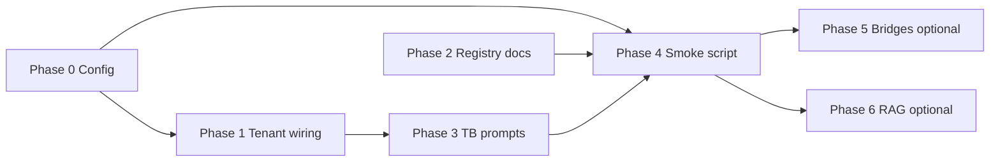

# Local AI Implementation Plan — AuditOS → Intelligence Core → Ollama → Qwen3:8b

**Date:** 2026-06-14  
**Prerequisite:** `LOCAL_AI_READINESS_AUDIT.md`  
**Constraint:** Reuse existing architecture — **no duplicate providers, no parallel AI stack, no redesign**

---

## Goal

Enable governed AuditOS and TB intelligence flows to execute inference on **Ollama @ `http://localhost:11434`** using **`qwen3:8b`**, through the existing pipeline:

```
AuditOS action / TB engine
    → runGovernedAuditAI() | generateClassification() | runInference()
    → AIOrchestrator.generate()
    → hybrid-router.selectProviderForTask()  [when hybrid/local mode]
    → LocalAIProvider.execute()
    → Ollama POST /api/chat
```

---

## Non-Goals

- New AI provider class or second orchestrator
- Bypassing governance (prompt assembly, audit logs, human review)
- Streaming UI for local models (Phase 2+ optional)
- Knowledge Foundation Ollama admission (separate program)
- Production air-gapped packaging claims
- Replacing deterministic handlers for tasks they already cover

---

## Phase 0 — Configuration & Enablement (No Code)

**Objective:** Prove existing stack works with Qwen3 before touching code.

### Actions

1. Confirm Ollama model tag: `ollama list` → use exact name (e.g. `qwen3:8b` or `qwen3:8b-instruct`)
2. Update local `.env` (not committed):

```env
FF_AI_REAL_PROVIDERS=true
AI_MODE=hybrid
AI_LOCAL_BASE_URL=http://localhost:11434
AI_LOCAL_MODEL=<exact-tag-from-ollama-list>
```

3. Optional for TB-only local-first pilot: `AI_MODE=local`
4. Keep `FF_AUDIT_INTELLIGENCE=true` if using audit intelligence surfaces
5. Manual curl smoke (operator):

```bash
curl http://localhost:11434/api/tags
curl http://localhost:11434/api/chat -d '{"model":"<tag>","messages":[{"role":"user","content":"ping"}],"stream":false}'
```

### Files involved

| File | Change |
|------|--------|
| `.env` | Operator local only |
| `.env.example` | **Doc-only** — add comment that `qwen3:8b` is valid `AI_LOCAL_MODEL` example |

### Functions involved

None — env only.

### Risk

| Risk | Mit | Severity |
|------|-----|----------|
| Wrong model tag | Document `ollama list` step | Low |
| `FF_AI_REAL_PROVIDERS` left false | Checklist in runbook | Medium — silent deterministic fallback |
| Cloud keys absent in hybrid | Expected — local tasks should still route local | Low |

### Effort

| Scale | Estimate |
|-------|----------|
| Human | 30–60 min |
| Agent | 15 min (doc comment only) |

### Exit criteria

- Ollama responds to `/api/tags` with Qwen3 model present
- Operator understands flag requirements

---

## Phase 1 — Tenant Settings → Runtime Wiring

**Objective:** Settings saved at `/settings/ai` (`localBaseUrl`, `localModel`) must affect inference, not only env at process start.

### Problem

- `saveAiSettingsAction()` writes `TenantIntegration.configMetadata` (`ai-settings-actions.ts`)
- `LocalAIProvider` reads env in constructor via `getLocalConfig()` — **singleton, no org scope**
- `createAnyAIProviderFromResolver()` (`provider-resolver.ts`) — **no `local` branch**

### Files to modify

| File | Modification |
|------|--------------|
| `src/lib/ai/providers/local-provider.ts` | Add `getLocalConfigForOrg(organizationId?: string)` reading TenantIntegration metadata with env fallback; allow `execute()` to accept resolved config or resolve per-request |
| `src/lib/ai/orchestrator.ts` | In `getProviderForExecution()` / `resolveProvider()`, when provider is `local`, pass org-scoped config into `LocalAIProvider.execute()` or use factory per org |
| `src/lib/ai/provider-resolver.ts` | Extend `createAnyAIProviderFromResolver()` with `case "local": return new LocalAIProvider(...)` using org metadata |
| `src/actions/ai-settings-actions.ts` | Ensure saved keys match reader: `localBaseUrl`, `localModel`, `executionMode` |
| `src/lib/ai/hybrid-router.ts` | Already reads org mode — verify key names align with settings action |

### Functions to modify

| Function | File | Change |
|----------|------|--------|
| `getLocalConfig()` | `local-provider.ts` | Split into env defaults + optional org override loader |
| `LocalAIProvider.execute()` | `local-provider.ts` | Accept optional `organizationId` in context or config param |
| `AIOrchestrator.getProviderForExecution()` | `orchestrator.ts` | Pass org id to local provider resolution |
| `createAnyAIProviderFromResolver()` | `provider-resolver.ts` | Add `local` case |
| `saveAiSettingsAction()` | `ai-settings-actions.ts` | Validate URL format; no functional change if keys already correct |

### Design choice (recommended)

**Minimal patch:** Add async `resolveLocalConfig(organizationId?: string)` in `local-provider.ts` that:

1. If `organizationId`, load `TenantIntegration` where `providerType === "aqliya-ai-runtime"`
2. Merge `configMetadata.localBaseUrl` / `localModel` over env
3. Cache per org with TTL 60s (match hybrid-router cache pattern)

Do **not** create a second Ollama client module.

### Risk

| Risk | Mitigation | Severity |
|------|------------|----------|
| SSRF via tenant URL | Allowlist localhost + private ranges only in dev; validate URL in settings action | Medium |
| Singleton race | Per-request config merge, not mutable singleton state | Low |
| DB miss on every call | 60s cache like `getOrgAiExecutionMode()` | Low |

### Effort

| Scale | Estimate |
|-------|----------|
| Human | 4–6 hours |
| Agent | 45–90 min |

### Exit criteria

- Org A with `localModel=qwen3:8b` in settings uses that model without restart
- Org without settings falls back to env

---

## Phase 2 — Model Registry & Documentation Sync

**Objective:** Align catalog and docs with implemented local runtime.

### Files to modify

| File | Modification |
|------|--------------|
| `src/lib/ai/model-registry.ts` | Replace `local-not-implemented` with active entry e.g. `qwen3-8b-local` / `AI_LOCAL_MODEL` binding; status `active` |
| `src/lib/ai/README.md` | Update provider table — LocalAIProvider implemented; IC-10 partial = streaming + tenant resolver |
| `src/lib/ai/cost-mapping.ts` | Add zero-cost local model entry if referenced by budget layer |
| `docs/source-of-truth/PRODUCT_STATUS_MATRIX.md` | Bump Local AI runtime notes if pilot validated |
| `docs/systems/auditos/LOCAL_AI_BRIDGE.md` | Update staging checklist with Phase 3 evidence |

### Functions to modify

| Function | File | Change |
|----------|------|--------|
| `MODEL_REGISTRY` array | `model-registry.ts` | New local model entries |
| `resolveModelForProvider()` | `model-registry.ts` | Map `local` provider → default local model id |

### Risk

| Risk | Mitigation | Severity |
|------|------------|----------|
| Hardcoding `qwen3:8b` in registry | Registry lists allowed models; runtime still uses env | Low |

### Effort

| Scale | Estimate |
|-------|----------|
| Human | 2 hours |
| Agent | 30 min |

---

## Phase 3 — TB Classification Prompt Quality

**Objective:** Ensure `classifyByLocalAi()` sends meaningful prompts to Qwen3 for per-account mapping.

### Problem

- `generateClassification()` → `taskType: "account_mapping"`, `mode: "classification"`
- `assemblePrompt()` uses `buildMappingRecommendationPrompt()` which expects aggregate TB stats (`accountCount`, `mappedCount`, …)
- TB engine passes `accountCode`, `accountName`, `canonicalCandidates` — task-specific layer dumps key-value (works) but mapping recommendation layer may be weak

### Files to modify

| File | Modification |
|------|--------------|
| `src/lib/governance/prompt-framework.ts` | Add `buildAccountClassificationPrompt()` for single-account candidate selection OR extend `buildTaskSpecificLayer` for `account_mapping` when `canonicalCandidates` present |
| `src/lib/ai/prompt-registry.ts` | Route `account_mapping` + `mode: classification` to new builder |
| `src/lib/tb-intelligence/engine.ts` | Verify `classifyByLocalAi()` payload; optionally add structured JSON output instruction |
| `src/lib/tb-intelligence/types.ts` | Document expected LLM response shape if adding JSON schema hint |

### Functions to modify

| Function | File | Change |
|----------|------|--------|
| `classifyByLocalAi()` | `tb-intelligence/engine.ts` | Ensure candidates formatted readably for LLM |
| `assemblePrompt()` | `prompt-registry.ts` | Branch on classification vs batch mapping |
| `buildMappingRecommendationPrompt()` | `prompt-framework.ts` | Keep for batch; don't break existing AuditOS mapping assist |

### Optional (same phase)

- Add deterministic JSON parse helper in `engine.ts` for `{ canonicalCode, confidence, rationale }` with fallback to human review on parse failure

### Risk

| Risk | Mitigation | Severity |
|------|------------|----------|
| Qwen3 JSON non-compliance | Human review gate; low confidence default | Medium |
| Prompt regression for batch mapping | Separate prompt builders by mode | Medium |
| Arabic account names | Include bilingual instruction in task layer | Low |

### Effort

| Scale | Estimate |
|-------|----------|
| Human | 4–8 hours |
| Agent | 1–2 hours |

### Exit criteria

- `classifyTrialBalanceAccount()` returns local AI step with confidence > 0 for sample unmapped GL account
- Audit log records provider `local`, model `qwen3:8b`

---

## Phase 4 — End-to-End Validation & Smoke Script

**Objective:** Repo-recorded proof of AuditOS → IC → Ollama path.

### New files (scripts only)

| File | Purpose |
|------|---------|
| `scripts/local-ai-smoke.mjs` | 1) `/api/tags` 2) `LocalAIProvider`-equivalent fetch 3) optional `runInference` import if DB available |
| `docs/audits/evidence/local-ai-smoke.json` | Captured output artifact |
| `docs/audits/LOCAL_AI_VALIDATION.md` | Human-readable pass/fail |

### Existing files to invoke

| File | Function | Test |
|------|----------|------|
| `src/lib/ai/runtime/inference-service.ts` | `runInference()` | Task `account_mapping` with minimal input |
| `src/lib/tb-intelligence/engine.ts` | `classifyTrialBalanceAccount()` | Integration with seeded TB line |
| `src/lib/audit/audit-ai-bridge.ts` | `runGovernedAuditAI()` | One assistive task e.g. `evidence_review` |

### package.json

Add script: `"local-ai:smoke": "node scripts/local-ai-smoke.mjs"`

### Risk

| Risk | Mitigation | Severity |
|------|------------|----------|
| CI without Ollama | Mark script `manual` / skip in CI | Low |
| GPU-less CI | Document dev-only | Low |

### Effort

| Scale | Estimate |
|-------|----------|
| Human | 3–4 hours |
| Agent | 45 min |

### Exit criteria

- Evidence JSON committed with pass timestamp
- `LOCAL_AI_BRIDGE.md` staging row updated to ✅ for local dev

---

## Phase 5 — Call-Site Consistency (Optional, Low Priority)

**Objective:** All product bridges respect hybrid local routing.

### Files to modify

| File | Modification |
|------|--------------|
| `src/lib/platform/product-ai-bridge.ts` | Extend `resolvePreferProvider()` to honor `AI_MODE` / org hybrid policy for `local` |
| `src/lib/ai/generate.ts` | Document as legacy facade; prefer `runInference` for new code |

### Functions

| Function | File |
|----------|------|
| `resolvePreferProvider()` | `product-ai-bridge.ts` |
| `runGovernedProductAI()` | `product-ai-bridge.ts` |

### Risk

Low — AuditOS path already uses `audit-ai-bridge`.

### Effort

| Scale | Estimate |
|-------|----------|
| Human | 2 hours |
| Agent | 30 min |

---

## Phase 6 — Embeddings & RAG (Optional, Separate Pilot)

**Only if RAG required for local pilot.**

### Configuration

```env
EMBEDDING_PROVIDER=local
AI_LOCAL_EMBED_MODEL=nomic-embed-text
FF_AI_RAG=true
```

### Files

| File | Role |
|------|------|
| `src/lib/ai/embedding/embedding-provider.ts` | Already supports Ollama |
| `src/lib/rag/intelligence-core-rag.ts` | Consumes embeddings |
| pgvector migration | Required for RAG storage |

**Do not block Phase 0–4 chat pilot on this.**

### Effort

| Scale | Estimate |
|-------|----------|
| Human | 1–2 days (pgvector + seed) |

---

## Implementation Sequence



**Critical path:** P0 → P1 → P3 → P4  
**Parallel:** P2 anytime after P0

---

## Complete File Inventory

### Core (must touch)

| Path | Phase |
|------|-------|
| `src/lib/ai/providers/local-provider.ts` | 1 |
| `src/lib/ai/orchestrator.ts` | 1 |
| `src/lib/ai/provider-resolver.ts` | 1 |
| `src/lib/ai/hybrid-router.ts` | 1 (verify only) |
| `src/lib/governance/prompt-framework.ts` | 3 |
| `src/lib/ai/prompt-registry.ts` | 3 |
| `src/lib/tb-intelligence/engine.ts` | 3, 4 |

### AuditOS bridge (verify, minimal change)

| Path | Phase |
|------|-------|
| `src/lib/audit/audit-ai-bridge.ts` | 4 |
| `src/lib/ai/runtime/inference-service.ts` | 4 |
| `src/lib/ai/generate.ts` | 3 |

### Settings & flags

| Path | Phase |
|------|-------|
| `src/actions/ai-settings-actions.ts` | 1 |
| `src/app/(dashboard)/settings/ai/page.tsx` | 1 (verify labels) |
| `src/lib/platform/feature-flags/registry.ts` | 0 (no change — use existing) |
| `.env.example` | 0, 2 |

### Docs & registry

| Path | Phase |
|------|-------|
| `src/lib/ai/model-registry.ts` | 2 |
| `src/lib/ai/README.md` | 2 |
| `docs/architecture/LOCAL_AI_READINESS_AUDIT.md` | Done |
| `docs/systems/auditos/LOCAL_AI_BRIDGE.md` | 2, 4 |
| `docs/source-of-truth/PRODUCT_STATUS_MATRIX.md` | 4 |

### Tests to add

| Path | Phase |
|------|-------|
| `src/lib/ai/providers/__tests__/local-provider.test.ts` | 1 — org config merge |
| `src/lib/tb-intelligence/__tests__/engine-local-ai.test.ts` | 3 — mock fetch |
| `scripts/local-ai-smoke.mjs` | 4 |

### Do NOT modify

| Path | Reason |
|------|--------|
| `src/lib/ai/providers/openai-provider.ts` | Out of scope |
| `src/lib/ai/providers/deterministic-provider.ts` | Fallback must remain |
| `src/lib/ai/provider-router-constants.ts` | Chain order correct |
| `knowledge-foundation/**` | Separate program |
| `prisma/schema.prisma` | No schema required for pilot |

---

## Risk Assessment Summary

| ID | Risk | Likelihood | Impact | Mitigation |
|----|------|------------|--------|------------|
| R1 | Silent deterministic fallback | High | High | Phase 0 checklist; log provider selection at info level |
| R2 | Weak mapping prompts → bad classifications | Medium | High | Phase 3; human review gate already exists |
| R3 | Tenant URL SSRF | Low | High | URL validation; localhost-only in dev pilot |
| R4 | Doc/commercial overclaim | Medium | Medium | Phase 2 + PRODUCT_STATUS_MATRIX honest labels |
| R5 | Qwen3 format / JSON drift | Medium | Medium | Parse fallback; never auto-commit mapping |
| R6 | GPU OOM on 8B model | Low | Medium | Operator sizing; document `OLLAMA_*` env |
| R7 | Parallel stack temptation | Low | High | **Reject** — extend LocalAIProvider only |

---

## Effort Estimate

| Phase | Human | Agent-assisted | Priority |
|-------|-------|----------------|----------|
| 0 Config | 0.5 h | 0.25 h | P0 |
| 1 Tenant wiring | 4–6 h | 1–1.5 h | P0 |
| 2 Registry/docs | 2 h | 0.5 h | P1 |
| 3 TB prompts | 4–8 h | 1–2 h | P0 |
| 4 Validation | 3–4 h | 0.75 h | P0 |
| 5 Bridges | 2 h | 0.5 h | P2 |
| 6 RAG | 8–16 h | 2–4 h | P3 optional |
| **Total (P0 path)** | **~14–20 h** | **~4–5 h** | |

**Calendar:** 2–3 working days focused engineering for pilot-ready local TB classification.

---

## Acceptance Criteria (Pilot Complete)

- [ ] `FF_AI_REAL_PROVIDERS=true` + `AI_MODE=hybrid|local` documented in runbook
- [ ] Qwen3 model invoked via `LocalAIProvider` (audit log proof)
- [ ] TB account classification uses local step before cloud when mode ≠ cloud
- [ ] Settings UI model/URL respected per organization
- [ ] `scripts/local-ai-smoke.mjs` passes on dev machine with Ollama
- [ ] Model registry + README no longer claim local is unimplemented
- [ ] No new AI provider classes added
- [ ] Human review gate unchanged for committed mappings

---

## Next Step

**Execute Phase 0** on your machine (env + curl), then approve **Phase 1** implementation when ready for code changes.

No application code should be written until Phase 0 confirms Qwen3 tag and flag behavior.
