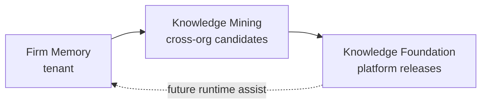

# ADR-028: Knowledge Foundation Bridge — Mining to Institutional Releases

**Status:** Accepted  
**Date:** 2026-06-21  
**Program:** Phase 28 — Knowledge Mining → Knowledge Foundation Integration  
**Supersedes:** None  
**Related audits:**
- [`docs/audits/PHASE_28_ARCHITECTURE_AUDIT.md`](../../audits/PHASE_28_ARCHITECTURE_AUDIT.md)
- [`docs/audits/PHASE_28_TENANT_POLICY_DECISION.md`](../../audits/PHASE_28_TENANT_POLICY_DECISION.md)  
**Related ADRs:** [`ADR-001-AI-RUNTIME-STRATEGY.md`](../ADR-001-AI-RUNTIME-STRATEGY.md) (Firm Memory tier; TB classification order)

Trust principle: **AI assists. Humans decide. Evidence governs.**

---

## 1. Context

AQLIYA operates three distinct knowledge layers. Each has a different scope, lifecycle, and governance boundary. They must not be collapsed into a single system.

### 1.1 Firm Memory (tenant-scoped, operational)

| Attribute | Value |
|-----------|--------|
| **Purpose** | Per-engagement TB classification learning |
| **Primary model** | `TBMappingPattern` (`organizationId` required) |
| **Scope** | Single organization |
| **Lifecycle** | Human-confirmed mappings → pattern upsert → lookup on classify |
| **Code** | `src/lib/tb-intelligence/firm-memory-engine.ts` |
| **ADR reference** | ADR-001 Decision 2 — step 1 in classification pipeline |

Firm Memory is **not** part of this bridge. It remains strictly tenant-isolated.

### 1.2 Knowledge Mining (cross-org candidates)

| Attribute | Value |
|-----------|--------|
| **Purpose** | Extract repeatable mapping patterns from firm memory feedback across organizations |
| **Primary model** | `KnowledgeCandidate`, `KnowledgeCandidateEvidence`, `KnowledgePromotionHistory` |
| **Scope** | Cross-org institutional candidates (`organizationId: null` on create; per-org evidence preserved) |
| **Lifecycle** | `CANDIDATE` → `UNDER_REVIEW` → `APPROVED` / `REJECTED` → `PROMOTED` |
| **Code** | `src/lib/tb-intelligence/knowledge-mining/` |
| **Artifacts** | `knowledge/tb-intelligence/candidates/*.json` (candidate-only; never production rules) |
| **Audit** | `productKey: "knowledge-mining"` via `knowledge-review/audit-handler.ts` |

Mining stops at `PROMOTED`. It does not create foundation versions.

### 1.3 Knowledge Foundation (platform-wide releases)

| Attribute | Value |
|-----------|--------|
| **Purpose** | Governed, versioned institutional knowledge releases |
| **Primary models** | `KnowledgeFoundationVersion`, `KnowledgeFoundationRelease`, `KnowledgeFoundationDiff` |
| **Scope** | Platform-wide (no `organizationId` on version model) |
| **Lifecycle** | `DRAFT` → `APPROVED` → `RELEASED` → `ACTIVE` → `DEPRECATED` (+ rollback) |
| **Code** | `src/lib/knowledge-foundation/` |
| **Artifacts** | `knowledge/releases/v{versionNumber}/` (manifest, SHA-256, `knowledge-foundation.json`) |
| **Audit** | `productKey: "knowledge-foundation"` via `knowledge-foundation/audit-handler.ts` |
| **Static reference** | `knowledge-foundation/domains/ifrs|isa|socpa/` (regulatory canonical knowledge) |

Foundation versioning is separate from static regulatory domains. This ADR governs the **DB-backed release pipeline** that packages mined candidates into institutional versions.

### 1.4 Three-tier model

```text
T1  Firm Memory          → tenant operational learning
T2  Knowledge Mining     → cross-org curated candidates (human reviewed)
T3  Knowledge Foundation → platform-wide governed releases (human approved)
```



---

## 2. Problem

Phase 8 (Mining) and Phase 9/27 (Foundation Versioning) were built as **parallel systems**. The following gaps are proven in source code:

| Gap | Evidence | Impact |
|-----|----------|--------|
| **No candidate ↔ version binding** | No FK or junction between `KnowledgeCandidate` and `KnowledgeFoundationVersion` | Cannot prove which candidates a release contains |
| **Global PROMOTED snapshot** | `release-generator.ts` loads all `status: "PROMOTED"` | Wrong rules in release; version integrity broken |
| **Manual draft with zero candidates** | `createVersion()` sets `candidateCount: 0` | UI promise ("from approved candidates") is false |
| **Temporal diff proxy** | `diff-engine.ts` uses `updatedAt <= version.createdAt` | Diffs do not reflect actual release contents |
| **No event bridge** | `knowledge.candidate.promoted` has no foundation listener | Audit chains are disconnected |
| **Duplicate release paths** | `releaseVersion()` vs `generateReleasePackage()` | Operator confusion; dead code risk |

Promotion ends at `PROMOTED`. Foundation starts at manual `DRAFT`. **Nothing governed connects them.**

Without an explicit bridge, AQLIYA cannot truthfully claim a closed institutional knowledge loop: *mine → review → promote → version → release → deploy*.

---

## 3. Decision

We adopt **MODEL_B** from the Phase 28.0 tenant policy audit:

> **Platform-wide Knowledge Foundation with mandatory provenance tracking.**

Combined with **Option D (Hybrid)** from the Phase 28 architecture audit:

> Promotion feeds an **unbound candidate pool**; foundation **draft creation binds** a scoped set; release, diff, and rollback operate on **version-bound snapshots** only.

### 3.1 Core decisions (frozen)

| # | Decision | Rationale |
|---|----------|-----------|
| D1 | **Introduce explicit candidate–version binding** | Junction table (preferred) or equivalent scoped link at `createVersion` |
| D2 | **Foundation versions remain platform-wide** | Matches schema, mining cross-org design, static `knowledge-foundation/domains/` |
| D3 | **Provenance is mandatory, not optional** | Satisfies "Evidence governs"; regulatory defensibility under MODEL_B |
| D4 | **Human approval remains mandatory at both planes** | Mining review/promote (OPERATOR) + foundation approve/activate (ADMIN) |
| D5 | **No autonomous institutional release** | AI/mining assists; humans approve version and activate; no auto `ACTIVE` |
| D6 | **Release content is canonical-only** | Phrase → canonical code mappings; no raw tenant TB rows in published artifacts |
| D7 | **Firm Memory unchanged** | Tenant isolation for operational TB learning preserved (ADR-001) |
| D8 | **Mining promotion path unchanged** | `promotion-service.ts` does not auto-create foundation versions |

### 3.2 Target flow (post-implementation)

```text
1. OPERATOR promotes candidate(s)           → PROMOTED + mining artifact + audit
2. OPERATOR creates foundation DRAFT        → binds eligible unbound PROMOTED candidates
3. ADMIN approves version                   → APPROVED
4. OPERATOR generates release package       → version-scoped snapshot + provenance manifest + SHA-256
5. ADMIN activates version                  → ACTIVE (one at a time; prior ACTIVE → DEPRECATED)
```

Optional future: TB classification reads ACTIVE foundation rules as assistive input (Phase 29+). Not in scope for Phase 28.

### 3.3 Rejected alternatives

| Alternative | Reason rejected |
|-------------|-----------------|
| **MODEL_A** — tenant-scoped foundation versions | Fights cross-org mining (`organizationId: null`); duplicates platform static knowledge model; loses institutional reuse |
| **Option B** — promotion → release directly | Skips foundation approve/activate gates; violates governance |
| **Option A** — auto-draft on every promote | Reduces operator intent; version sprawl |
| **Global PROMOTED query** (status quo) | Proven incorrect; breaks version integrity |

---

## 4. Data Ownership

### 4.1 Candidate origin organization

| Data | Owner | Retention |
|------|-------|-----------|
| `TBMappingFeedback`, `TBMappingPattern` | Tenant (organization) | Firm Memory lifecycle |
| `KnowledgeCandidate` | Platform mining pool | Until deprecated/archived per governance policy |
| `KnowledgeCandidate.organizationId` | Nullable — cross-org candidate; may be set for org-specific candidates | Preserved as-is |
| `KnowledgeCandidateEvidence.organizationId` | **Source tenant per evidence row** | **Immutable after bind**; retained in provenance manifest |
| `organizationCount` on candidate | Platform metadata (distinct contributing orgs) | Published in provenance; not client PII |

Evidence rows are the **authoritative provenance** for which organizations contributed to a candidate.

### 4.2 Platform-owned institutional release

| Data | Owner | Notes |
|------|-------|-------|
| `KnowledgeFoundationVersion` | Platform (AQLIYA operator governance) | No `organizationId`; one ACTIVE line platform-wide |
| `KnowledgeFoundationRelease` | Platform | Immutable package record per version |
| `knowledge/releases/v{X}/` artifacts | Platform filesystem / object storage | Canonical rules only in `knowledge-foundation.json` |
| Binding junction (`versionId`, `candidateId`) | Platform | Establishes institutional release composition |

Tenants do **not** own foundation versions. They contribute evidence to candidates through operational use (firm memory feedback → mining).

### 4.3 Provenance retention requirements

Every foundation release **must** include a provenance block (manifest or sidecar) with, per bound candidate:

| Field | Required |
|-------|----------|
| `candidateId` | Yes |
| `candidatePhrase`, `canonicalCode`, `category`, `confidence` | Yes (canonical fields) |
| `evidenceIds[]` | Yes |
| `contributingOrganizationIds[]` (distinct) | Yes |
| `reviewerId`, `reviewedAt` | Yes |
| `promotedBy`, `promotedAt`, `artifactPath` (mining) | Yes |
| `boundAt`, `boundById` | Yes |
| Raw `clientAccountCode` / client names from evidence | **No** in published rules |

Platform audit logs (`PlatformAuditLog`) must cross-reference `candidateIds[]` on foundation release events.

Retention: provenance metadata retained for the life of the version record plus platform audit retention policy. Rollback does not delete provenance history.

---

## 5. Security

### 5.1 No raw tenant TB data in releases

Published `knowledge-foundation.json` contains **canonical mapping suggestions** only:

- `phrase`, `canonicalCode`, `category`, `confidence`, `supportCount`, `organizationCount`

**Forbidden in published release artifacts:**

- Client account codes from engagements
- Client account names tied to specific organizations
- Engagement IDs
- Any field that identifies a specific tenant client

Provenance manifest may reference `organizationId` and internal evidence IDs for **operator audit** — access restricted to ADMIN/OPERATOR on foundation workspace.

### 5.2 Canonical knowledge only

Foundation releases package **institutional mapping rules**, analogous to static IFRS/ISA domain rules — not operational firm memory rows.

Mining artifacts under `knowledge/tb-intelligence/candidates/` remain **candidate status** (`requiresHumanReview: true` in artifact meta). Foundation releases are a **separate, higher governance tier**.

### 5.3 Audit linkage required

| Event plane | productKey | Must link to |
|-------------|------------|--------------|
| Mining promotion | `knowledge-mining` | `candidateId`, `artifactPath` |
| Foundation bind | `knowledge-foundation` | `versionId`, `candidateIds[]` |
| Foundation release | `knowledge-foundation` | `versionId`, manifest hash, `candidateIds[]` |
| Foundation activate | `knowledge-foundation` | `versionId`, hash verification (Phase 28.4) |

Disconnected audit chains are **not acceptable** for production institutional releases.

### 5.4 RBAC and access (policy)

| Action | Minimum role |
|--------|--------------|
| Promote candidate | OPERATOR |
| Create/bind draft version | OPERATOR |
| Approve version | ADMIN |
| Generate release | OPERATOR |
| Activate version | ADMIN |
| Rollback | ADMIN + reason |

**Phase 28.3+:** `/knowledge-foundation/*` access policy must clarify platform-operator curation vs tenant consumption of ACTIVE rules. VIEWER access to ACTIVE versions without org filter is a **known gap** to address before tenant-facing runtime consumption.

### 5.5 Tenant isolation boundaries

| Layer | Isolation |
|-------|-----------|
| Firm Memory | **Strict** — `organizationId` on all queries |
| Mining list/API | **Must be hardened** — session-derived filters where tenant views apply |
| Foundation curation | Platform-wide — operator roles |
| Foundation consumption (future) | Policy TBD in Phase 29 — canonical rules only |

---

## 6. Consequences

### 6.1 Positive

- Closes the governed loop: mine → review → promote → bind → approve → release → activate.
- Version integrity: each release contains exactly its bound candidate set.
- Diff and rollback operate on faithful snapshots.
- Aligns with cross-org institutional learning (`organizationCount`, pattern aggregator).
- Matches existing schema direction (no `organizationId` on `KnowledgeFoundationVersion`).
- Extends static `knowledge-foundation/domains/` with governed mined overlays.
- Strengthens "Evidence governs" via mandatory provenance manifests.
- Firm Memory and ADR-001 classification order remain stable.

### 6.2 Negative

- Schema migration required (junction table + provenance fields).
- `createVersion`, `release-generator`, and `diff-engine` must change — not a thin adapter.
- Operators gain binding workflow steps (eligible pool review before draft).
- Platform operators bear accountability for cross-org institutional releases.
- Documentation and PRODUCT_STATUS_MATRIX must reflect bridge completion honestly.

### 6.3 Risks

| Risk | Likelihood | Mitigation |
|------|------------|------------|
| Cross-tenant perception if ACTIVE rules shown to all VIEWERs | Medium | Phase 28.3 access policy; Phase 29 consumption scoping |
| Provenance omitted under delivery pressure | Medium | ADR P1/P2 non-negotiable; tests in 28.2 |
| Binding race (candidate bound to two versions) | Low | `@@unique([candidateId])` on junction for non-deprecated bindings |
| Schema/migration drift (`@unique` on versionNumber) | Low | Align Prisma with migration in 28.1 |
| Operators confuse mining artifacts vs foundation releases | Medium | UI labels + separate paths in 28.3 |
| Runtime consumer delayed — ACTIVE unused | High (today) | Phase 29; does not block 28 bridge |

---

## 7. Future Work

Implementation is phased per [`PHASE_28_ARCHITECTURE_AUDIT.md`](../../audits/PHASE_28_ARCHITECTURE_AUDIT.md). This ADR does not authorize implementation by itself; it freezes the decision for those phases.

### Phase 28.1 — Schema and binding core

- Add `KnowledgeFoundationVersionCandidate` junction (or equivalent).
- Implement `candidate-bridge.ts`: `listEligiblePromotedCandidates()`, `bindCandidatesToVersion()`, `getVersionCandidates()`.
- Extend `createVersion` to bind eligible unbound `PROMOTED` candidates and set `candidateCount`.
- Unit tests for eligibility and binding rules.
- Align Prisma unique constraints with migration `20270622100000`.

**Exit gate:** Bind creates junction rows; unbound pool queryable; no release changes yet.

### Phase 28.2 — Release and diff correctness

- `release-generator.ts`: version-scoped candidates only; provenance manifest in package; persist manifest hash.
- `diff-engine.ts`: compare version-bound sets or stored snapshots — retire `createdAt` proxy.
- Deprecate or gate status-only `releaseVersion()` path.
- Regression tests: bind → release → `RELEASED` with correct `candidateCount`.

**Exit gate:** Release artifact matches bound set; diff reflects snapshot truth.

### Phase 28.3 — UI and operator workflow

- New version form: eligible promoted pool + binding UX.
- Version detail: bound candidate list with provenance summary.
- Knowledge review: foundation binding status on candidate detail.
- KPI cards: unbound promoted count.
- Access policy documentation for foundation workspace.

**Exit gate:** Operator can complete bind → approve → release without raw SQL.

### Phase 28.4 — Governance hardening and observability

- Hash verification on `activateVersion`.
- Audit cross-link: mining promote → foundation bind → release (metadata).
- Emit `knowledge.candidate.created` in mining pipeline.
- E2E integration test: full governed path.
- Docs sync: `PRODUCT_STATUS_MATRIX.md`, `AQLIYA_ARCHITECTURE.md`, Phase 9 deliverable corrections.

**Exit gate:** E2E test green; provenance manifest validated; activate verifies hash.

### Beyond Phase 28 (not in scope)

| Item | Phase |
|------|-------|
| TB runtime consumption of ACTIVE foundation | 29 |
| Hash verification policy in production ops | 28.4 + ops runbook |
| Release signature chain | Post-28 |
| Mining API tenant filters (session org) | 28.3 or parallel security pass |

---

## Compliance Checklist (frozen)

Before marking Phase 28 complete, all must be true:

- [ ] Candidate–version binding exists in schema and is enforced in `createVersion`
- [ ] Release packages include provenance manifest (P1)
- [ ] Published rules are canonical-only — no raw client TB data (P3)
- [ ] Foundation audit events include `candidateIds[]` (P4)
- [ ] No autonomous path from `PROMOTED` to `ACTIVE` without human gates
- [ ] Firm Memory tenant isolation unchanged
- [ ] Diff and rollback use version-bound data
- [ ] Tests prove bind → release → activate chain

---

## Director Sign-off

- [x] ADR-028 Accepted — 2026-06-21
- Decision source: Phase 28.0 Architecture Audit + Phase 28.0 Tenant Policy Decision
- Model: **MODEL_B** — Platform-wide Foundation + mandatory provenance
- Bridge pattern: **Option D (Hybrid)** — unbound pool → explicit bind → version-scoped release
- Unblocks: Phase 28.1 implementation (schema + binding core)
