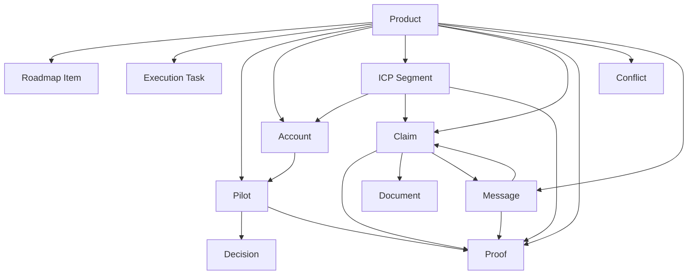
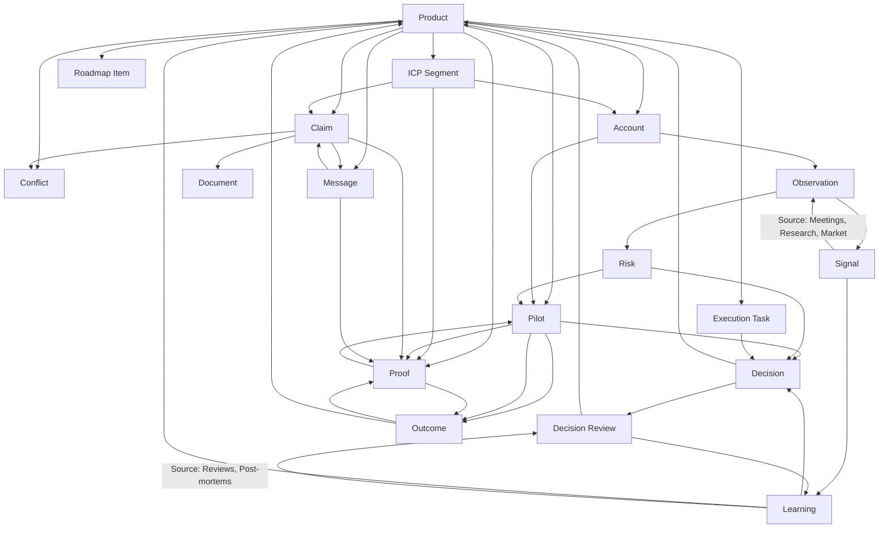

# AQLIYA Knowledge Graph — Entity & Relation Analysis

**Status:** Complete  
**Source:** Direct Notion API audit of 12 databases (docs/archive/notion-export-2026/10-full-notion-asset-inventory.md)  
**Date:** 2026-05-30

---

## 1. CURRENT ENTITY GRAPH

### Entities Discovered

| # | Entity | Source Database | Records | Maturity |
|---|---|---|---|---|
| 1 | Product | Product Portfolio | 10+ | L4 |
| 2 | Account | Accounts CRM | 14+ | L3 |
| 3 | ICP Segment | ICP Register | 4 | L3 |
| 4 | Pilot | Pilot Tracker | 5+ | L4 |
| 5 | Claim | Claims Register | 7 | L4 |
| 6 | Proof | Proof Library | 8+ | L4+ |
| 7 | Decision | Decisions Log | 6+ | L3 |
| 8 | Conflict | Conflicts Register | 3 | L3 |
| 9 | Message | External Messaging | 3 | L5 |
| 10 | Roadmap Item | Roadmap | 8+ | L3 |
| 11 | Execution Task | Execution Board | 15+ | L3 |
| 12 | Document | Documentation Authority | 10+ | L4 |

### Current Entity Graph (Mermaid)



### Current Relation Table

| From | To | Type | Bidirectional? | Database | Coverage |
|---|---|---|---|---|---|
| Pilot | Decision | Pilot→Decision Memo | No | Pilot Tracker | Partial |
| Pilot | Proof | Pilot→Proof Produced | No | Pilot Tracker | Partial |
| Account | Pilot | Account→Related Pilot | No | Accounts CRM | Partial |
| Account | ICP | Account→ICP Segment | No | Accounts CRM | Good |
| Account | Product | Account→Primary Product | No | Accounts CRM | Good |
| Claim | Product | Claim→Product | No | Claims Register | Good |
| Claim | Document | Claim→Source Document | No | Claims Register | Partial |
| Claim | Proof | Proof→Supports Claim | **Yes** | Proof + Claims | Good |
| Claim | Message | Message→Approved Claims | No | Messaging | Good |
| Claim | ICP | ICP→Approved Claims | No | ICP | Partial |
| Proof | Product | Proof→Product | No | Proof Library | Good |
| Proof | ICP | ICP→Proof Needed | No | ICP | Partial |
| Proof | Message | Message→Proof Required | No | Messaging | Good |
| Conflict | Product | Conflict→Product | No | Conflicts | Good |
| Roadmap | Product | Roadmap→Product | No | Roadmap | Good |
| Execution | Product | Execution→Product | No | Execution | Good |

### Missing Critical Relations

| Missing | Impact | Risk Level |
|---|---|---|
| Proof → Pilot (reverse) | Cannot see which proofs came from which pilot | **Critical** |
| Decision → Product | Cannot see product impact of decisions | **High** |
| Proof → Account | Cannot see which customer generated which proof | **High** |
| Execution → Decision | Tasks disconnected from decisions | Medium |
| Conflict → Claim | Conflicts not linked to claims they challenge | Medium |
| Conflict → Proof | Conflicts not linked to evidence they dispute | Medium |
| Decision → Outcome Metrics | No outcome measurement on decisions | **Critical** |

---

## 2. TARGET ENTITY GRAPH

### New Entities Required

| # | Entity | Purpose | Source Database | Records Needed |
|---|---|---|---|---|
| 13 | **Signal** | External/internal observations that may require action | New DB | 0 |
| 14 | **Learning** | Structured knowledge extracted from pilots/decisions/signals | New DB | 0 |
| 15 | **Observation** | Raw capture from meetings, calls, research | New/Pages | 0 |
| 16 | **Risk** | Identified risks to strategy, sales, operations | New/Conflicts+ | 0 |
| 17 | **Decision Review** | Retrospective analysis of decision quality | New/Decisions+ | 0 |
| 18 | **Outcome** | Measurable result of a pilot, decision, or product change | New/Pilot+ | 0 |

### Target Entity Graph



### Target Relation Table

| From | To | Type | Purpose |
|---|---|---|---|
| Observation | Signal | Direct | Raw field data → structured signal |
| Observation | Risk | Direct | Raw field data → structured risk |
| Signal | Learning | Analysis | Multiple signals → synthesized learning |
| Signal | Decision | Trigger | Signal may trigger a decision |
| Learning | Product | Impact | Learning changes product direction |
| Learning | Decision | Input | Learning informs decision |
| Risk | Decision | Constraint | Risk influences decision |
| Risk | Pilot | Monitor | Risk tracked during pilot |
| Pilot | Outcome | Result | Pilot produces measurable outcome |
| Outcome | Proof | Evidence | Outcome becomes proof |
| Outcome | Product | Validation | Outcome validates product direction |
| Decision | Decision Review | Cycle | Decision is later reviewed |
| Decision Review | Learning | Output | Review produces learning |
| Decision | Product | Impact | Decision affects product |
| Task | Decision | Traceability | Task traces back to decision |
| Conflict | Claim | Challenge | Conflict challenges a specific claim |
| Proof | Pilot | Source | Proof originated from pilot |
| Proof | Account | Source | Proof originated from customer |

---

## 3. ENTITY DEPENDENCY CHAIN

### Evidence Chain (Must Be Traceable)

```
Meeting/Observation
    → Signal (structured observation)
    → Decision (action taken)
    → Execution Task (work done)
    → Pilot/Implementation (customer-facing)
    → Outcome (measurable result)
    → Proof (evidence recorded)
    → Claim (commercial statement)
    → Approved Message (external communication)
```

### Decision Chain (Must Be Traceable)

```
Observation
    → Signal
    → Options Considered
    → Decision
    → Decision Review (later)
    → Learning
    → Product Change
    → Outcome
    → Proof
```

### Commercial Chain (Must Be Traceable)

```
ICP Segment
    → Account
    → Discovery
    → Pilot
    → Outcome
    → Proof
    → Claim
    → Approved Message
    → External Communication
```

---

## 4. TRUTH SOURCE MAP

| Entity | Primary Truth Source | Notion Role | Sync Frequency |
|---|---|---|---|
| Product | Git (source code + docs) | Reference + status display | Weekly |
| Account | Notion (CRM) | Authoritative | Real-time |
| ICP | Notion | Authoritative | Real-time |
| Pilot | Notion | Authoritative | Real-time |
| Claim | Notion (approved) + Git docs | Authoritative after Git sync | Weekly |
| Proof | Git (test results, code) + Notion (commercial) | Both | Weekly |
| Decision | Notion | Authoritative | Real-time |
| Conflict | Notion | Authoritative | Real-time |
| Message | Notion (after approval) | Authoritative | Real-time |
| Roadmap | Notion + Git docs | Notion primary, Git reference | Weekly |
| Execution | Notion | Authoritative | Real-time |
| Document | Git (code docs) + Drive (commercial) | Notion reference, not source | Monthly |

---

## 5. ENTITY HEALTH

| Entity | Completeness | Relation Coverage | Governance | Priority |
|---|---|---|---|---|
| Product | 70% | 90% | L4 | Medium |
| Account | 60% | 70% | L3 | **High** |
| ICP | 50% | 80% | L3 | Medium |
| Pilot | 65% | 75% | L4 | Medium |
| Claim | 80% | 85% | L4 | Low |
| Proof | 75% | 80% | L4+ | Low |
| Decision | 50% | 30% | L3 | **High** |
| Conflict | 60% | 40% | L3 | Medium |
| Message | 90% | 90% | L5 | Low |
| Roadmap | 50% | 50% | L3 | Medium |
| Execution | 60% | 40% | L3 | Medium |
| Document | 70% | 50% | L4 | Low |

---

## 6. KEY FINDINGS

1. **Decision entity is the weakest link**: Low completeness, almost no relations, no quality measurement. This is the biggest intelligence gap.

2. **Proof → Pilot is broken**: Proof cannot trace back to its originating pilot. This violates the Evidence Chain principle.

3. **Observation → Signal → Learning pipeline is missing**: The entire institutional memory pathway from raw observation to structured learning does not exist.

4. **Conflict isolation**: Conflicts are disconnected from the claims and proof they dispute. This reduces their governance value.

5. **Message entity is strongest**: External Messaging Register has the highest entity health (90%), setting the standard for the rest.

6. **No Outcome entity**: Success/failure of pilots and decisions is not captured as a first-class entity. This prevents learning feedback loops.
