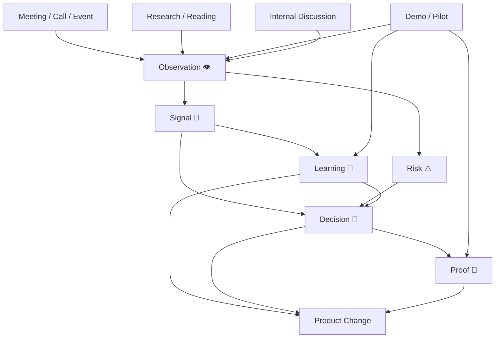

# Institutional Memory System — Signal → Learning → Decision → Proof

**Status:** Design  
**Date:** 2026-05-30  
**Prerequisite:** docs/archive/notion-export-2026/10-full-notion-asset-inventory.md, docs/archive/notion-export-2026/11-aqliya-knowledge-graph.md  

---

## 1. WHY INSTITUTIONAL MEMORY

AQLIYA currently has no structured memory system.

Information flows:
- Meeting → Notes (unstructured)
- Pilot → Outcome (not captured)
- Decision → No review (not analyzed)
- Signal → No capture (lost)

The Institutional Memory System captures every observation, converts it to signals, synthesizes learnings, and feeds decisions and proof.

---

## 2. ENTITY DESIGN

### Entity 1: Observation (Raw Capture)

| Field | Type | Purpose |
|---|---|---|
| Observation | Title | What was observed |
| Source | Select | Meeting, Call, Email, Research, Event, Demo, Pilot, Internal |
| Source Link | URL | Link to notes, recording, document |
| Date | Date | When observed |
| Observer | Person | Who captured it |
| Related Product | Relation→Product | Which product |
| Related Account | Relation→Account | Which account |
| Tags | Multi-Select | Market, Customer, Product, Competitive, Risk, Opportunity |
| Raw Notes | Text | Full capture |

**Location:** New database under HQ section "Institutional Memory"  
**Icon:** 👁️

### Entity 2: Signal (Structured Observation)

| Field | Type | Purpose |
|---|---|---|
| Signal | Title | Structured statement |
| Signal Type | Select | Market Signal, Customer Signal, Product Signal, Competitive Signal, Risk Signal, Opportunity Signal |
| Source Observation | Relation→Observation | Linked raw capture |
| Signal Strength | Select | Weak, Medium, Strong, Confirmed |
| Impact | Select | Low, Medium, High, Critical |
| Urgency | Select | Now, This Week, This Month, This Quarter, Monitor |
| Related Product | Relation→Product | — |
| Related Account | Relation→Account | — |
| Status | Select | New, Acknowledged, In Analysis, Action Taken, Closed |
| Decision Triggered | Relation→Decision | If signal led to a decision |
| Notes | Text | Analysis |

**Location:** New database under HQ section "Institutional Memory"  
**Icon:** 📡

### Entity 3: Learning (Synthesized Knowledge)

| Field | Type | Purpose |
|---|---|---|
| Learning | Title | What we learned |
| Source Signals | Relation→Signal | Multiple signals may produce one learning |
| Source Decision Review | Relation→Decision Review | Learning from decision reviews |
| Source Pilot | Relation→Pilot | Learning from pilot outcomes |
| Category | Select | Product, Customer, Market, Process, Governance, Technical |
| Confidence | Select | Hypothesis, Tentative, Established, Proven |
| Product Impacted | Relation→Product | Product change triggered |
| Decision Impacted | Relation→Decision | Decision informed |
| Status | Select | Active, Superseded, Archived |
| Notes | Text | — |

**Location:** New database under HQ section "Institutional Memory"  
**Icon:** 🧠

### Entity 4: Risk (Identified Risk)

| Field | Type | Purpose |
|---|---|---|
| Risk | Title | Risk statement |
| Risk Type | Select | Strategic, Commercial, Technical, Governance, Market, Operational, Compliance |
| Source | Select | Signal, Decision Review, Pilot, Audit, External |
| Source Observation | Relation→Observation | — |
| Probability | Select | Low, Medium, High, Very High |
| Impact | Select | Low, Medium, High, Critical |
| Risk Score | Formula | Probability × Impact (manual) |
| Mitigation | Text | — |
| Owner | Person | — |
| Status | Select | Identified, Mitigating, Monitored, Realized, Closed |
| Related Product | Relation→Product | — |
| Related Decision | Relation→Decision | — |
| Related Pilot | Relation→Pilot | — |

**Location:** New database under HQ  
**Icon:** ⚠️

---

## 3. INFORMATION FLOW

---

## 4. WEEKLY MEMORY RHYTHM

| Day | Activity | Output |
|---|---|---|
| Mon | Capture observations from previous week | 5-10 Observations |
| Mon | Convert observations to signals | 2-5 Signals |
| Tue | Review signals for action | Decisions or Risks |
| Wed | Review pilot outcomes | Learnings |
| Thu | Decision review (if any this week) | Decision Reviews |
| Fri | Synthesize learnings | 1-2 Learnings |
| Fri | Feed into Weekly Founder Review | Updated product direction |

---

## 5. RELATIONS TO EXISTING DATABASES

| New Entity | Relates To | Existing DB | Purpose |
|---|---|---|---|
| Observation | Product | Product Portfolio | Tag observations to products |
| Observation | Account | Accounts CRM | Tag observations to accounts |
| Signal | Decision | Decisions Log | Signal triggered a decision |
| Signal | Product | Product Portfolio | Signal affects product |
| Signal | Account | Accounts CRM | Signal about account/market |
| Learning | Product | Product Portfolio | Learning changes product |
| Learning | Decision | Decisions Log | Learning informed decision |
| Learning | Pilot | Pilot Tracker | Learning from pilot |
| Risk | Decision | Decisions Log | Risk influences decision |
| Risk | Pilot | Pilot Tracker | Risk monitored during pilot |
| Risk | Product | Product Portfolio | Strategic product risk |

---

## 6. DATABASE SUMMARY

| Database | Fields | Relations | Icon | Priority |
|---|---|---|---|---|
| Observations 👁️ | 9 | 2 (Product, Account) | 👁️ | P0 — Create first |
| Signals 📡 | 12 | 4 (Observation, Product, Account, Decision) | 📡 | P0 — Create first |
| Learnings 🧠 | 10 | 4 (Signals, Decision Review, Pilot, Product, Decision) | 🧠 | P0 — Create second |
| Risks ⚠️ | 13 | 4 (Observation, Product, Decision, Pilot) | ⚠️ | P1 — Create third |

---

## 7. EXECUTION PLAN

1. Create Observations database (9 fields, 2 relations) — 15 min
2. Create Signals database (12 fields, 4 relations) — 20 min
3. Create Learnings database (10 fields, 5 relations) — 20 min
4. Create Risks database (13 fields, 4 relations) — 20 min
5. Add 4 linked views to CEO Dashboard (New Signals, Pending Observations, Active Risks, Recent Learnings)
6. Enter 3 sample observations from recent activity
7. Convert to 2 sample signals
8. Test weekly rhythm for 1 cycle

Total: ~2 hours
