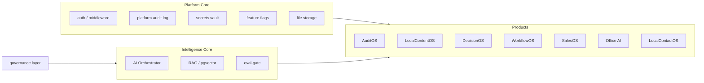

# Architecture Reality — AQLIYA Deep Reality Audit

**Audit date:** 2026-06-17  
**Method:** Reverse-engineered from `src/` structure, imports, Prisma schema, middleware

---

## Platform Identity (Code-Proven)

AQLIYA is implemented as a **modular monolith** on Next.js 16 App Router:
- Single deployable artifact (Docker standalone)
- Product boundaries via route prefixes and `src/lib/{product}/`
- Shared platform services in `src/lib/platform/`, `src/lib/governance/`, `src/lib/ai/`

**Status:** VERIFIED

---

## Domain Boundaries



| Boundary | Separation Quality | Evidence |
|----------|-------------------|----------|
| Platform vs Product | **Good** | Separate lib folders, shared guards |
| Product vs Product | **Moderate** | Cross-product signals in Sales; audit-risk under /risk |
| AI vs Products | **Good** | `product-ai-bridge.ts`, `audit-ai-bridge.ts` |
| Legacy vs New | **Poor** | Sunbul + WorkflowOS dual layer; Sales `_v02`/`vnext`/`(1)` duplicates |

---

## Layering Model

```
UI (src/app/, src/components/)
  ↓
Server Actions (src/actions/) + API Routes (src/app/api/)
  ↓
Domain Services (src/lib/{domain}/)
  ↓
Platform Services (src/lib/platform/, src/lib/governance/, src/lib/ai/)
  ↓
Prisma Client → PostgreSQL
```

**Violations found:**
- Some pages query Prisma patterns via actions correctly; contacts page uses actions ✓
- `CoreAccessControl` stub bypasses permission matrix — **architectural gap**
- Content Studio standalone service uses `prisma as any` — **type safety violation**

---

## Tenancy Model — VERIFIED

| Layer | Mechanism | File |
|-------|-----------|------|
| Organization scoping | `organizationId` on User + domain models | `prisma/schema.prisma` (310 org references) |
| Platform org bridge | `PlatformOrganization`, `platformOrganizationId` | Schema + seeds |
| Product guards | `assertProjectAccess`, `requireDecisionAccess`, `requireClientAccess` | Product lib guards |
| Middleware | JWT carries `organizationId` | `src/middleware.ts` |
| Cross-tenant block | Tests in `cross-tenant-isolation.test.ts` | VERIFIED test exists |

**Gap:** SCIM defaults to single `SCIM_DEFAULT_ORG_ID` — multi-tenant SCIM is PARTIAL.

---

## Security Model — PARTIALLY VERIFIED

| Control | Implementation | Status |
|---------|---------------|--------|
| Authentication | NextAuth v5 JWT + custom login | VERIFIED |
| Authorization (coarse) | Middleware role hierarchy | VERIFIED |
| Authorization (fine) | CoreAccessControl | **STUB** |
| Tenant isolation | Server-side org checks | VERIFIED (product-specific) |
| Audit trail | PlatformAuditLog, product audit events | VERIFIED (write fails without DB) |
| Download tickets | `download-handler.ts` | VERIFIED |

---

## AI Architecture — VERIFIED

**Default path:** Deterministic handlers (no external LLM)  
**Real LLM path:** `FF_AI_REAL_PROVIDERS=true` → Orchestrator → Provider router → OpenAI/Anthropic/Local  
**Hybrid routing:** `AI_MODE=hybrid` → task-level local/cloud selection  
**Governance injection:** `getGovernanceContext()` → prompt framework → metadata on output  
**Human review:** Required by design; `ai-review-gate.ts` mock for suggestions

See `local-ai-reality.md` for provider details.

---

## Critical Dependency Graph

```
middleware.ts
├── next-auth/jwt (jose) ← Edge runtime warning
├── rate-limit-edge.ts (memory-only)
└── RBAC routeMinRoles

auth-config.ts
├── Credentials provider
├── OAuth env providers
└── Prisma adapter

AIOrchestrator
├── hybrid-router.ts
├── provider-router.ts → circuit-breaker
├── governed-ai-executor.ts → budget-manager
├── orchestrator-rag-inject.ts → intelligence-core-rag
└── deterministic-provider (fallback)

Prisma Client
├── 100 models
└── pgvector extension (optional)
```

---

## Anti-Patterns Identified

| Pattern | Location | Severity | Impact |
|---------|----------|----------|--------|
| Duplicate `(1)` files | `src/lib/sales/`, `src/actions/` | High | Test/TS noise |
| Dual workflow systems | Sunbul + WorkflowTemplate | Medium | Maintenance burden |
| Schema-code drift | `platformAuditEvent`, content-studio models | Critical | Build blocked |
| Stub security control | `CoreAccessControl` | High | False RBAC confidence |
| Debug endpoint | `/api/test-token` | Critical | Token disclosure |
| Doc-code drift | AI README, status matrix | Medium | Commercial misrepresentation |

---

## Bottlenecks

1. **Build/TS gate** — blocks all deployment
2. **Single-region primary** — DR is snapshot-copy, not active-active
3. **Edge rate limiting** — memory-only, not shared across ECS tasks
4. **Default deterministic AI** — real LLM requires operator env configuration
5. **Monolith build time** — ~170s+ for full build

---

## Circular Dependencies

No hard circular import cycles detected in AI/governance path (static review).  
**Hidden coupling:** SalesOS intelligence imports platform modules created during phantom-import fix — coupling via stubs/TODOs.

---

**Architecture score: 72/100** — Sound modular monolith design undermined by legacy dual layers, schema drift, and security stubs.
