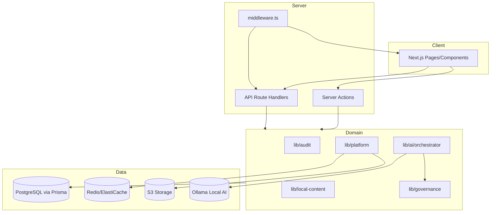

# Code Inventory — AQLIYA Deep Reality Audit

**Audit date:** 2026-06-17  
**Method:** Filesystem enumeration + grep + package.json analysis  
**Evidence status:** VERIFIED (counts from PowerShell `Get-ChildItem` on local workspace)

---

## Executive Summary

AQLIYA is a large Next.js 16 monorepo with **~27,925 tracked files** (excluding `node_modules`/`.git`), **100 Prisma models**, **234 page routes**, **44 API route handlers**, **69 server action files**, and **272 Jest test suites**. The codebase spans multiple governed products on a shared platform core.

---

## File & Folder Counts

| Category | Count | Evidence |
|----------|------:|----------|
| Total files (excl. node_modules, .git) | 27,925 | PowerShell recursive count |
| `src/` TypeScript/TSX | 1,968 | `Get-ChildItem src -Include *.ts,*.tsx` |
| `src/actions/` | 69 | Directory listing |
| `src/components/` | 323 | Directory listing |
| `src/lib/` | 1,077 | Directory listing |
| Test files (`*.test.ts`) | 272 | Glob under `src/` |
| Page routes (`page.tsx`) | 234 | Glob under `src/app/` |
| API routes (`route.ts`) | 44 | Glob under `src/app/api/` |
| Prisma migrations (files) | 87 | `prisma/migrations/` |
| Prisma models | 100 | `grep ^model prisma/schema.prisma` |
| Documentation (`.md`) | 1,671 | `docs/` |
| Scripts | 154 | `scripts/` |
| Infrastructure (Terraform) | 20 | `infra/terraform/` |

---

## Module Purpose & Ownership

| Module | Path | Purpose | Risk |
|--------|------|---------|------|
| **Platform Core** | `src/lib/platform/` | Auth helpers, audit logs, secrets vault, Redis, queues, monitoring | Medium — schema drift on `platformAuditEvent` |
| **Intelligence Core / AI** | `src/lib/ai/` (~70 files) | Orchestrator, providers, RAG, eval-gate, spend tracking | Medium — default deterministic; real LLM env-gated |
| **Governance** | `src/lib/governance/` | Prompt framework, retrieval router, approval state | Low — well-tested patterns |
| **AuditOS** | `src/lib/audit/`, `src/app/audit/` | Full audit lifecycle | Low — L5, extensive tests |
| **LocalContentOS** | `src/lib/local-content/`, `src/app/local-content/` | LC scoring, workbook, ERP | Medium — dual content backend |
| **DecisionOS** | `src/lib/decision/`, `src/app/(dashboard)/decisions/` | Decision governance | Low-Medium |
| **WorkflowOS** | `src/lib/workflowos/`, Sunbul legacy | Governed workflows | Medium — dual Sunbul/Workflow layer |
| **SalesOS** | `src/lib/sales/` (~100+ test files) | CRM-lite intelligence | **High** — duplicate `(1).test.ts` files, TS errors |
| **Office AI** | `src/lib/office-ai/` | Deterministic assistant | Low |
| **LocalContactOS** | `src/actions/contact-*`, `src/app/contacts/` | Relationship registry | Medium — no seed |
| **Auth/SCIM/SSO** | `src/lib/auth/`, `src/app/api/scim/` | Enterprise auth | **High** — MFA JWT gap, DB SSO not wired |
| **Infrastructure** | `infra/terraform/`, `.github/workflows/` | AWS ECS Fargate deployment | Medium — Terraform monitoring bug |
| **Knowledge Foundation** | `knowledge-foundation/` | Institutional knowledge docs | Low — reference only |

---

## Routes Inventory

### API Routes (44)

Health: `/api/health`, `/api/health/live`, `/api/health/ready`  
Auth: `/api/auth/[...nextauth]`, `/api/auth/custom-login`, `/api/auth/mfa/verify`  
AI: `/api/ai/eval-gate`, `/api/ai/governance`, `/api/ai/spend`, `/api/ai/providers`, `/api/ai/knowledge/*`  
SCIM: `/api/scim/v2/Users`, `/api/scim/v2/Groups`  
Platform: `/api/platform/retention/*`, `/api/platform/siem`  
Product downloads: audit, decisions, local-content, workflowos, office-ai  
**Risk routes:** `/api/test-token` (unauthenticated JWT disclosure), `/api/skills/evaluate` GET (no auth)

### Page Route Families (by prefix)

| Prefix | Pages | Product |
|--------|------:|---------|
| `/audit/*` | 27 | AuditOS |
| `/local-content/*` | 26 | LocalContentOS |
| `/sales/*` | 30 | SalesOS |
| `/decisions/*` + `/decision/*` | 22 | DecisionOS |
| `/workflowos/*` | 8 | WorkflowOS |
| `/assistant/*`, `/office-ai/*` | 7 | Office AI |
| `/contacts/*` | 5 | LocalContactOS |
| `/content-studio/*` | 5 | Content Studio (standalone) |
| `/risk/*` | 4 | Audit Risk submodule |
| `/auditos/*` | demo | Public demo |
| Marketing/public | ~40+ | Platform marketing |

---

## Dependency Graph (Critical Path)



---

## Providers & Integrations

| Provider | Location | Status |
|----------|----------|--------|
| OpenAI | `src/lib/ai/providers/openai-provider.ts` | VERIFIED (env-gated) |
| Anthropic | `src/lib/ai/providers/anthropic-provider.ts` | VERIFIED (env-gated) |
| Ollama/Local | `src/lib/ai/providers/local-provider.ts` | VERIFIED (smoke PASS 2026-06-17) |
| vLLM | `src/lib/integration/factory-registry.ts` | PARTIAL |
| Deterministic | `src/lib/ai/providers/deterministic-provider.ts` | VERIFIED (default) |
| AWS S3 | `src/lib/platform/storage/` | VERIFIED |
| HubSpot/Salesforce CRM | `src/lib/sales/crm/` | PARTIAL |
| SAP/Oracle ERP | `src/lib/local-content/erp/` | PARTIAL |
| Sentry | `sentry.server.config.ts` | VERIFIED |
| Bull Queue | `src/lib/platform/operations/queue-runtime.ts` | VERIFIED (flag-gated) |

---

## Risk Register (Inventory-Level)

| ID | Finding | Severity | Evidence |
|----|---------|----------|----------|
| INV-01 | Duplicate `(1).ts` action/test files in SalesOS | High | `sales-icp-actions (1).ts`, 24 `(1).test.ts` failures |
| INV-02 | `platformAuditEvent` referenced but not in schema | Critical | `audit-event-service.ts:47`, build failure |
| INV-03 | Untracked schema diff (`diff_platform_models.sql`) | High | `prisma/migrations/diff_platform_models.sql` untracked |
| INV-04 | 1,671 doc files vs code reality drift | Medium | PRODUCT_STATUS_MATRIX claims vs build state |
| INV-05 | Content Studio standalone models missing from schema | High | `content-studio-service.ts` uses unmodeled tables |

---

## Commands Run

```powershell
Get-ChildItem -Recurse -File | Where-Object { $_.FullName -notmatch 'node_modules|\.git' } | Measure
Get-ChildItem src -Recurse -Include *.ts,*.tsx | Measure
grep ^model prisma/schema.prisma  # 100 models
Glob src/app/api/**/route.ts      # 44 routes
```

**Validation:** Inventory counts VERIFIED. Dependency graph PARTIALLY VERIFIED (static analysis only).
