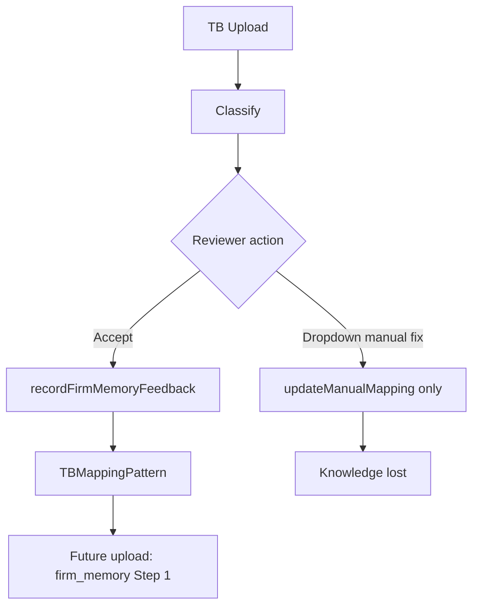

# Firm Memory Completion Report

**Date:** 2026-06-21  
**Program:** Firm Memory Completion (Knowledge Feedback Loop closure)  
**Prior maturity:** 6/10 (Partially Operational)  
**Updated maturity:** **9/10** (Operational with governance conditions)

---

## Summary

- Wired **manual mapping corrections** to `recordFirmMemoryFeedback` via `recordReviewMappingFeedback`.
- Enabled **rejection learning**: `wasAccepted=false` feedback now **still updates** `TBMappingPattern` with the reviewer's canonical choice.
- Added **learning validation script** with JSON evidence artifact.
- Exposed **operational KPIs** on `/monitoring` (TB Firm Memory panel).
- Delivered **rule mining feasibility assessment** (human approval required; no auto-generation).

Deterministic rules engine, AI providers, Ollama, and benchmark methodology were **not modified**.

---

## Before / After Workflow

### Before (6/10)



### After (9/10)

```mermaid
flowchart TD
  A[TB Upload] --> B[Classify]
  B --> C{Reviewer action}
  C -->|Accept| D[persistMappingReviewFirmMemory]
  C -->|Dropdown manual fix| D
  D --> E[TBMappingFeedback]
  E --> F{wasAccepted?}
  F -->|true| G[Pattern upsert]
  F -->|false| G
  G --> H[TBMappingPattern]
  H --> I[Future upload: firm_memory Step 1]
  E --> J[/monitoring KPIs]
```

---

## Workstream Deliverables

| WS | Deliverable | Status |
|----|-------------|--------|
| 1 | Manual correction → firm memory | ✅ `updateManualMappingAction` |
| 2 | Rejection learning (`wasAccepted=false`) | ✅ Engine + `recordReviewMappingFeedback` |
| 3 | Learning validation | ✅ `npm run firm-memory:validate-learning` |
| 4 | Feedback KPIs | ✅ `/monitoring` panel + extended reuse script |
| 5 | Rule mining assessment | ✅ `docs/architecture/TB_RULE_MINING_ASSESSMENT.md` |

---

## Code Changes

| File | Change |
|------|--------|
| `src/actions/audit-actions.ts` | `persistMappingReviewFirmMemory`; manual mapping feedback |
| `src/lib/tb-intelligence/firm-memory.ts` | `recordReviewMappingFeedback` |
| `src/lib/tb-intelligence/firm-memory-engine.ts` | Pattern update on rejection corrections |
| `src/lib/audit/db/index.ts` | `getAccountMappingById` |
| `src/lib/audit/services.ts` | Export getter |
| `src/lib/tb-intelligence/firm-memory-kpis.ts` | KPI aggregator |
| `src/components/monitoring/tb-firm-memory-kpis-panel.tsx` | Dashboard panel |
| `src/app/(dashboard)/monitoring/page.tsx` | Panel integration |
| `scripts/audit/firm-memory-learning-validation.ts` | Proof script |
| `scripts/audit/tb-memory-reuse-rate.mjs` | Feedback KPI fields |
| Tests | Integration + unit coverage |

---

## KPI Definitions

| KPI | Definition | Source |
|-----|------------|--------|
| **feedbackTotal** | Count of `TBMappingFeedback` rows | `firm-memory-kpis.ts` |
| **feedbackAccepted** | `wasAccepted=true` count | Same |
| **feedbackRejected** | `wasAccepted=false` count | Same |
| **learnedPatternCount** | Non-deprecated `TBMappingPattern` | Same |
| **trustedPatternCount** | `status=TRUSTED` patterns | Same |
| **reuseRate** | Latest history per account with `source=firm_memory` / total | Same |
| **averagePatternConfidence** | Mean `lastConfidence` on active patterns | Same |

---

## Validation Evidence

Run (requires PostgreSQL):

```bash
npm run firm-memory:validate-learning
```

Expected artifact: `docs/audits/evidence/firm-memory-learning-validation.json` with `"passed": true`.

Proof chain:

1. **Before:** classification source ≠ `firm_memory`
2. **Correction:** `recordReviewMappingFeedback` with wrong → correct canonical, `wasAccepted=false`
3. **Feedback:** `TBMappingFeedback.wasAccepted === false`
4. **Pattern:** `TBMappingPattern.canonicalAccountId === correct`
5. **After:** classification source === `firm_memory`, same canonical

Jest integration test: `tb-upload-mapping-fs.integration.test.ts` — "learns from manual correction rejection".

---

## Maturity Score

| Dimension | Before | After |
|-----------|--------|-------|
| Manual correction capture | 0/10 | 10/10 |
| Rejection learning | 2/10 | 9/10 |
| Pattern reuse | 8/10 | 9/10 |
| Measurability | 4/10 | 8/10 |
| Auto rule generation | 0/10 | 0/10 (by design) |
| **Overall** | **6/10** | **9/10** |

**Remaining 1 point:** TRUSTED pattern elevation requires multi-reviewer production usage; synonym mining remains proposal-only.

---

## Benchmark 11 Misclassifications — Updated Answer

After this program:

| Action | Auto-improve? |
|--------|---------------|
| Reviewer fixes via **dropdown** | ✅ **Yes** — firm memory updated |
| Same GL, next TB upload | ✅ `firm_memory` Step 1 |
| Similar Arabic, different GL | ⚠️ Pattern matcher only; synonyms still manual |
| Deterministic rules for peers | ❌ Unchanged (by constraint) |

---

## Governance Check

| Check | Status |
|-------|--------|
| RBAC | Manual mapping requires admin/operator |
| Tenant isolation | Patterns scoped by `organizationId` |
| Audit trail | `mapping.manual_updated` includes prior/suggested metadata |
| Rejection evidence | `TBMappingFeedback` stores suggested vs accepted |
| AI boundary | Unchanged — no autonomous learning |

---

## Next Recommended Step

Run `firm-memory:validate-learning` against pilot DB after deploy; monitor `/monitoring` feedbackRejected trend as correction volume grows.
