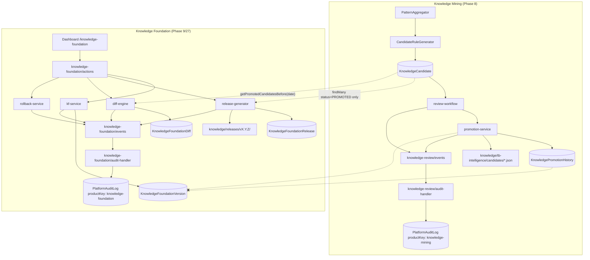
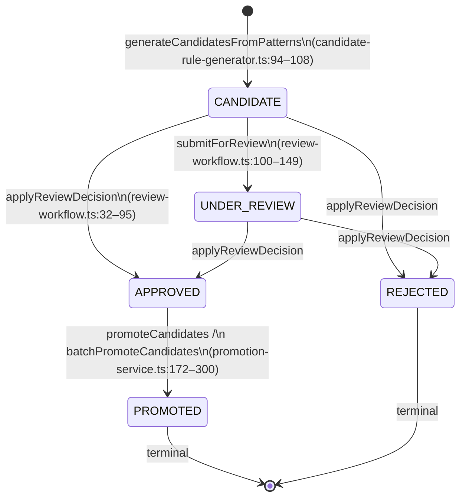
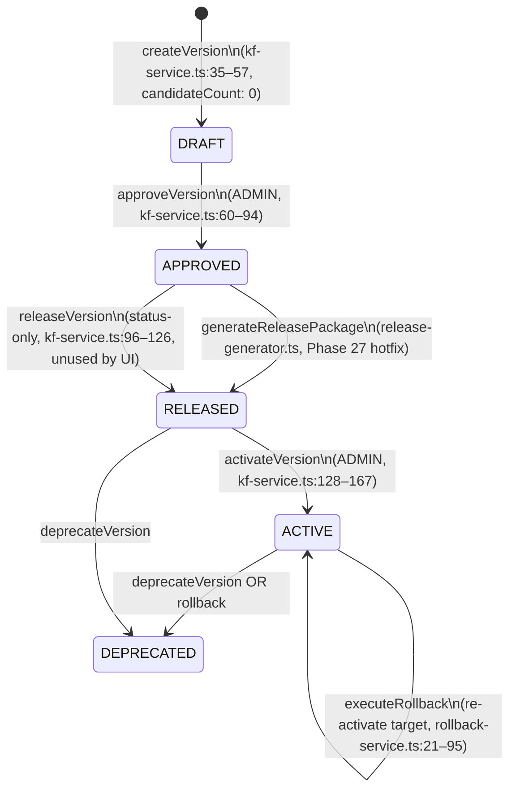
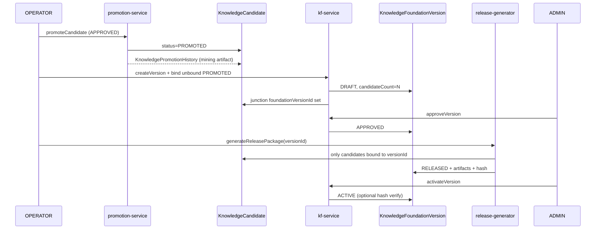

# Phase 28 — Knowledge Mining → Knowledge Foundation Integration

**Audit type:** Architecture (read-only)  
**Date:** 2026-06-21  
**Authority:** Source code in repository at audit time  
**Scope:** Governed bridge between Knowledge Mining and Knowledge Foundation Versioning  
**Constraints:** No code, migrations, commits, or PRs — audit only

---

## Executive Summary

Knowledge Mining and Knowledge Foundation Versioning are **implemented as parallel systems** with **one weak read-only coupling**: `release-generator.ts` and `diff-engine.ts` query `KnowledgeCandidate` rows where `status = "PROMOTED"`. There is **no schema link**, **no event bridge**, **no shared candidate binding**, and **no runtime consumer** of ACTIVE foundation versions in TB intelligence or AI layers.

Promotion (mining) stops at `PROMOTED` + filesystem artifacts under `knowledge/tb-intelligence/candidates/`. Foundation versioning operates on manually created `DRAFT` versions with a separate governance lifecycle. UI copy on `/knowledge-foundation/new` claims versions are created "from approved candidates" but `createVersion()` sets `candidateCount: 0` and does not query candidates.

**Recommendation:** **Option D (Hybrid)** — promotion feeds an **unbound candidate pool**; foundation **draft creation binds** a scoped candidate set; release/diff/rollback operate on **version-bound snapshots** only.

**Final decision:** **READY_TO_IMPLEMENT** (phased; governance model is clear; gaps are bounded and evidenced).

---

# Current State

## System map (proven from code)



**Evidence:** Zero imports of `knowledge-foundation` in `src/lib/tb-intelligence/knowledge-mining/` (grep). Foundation reads candidates only in `release-generator.ts:42–46` and `diff-engine.ts:137–144`.

---

## Candidate lifecycle (Knowledge Mining)

### Schema

| Entity | Path | Key fields |
|--------|------|------------|
| `KnowledgeCandidateStatus` | `prisma/schema.prisma:3603–3609` | `CANDIDATE`, `UNDER_REVIEW`, `APPROVED`, `REJECTED`, `PROMOTED` |
| `KnowledgeCandidate` | `prisma/schema.prisma:3611–3640` | `organizationId?`, phrase, canonical fields, `status`, `reviewerId`, `reviewedAt` |
| `KnowledgeCandidateEvidence` | `prisma/schema.prisma:3642–3656` | Evidence linkage per candidate |
| `KnowledgePromotionHistory` | `prisma/schema.prisma:3658–3672` | `artifactType`, `artifactPath`, `artifactVersion` (date string) — **no `foundationVersionId`** |

### State machine



**Governance notes (code-proven):**

- `applyReviewDecision` does **not** require `UNDER_REVIEW` — approve/reject allowed from `CANDIDATE` (`review-workflow.ts:67–77`; UI exposes approve on `CANDIDATE` in `review-actions.tsx:38–52`).
- `PROMOTED` and `REJECTED` are terminal for review (`review-workflow.ts:49–65`).
- Promotion requires `APPROVED` (`promotion-service.ts:184–190`).
- Mining promotion **explicitly does not** modify production TB files (`promotion-service.ts:6–9`).

### Artifacts on promotion

| Artifact type | Path pattern | Generator |
|---------------|--------------|-----------|
| `candidate-synonyms` | `knowledge/tb-intelligence/candidates/candidate-synonyms-{version}.json` | `promotion-service.ts:60–109` |
| `candidate-rule-pack` | `knowledge/tb-intelligence/candidates/candidate-rule-pack-{version}.json` | `promotion-service.ts:112–166` |

`artifactVersion` = date string `YYYY.MM.DD` (`promotion-service.ts:192`, `257`) — **not** a foundation `versionNumber`.

### Audit events (mining)

| Event | Emitted from | Audit productKey |
|-------|--------------|------------------|
| `knowledge.candidate.submitted` | `review-workflow.ts:136–143` | `knowledge-mining` |
| `knowledge.candidate.approved` / `.rejected` | `review-workflow.ts:80–88` | `knowledge-mining` |
| `knowledge.candidate.promoted` | `promotion-service.ts:224–233`, `286–295` | `knowledge-mining` |
| `knowledge.candidate.created` | **Defined** `events.ts:23` — **never emitted** in mining pipeline | Handler exists (`audit-handler.ts:24–25`) |

**No subscriber** bridges `onReviewEvent("knowledge.candidate.promoted")` to foundation code (grep: only tests register handlers).

---

## Foundation lifecycle (Knowledge Foundation Versioning)

### Schema

| Entity | Path | Key fields |
|--------|------|------------|
| `KnowledgeFoundationVersionStatus` | `prisma/schema.prisma:5363–5369` | `DRAFT`, `APPROVED`, `RELEASED`, `ACTIVE`, `DEPRECATED` |
| `KnowledgeFoundationVersion` | `prisma/schema.prisma:5371–5397` | `versionNumber`, `status`, `artifactPath`, `candidateCount`, `rollbackVersionId` — **no `organizationId`** |
| `KnowledgeFoundationRelease` | `prisma/schema.prisma:5399–5416` | `changeSummary` JSON, `approvedById`/`approvedAt` (unused in generator) |
| `KnowledgeFoundationDiff` | `prisma/schema.prisma:5418–5435` | Rule-level diff persistence |

**Schema drift:** Migration `20270622100000_knowledge_foundation_versioning/migration.sql:17,32` adds `UNIQUE` on `versionNumber` and `versionId`; current `schema.prisma` has `@@index` only — no `@unique`.

### State machine



### Release package generation

`generateReleasePackage` (`release-generator.ts:25–160`):

1. Requires version `APPROVED` (`release-generator.ts:35–38`).
2. Loads **all** `KnowledgeCandidate` where `status: "PROMOTED"` globally (`release-generator.ts:42–46`) — **no version filter, no cutoff, no junction table**.
3. Writes `knowledge/releases/v{versionNumber}/` with `manifest.json` (SHA-256), `knowledge-foundation.json`, etc.
4. Updates version: `artifactPath`, `candidateCount`, `status: "RELEASED"`.
5. Creates `KnowledgeFoundationRelease` with `createdById` only — not `approvedById`/`approvedAt`.
6. Comment explicitly skips linking `KnowledgePromotionHistory` (`release-generator.ts:147–149`).

### Diff engine

`generateDiff` (`diff-engine.ts:9–135`):

- Compares candidates promoted before each version's **`createdAt`** (`diff-engine.ts:24–27`, `137–144`).
- Does **not** read release artifacts or version-bound candidate sets.
- Temporal proxy can diverge from actual release contents if candidates are promoted after version creation.

### Rollback

`executeRollback` (`rollback-service.ts:21–95`):

- ADMIN + reason required.
- Deprecates current `ACTIVE`, re-activates `targetVersionId`.
- `input.versionId` from UI is **never read** (only `targetVersionId`, `reason`).
- Does not restore candidate bindings or re-snapshot artifacts.

### Audit events (foundation)

| Event | Source |
|-------|--------|
| `knowledge.foundation.version.created` | `kf-service.ts:48–55` |
| `knowledge.foundation.version.approved` | `kf-service.ts:82–91` |
| `knowledge.foundation.version.released` | `kf-service.ts:114–123`, `release-generator.ts` emit |
| `knowledge.foundation.version.activated` | `kf-service.ts:156–164` |
| `knowledge.foundation.version.deprecated` | `kf-service.ts:187–196`, rollback |
| `knowledge.foundation.rollback.executed` | `rollback-service.ts:77–92` |
| `knowledge.foundation.diff.generated` | `diff-engine.ts:106–121` |

`productKey: "knowledge-foundation"`, `targetType: "KnowledgeFoundationVersion"` (`audit-handler.ts:44–50`).

### RBAC (both systems)

| Surface | Enforcement | Evidence |
|---------|-------------|----------|
| `/api/knowledge-mining/*` | Middleware `routeMinRoles` = `viewer`; per-route `requireRole` | `middleware.ts:112`, `331–332` |
| `/knowledge-review/*` | Dashboard layout auth only; mutations via `assertOperator`/`assertAdmin` in actions | `(dashboard)/layout.tsx`, `knowledge-mining-actions.ts:34–44` |
| `/knowledge-foundation/*` | **Not in middleware matcher**; page-level role gates on some pages; service-level gates on mutations | `middleware.ts` grep; `new/page.tsx:17–19`; `kf-service.ts:17–31` |
| Foundation list RBAC | `assertVersionAccess` sync filter in `getVersions` | `kf-service.ts:203–246` (fixed Phase 27) |

---

## Current integration points (what exists today)

| # | Integration | Type | Evidence |
|---|-------------|------|----------|
| 1 | Release reads global `PROMOTED` candidates | Read-only DB query | `release-generator.ts:42–46` |
| 2 | Diff uses temporal `PROMOTED` proxy | Read-only DB query | `diff-engine.ts:137–144` |
| 3 | Shared `KnowledgeCandidate` model | Data model only | `prisma/schema.prisma` |
| 4 | Sidebar links both workspaces | Navigation only | `sidebar.tsx` (both routes listed independently) |
| 5 | Phase 9 deliverable doc claims closed loop | **Documentation only** — not fully implemented | `docs/deliverables/PHASE_9_KNOWLEDGE_FOUNDATION_VERSIONING.md:12` vs `createVersion` behavior |

---

# Gap Analysis

## What exists

- Full mining pipeline: mine → review → approve → promote with audit (`knowledge-mining/*`, `knowledge-review/*`).
- Full foundation pipeline: draft → approve → release package → activate → deprecate/rollback with audit (`knowledge-foundation/*`).
- Promotion history per candidate (`KnowledgePromotionHistory`).
- Release artifacts with SHA-256 manifest (`release-generator.ts:101–113`).
- Unit tests for both domains (`src/__tests__/unit/knowledge-foundation/`, `knowledge-mining-security.test.ts`).

## What is missing

| Gap | Impact | Evidence |
|-----|--------|----------|
| **G1: No version ↔ candidate binding** | Same `PROMOTED` candidate can appear in multiple releases; no ownership | No FK/junction in schema; `createVersion` sets `candidateCount: 0` |
| **G2: Global release snapshot** | Release includes all historical promoted rows, not version scope | `release-generator.ts:42–46` |
| **G3: No event bridge** | Promotion does not notify or queue foundation work | No `onReviewEvent` handler outside tests |
| **G4: Duplicate artifact silos** | Mining artifacts vs foundation releases disconnected | `knowledge/tb-intelligence/candidates/` vs `knowledge/releases/` |
| **G5: Diff not artifact-faithful** | Diff uses `createdAt` proxy, not release snapshot | `diff-engine.ts:24–27` |
| **G6: ACTIVE version not consumed** | No TB/AI runtime reads ACTIVE foundation | Grep: `KnowledgeFoundationVersion` only in `knowledge-foundation/` + tests |
| **G7: UI false promise** | New version page says "from approved candidates" | `new/page.tsx:32` vs `kf-service.ts:44` |
| **G8: Duplicate release paths** | `releaseVersion` vs `generateReleasePackage` | `actions.ts:69–88`; UI uses only `generateFoundationRelease` |
| **G9: Tenant boundary** | Candidates may be org-scoped; versions are platform-global | `KnowledgeCandidate.organizationId?` vs no org on `KnowledgeFoundationVersion` |
| **G10: Hash verify on activate** | SHA-256 at generation only; no verify on activate | `release-generator.ts:101–113`; `activateVersion` has no hash check |
| **G11: `knowledge.candidate.created` silent** | Creation not audited | `candidate-rule-generator.ts` — no emit |

## Duplicate concepts

| Concept | Mining meaning | Foundation meaning |
|---------|----------------|-------------------|
| **Promotion** | `APPROVED → PROMOTED` + candidate JSON artifacts | N/A (uses "release") |
| **Release** | N/A | `APPROVED → RELEASED` + institutional package |
| **Version string** | Date-based `artifactVersion` on promotion history | Semver `versionNumber` on foundation version |
| **Artifact directory** | `knowledge/tb-intelligence/candidates/` | `knowledge/releases/v{X}/` |
| **Approval** | Candidate review (OPERATOR) | Version approval (ADMIN) |

## Data ownership boundaries

| Domain | Owner model | Scope | Mutations |
|--------|-------------|-------|-----------|
| Candidate intelligence | `KnowledgeCandidate` | Optional `organizationId` | Mining services + review/promotion |
| Promotion audit trail | `KnowledgePromotionHistory` | Per candidate | `promotion-service.ts` |
| Institutional versioning | `KnowledgeFoundationVersion` | Platform-wide (no tenant field) | `kf-service`, `release-generator`, `rollback-service` |
| Platform audit | `PlatformAuditLog` | Cross-product via `productKey` | Separate handlers per product |

**Risk:** Releasing org-scoped candidates into platform-global foundation versions without explicit scope policy.

---

# Integration Options

## Option A — Candidate Promotion → Foundation Draft

**Design:** Each `promoteCandidates` / `batchPromoteCandidates` call automatically creates or appends to a `DRAFT` `KnowledgeFoundationVersion`.

| | |
|--|--|
| **Advantages** | Immediate linkage; operators see foundation work queued |
| **Risks** | Auto-draft without explicit operator intent; version sprawl; bypasses deliberate versioning cadence |
| **Governance impact** | Weakens "human decides" at foundation layer — draft appears without OPERATOR create action |
| **Operational complexity** | Medium — hook in `promotion-service.ts` |

## Option B — Candidate Promotion → Release Package

**Design:** Promotion directly invokes `generateReleasePackage`, skipping `DRAFT`/`APPROVED` foundation gates.

| | |
|--|--|
| **Advantages** | Shortest path; fewest UI steps |
| **Risks** | **Breaks foundation governance** — no ADMIN version approval, no separate activate gate, no diff-before-release |
| **Governance impact** | **Unacceptable** — collapses two approval planes into one |
| **Operational complexity** | Low code, high governance debt |

## Option C — Batch Promotion → Draft Generation

**Design:** Only `batchPromoteCandidates` creates a foundation `DRAFT` containing all newly promoted IDs.

| | |
|--|--|
| **Advantages** | Matches periodic release cadence; single draft per batch |
| **Risks** | Single promotes orphaned from foundation; inconsistent paths; batch may promote unrelated org candidates |
| **Governance impact** | Partial — still needs foundation approve/release/activate |
| **Operational complexity** | Medium — batch-only coupling |

## Option D — Hybrid (Recommended)

**Design:**

1. **Mining promotion unchanged** — `APPROVED → PROMOTED` + mining artifacts (human promote action preserved).
2. **Unbound pool** — `PROMOTED` candidates with no `foundationVersionId` (or junction row) are *eligible* for institutional packaging.
3. **Explicit draft binding** — OPERATOR runs `createFoundationVersion` **with candidate selection or auto-bind all eligible unbound PROMOTED** → `DRAFT` + `candidateCount` + junction records.
4. **Foundation governance unchanged** — ADMIN approves version → OPERATOR generates release (version-scoped snapshot) → ADMIN activates.
5. **Diff/rollback** — operate on **version-bound snapshot** (DB junction + release artifact hash), not global `PROMOTED` or `createdAt` proxy.
6. **Optional event hook** — `onReviewEvent("knowledge.candidate.promoted")` writes **audit-only suggestion** or KPI increment — **no auto version mutation**.

| | |
|--|--|
| **Advantages** | Preserves dual human gates; clear data ownership; fixes G1–G5; aligns UI copy with behavior |
| **Risks** | Requires schema migration + careful binding rules; tenant scope policy must be decided |
| **Governance impact** | **Strong** — no autonomous institutional release |
| **Operational complexity** | Higher initial implementation; lower long-term operational risk |

---

# Recommended Architecture

**Chosen option: D (Hybrid)**

### Why not A, B, or C alone

- **B** violates mandatory foundation approval and activation gates (`kf-service.ts:60–61`, `128–129`).
- **A** auto-creates drafts on every promote — too granular and reduces operator intent.
- **C** leaves single-promote paths disconnected and encourages batch-only operations.

### Why D

1. **Trust principle preserved:** Mining review ≠ institutional release approval. Two committees, two audit chains (`productKey: knowledge-mining` vs `knowledge-foundation`).
2. **Matches existing RBAC:** OPERATOR promotes candidates and creates/releases packages; ADMIN approves versions and activates (`kf-service.ts`, `knowledge-mining-actions.ts`).
3. **Fixes proven bugs:** Global `PROMOTED` query and temporal diff proxy are architectural defects, not integration polish.
4. **Minimal disruption:** `promotion-service.ts` stays stable; binding happens at `createVersion` boundary.

### Target end-state flow



---

# Required Changes

*Listed for implementation planning — **not executed in this audit**.*

## Schema (new migration — Phase 28.1)

| Change | Purpose |
|--------|---------|
| `KnowledgeFoundationVersionCandidate` junction **or** `foundationVersionId` on `KnowledgeCandidate` + `boundAt` | Version-scoped binding |
| `foundationVersionId` on `KnowledgePromotionHistory` (optional) | Audit chain mining → foundation |
| `manifestHash` on `KnowledgeFoundationVersion` or `KnowledgeFoundationRelease` | Activate-time verification |
| Align `@unique` on `versionNumber`, `versionId` with migration | Fix schema drift |

**Preferred:** Junction table `KnowledgeFoundationVersionCandidate(versionId, candidateId, boundAt, boundById)` with `@@unique([candidateId])` where candidate can bind to only one non-deprecated version at a time.

## Services

| File | Change |
|------|--------|
| `src/lib/knowledge-foundation/kf-service.ts` | `createVersion` accepts `candidateIds?` or auto-binds eligible unbound `PROMOTED`; set `candidateCount` |
| `src/lib/knowledge-foundation/release-generator.ts` | Query bound candidates only; persist hash on release record |
| `src/lib/knowledge-foundation/diff-engine.ts` | Diff from version snapshots (junction or artifact JSON), not `createdAt` proxy |
| `src/lib/knowledge-foundation/rollback-service.ts` | Document/use `versionId`; optional artifact hash check |
| `src/lib/tb-intelligence/knowledge-mining/promotion-service.ts` | **No auto foundation mutation**; optional emit payload `eligibleForFoundation: true` |
| **New:** `src/lib/knowledge-foundation/candidate-bridge.ts` | `listEligiblePromotedCandidates()`, `bindCandidatesToVersion()`, `getVersionCandidates()` |
| **New (optional):** `src/lib/knowledge-foundation/promotion-event-bridge.ts` | `onReviewEvent` → audit/KPI only |

## Actions

| File | Change |
|------|--------|
| `src/actions/knowledge-foundation/actions.ts` | Extend `createFoundationVersion` input; add `listEligibleCandidatesForVersion` read action |
| `src/actions/knowledge-mining-actions.ts` | No breaking changes; optional KPI for unbound promoted count |

## UI surfaces

| File | Change |
|------|--------|
| `src/app/(dashboard)/knowledge-foundation/new/page.tsx` | Show eligible promoted pool count |
| `src/components/knowledge-foundation/new-version-form.tsx` | Candidate picker or "bind all eligible" checkbox |
| `src/components/knowledge-foundation/version-detail-client.tsx` | List bound candidates; link to mining detail |
| `src/app/(dashboard)/knowledge-review/[id]/page.tsx` | Show foundation binding status if bound |
| `src/components/knowledge-foundation/kpi-cards.tsx` | Unbound promoted / pending foundation count |

## Tests (new/extended)

| File | Coverage |
|------|----------|
| `src/__tests__/unit/knowledge-foundation/candidate-bridge.test.ts` | Binding rules, eligibility |
| `src/__tests__/unit/knowledge-foundation/phase-28-integration.test.ts` | Promote → bind → release → activate |
| Extend `release-governance.test.ts` | Version-scoped release query |
| Extend `knowledge-diff-engine.test.ts` | Snapshot-based diff |

## Documentation (post-implementation)

| File | Change |
|------|--------|
| `docs/source-of-truth/PRODUCT_STATUS_MATRIX.md` | Phase 28 integration status |
| `docs/source-of-truth/AQLIYA_ARCHITECTURE.md` | Bridge diagram |
| `docs/deliverables/PHASE_9_KNOWLEDGE_FOUNDATION_VERSIONING.md` | Correct overstated "closed loop" claim |

## Cleanup (same phase)

| Item | Action |
|------|--------|
| Dead `releaseFoundationVersion` UI path | Remove or document as status-only legacy |
| `releaseVersion()` in `kf-service.ts` | Merge into generator or deprecate |
| Emit `knowledge.candidate.created` | Wire in `candidate-rule-generator.ts` |

---

# Governance Review

| Requirement | Current | After Option D |
|-------------|---------|----------------|
| Human approval mandatory | ✅ Mining review + ✅ Foundation approve/activate (separate) | ✅ Preserved — two gates |
| No autonomous promotion to ACTIVE | ✅ Promotion stops at PROMOTED | ✅ Binding + release still require explicit actions |
| Audit chain preserved | ✅ Separate `productKey`s | ✅ Junction + cross-reference in metadata |
| Rollback preserved | ✅ `rollback-service.ts` | ✅ Enhanced with version-bound context |
| Diff engine preserved | ⚠️ Exists but inaccurate | ✅ Snapshot-faithful diff |
| Version integrity preserved | ⚠️ Global PROMOTED breaks integrity | ✅ Version-scoped snapshots + hash verify on activate |

**Tenant policy decision required before implementation:** Whether platform-global foundation versions may include org-scoped candidates, or only `organizationId IS NULL` candidates are eligible.

---

# Risk Matrix

| Risk | Category | Likelihood | Impact | Mitigation |
|------|----------|------------|--------|------------|
| Global PROMOTED in release ships wrong rules | Technical | High (today) | High | Version-scoped binding (G1/G2) |
| Duplicate candidate in multiple releases | Governance | Medium | High | `@@unique` on junction `candidateId` |
| Org data in platform foundation | Governance | Medium | High | Eligibility filter by scope policy |
| Diff misleading operators | Operational | High (today) | Medium | Artifact/junction-based diff |
| Auto-draft on promote (Option A/B) | Governance | N/A if D | Critical | Reject A/B |
| Schema migration breaks seeds | Technical | Low | Medium | Migration + seed update in 28.1 |
| ACTIVE version still unused at runtime | Operational | High (today) | Medium | Phase 29 — TB consumer of ACTIVE artifact |
| Event bridge causes side-effect loops | Technical | Low | Medium | Audit-only bridge; no mutations in handler |

---

# Migration Strategy

## Phase 28.1 — Schema & binding core

- Add junction model + migration.
- Implement `candidate-bridge.ts`.
- Update `createVersion` to bind candidates.
- Unit tests for eligibility and binding rules.
- **No UI change required for merge** (API/service only).

## Phase 28.2 — Release & diff correctness

- `release-generator.ts`: version-scoped candidates only; persist manifest hash on release.
- `diff-engine.ts`: compare bound sets or stored artifact snapshots.
- Regression tests; deprecate or gate `releaseVersion()` status-only path.
- Backfill: existing `PROMOTED` without binding remain in pool (manual bind on next draft).

## Phase 28.3 — UI & operator workflow

- New version form: eligible pool + binding UX.
- Version detail: bound candidate list.
- Knowledge review: binding status indicator.
- KPI cards: unbound promoted count.

## Phase 28.4 — Governance hardening & observability

- Hash verification on `activateVersion` (compare stored hash vs manifest).
- Optional `onReviewEvent` audit bridge (no auto mutations).
- Emit `knowledge.candidate.created`.
- E2E integration test: full mine → promote → bind → approve → release → activate.
- Docs sync (`PRODUCT_STATUS_MATRIX`, architecture).

---

# Final Decision

```text
READY_TO_IMPLEMENT ✅
```

**Rationale:**

- Both subsystems are **operationally complete in isolation** (evidenced by Phase 27 hotfix, tests, build).
- Integration gap is **well-bounded** — primarily schema binding + query scope + UI honesty.
- **Option D (Hybrid)** satisfies governance constraints without architectural rewrite.
- **One blocking product decision** before coding: tenant eligibility policy for platform foundation versions (document in 28.1 ADR or implementation spec).

**Not ready items (do not block 28.1 start):**

- Runtime consumption of ACTIVE foundation in TB intelligence (Phase 29).
- Production penetration testing (infrastructure).
- Release signature chain (enhancement within 28.4 or later).

---

## Appendix — Key file index

| Area | Path |
|------|------|
| Candidate schema | `prisma/schema.prisma` (3601–3672) |
| Foundation schema | `prisma/schema.prisma` (5361–5435) |
| Mining promotion | `src/lib/tb-intelligence/knowledge-mining/promotion-service.ts` |
| Mining review | `src/lib/tb-intelligence/knowledge-mining/review-workflow.ts` |
| Mining actions | `src/actions/knowledge-mining-actions.ts` |
| Foundation service | `src/lib/knowledge-foundation/kf-service.ts` |
| Release generator | `src/lib/knowledge-foundation/release-generator.ts` |
| Diff engine | `src/lib/knowledge-foundation/diff-engine.ts` |
| Rollback | `src/lib/knowledge-foundation/rollback-service.ts` |
| Mining events/audit | `src/lib/knowledge-review/events.ts`, `audit-handler.ts` |
| Foundation events/audit | `src/lib/knowledge-foundation/events.ts`, `audit-handler.ts` |
| Foundation actions | `src/actions/knowledge-foundation/actions.ts` |
| Foundation UI | `src/app/(dashboard)/knowledge-foundation/`, `src/components/knowledge-foundation/` |
| Review UI | `src/app/(dashboard)/knowledge-review/`, `src/components/knowledge-review/` |
| Middleware | `src/middleware.ts` |

---

*Audit completed from repository source. No code changes made.*
