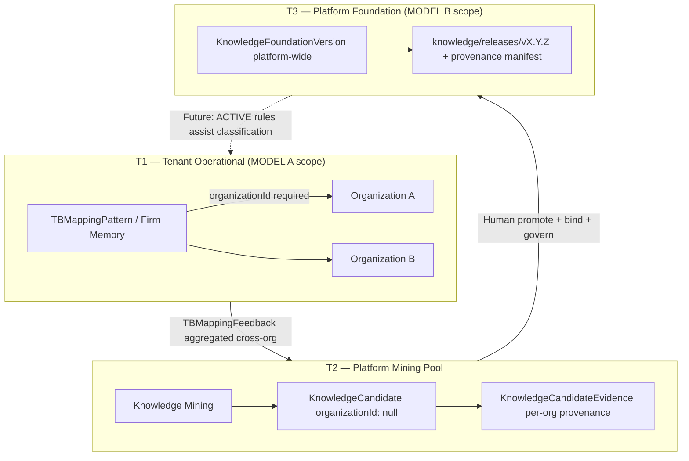

# Phase 28.0 — Tenant Policy Decision Audit

**Audit type:** Policy decision (read-only)  
**Date:** 2026-06-21  
**Prerequisite:** `docs/audits/PHASE_28_ARCHITECTURE_AUDIT.md`  
**Authority:** Repository source code, schema, and official doctrine at audit time  
**Constraints:** No code, migrations, commits, or PRs

---

## Executive Summary

AQLIYA already implements a **three-tier knowledge architecture** in code:

| Tier | System | Scope (proven) | Purpose |
|------|--------|----------------|---------|
| **T1 — Operational** | Firm Memory (`TBMappingPattern`) | **Tenant-scoped** (`organizationId` required) | Per-engagement TB classification learning |
| **T2 — Curated institutional candidates** | Knowledge Mining (`KnowledgeCandidate`) | **Cross-org by design** (`organizationId: null` on create) | Human-reviewed patterns aggregated across orgs |
| **T3 — Versioned institutional releases** | Knowledge Foundation DB (`KnowledgeFoundationVersion`) | **Platform-wide** (no `organizationId` field) | Governed release packages of promoted candidates |

Static regulatory knowledge (`knowledge-foundation/domains/ifrs|isa|socpa/`) is already **platform-wide canonical reference**, separate from DB versioning.

**FINAL DECISION: `MODEL_B`** — Platform-wide Foundation Versions with mandatory candidate provenance tracking.

**Rationale:** Repository intent, schema, mining pipeline, and static knowledge assets align with a **platform-curated institutional layer** above tenant-scoped firm memory. Model A would fight explicit cross-org mining design and duplicate the platform reference model. Model B requires **provenance and RBAC hardening** (not optional) before production multi-tenant exposure.

---

# Repository Evidence — Current Scoping

## Firm Memory (tenant-scoped)

| Evidence | Location |
|----------|----------|
| `TBMappingPattern.organizationId` required | `prisma/schema.prisma:3523`, `@@unique([organizationId, clientAccountCode])` |
| Lookup always scoped by `organizationId` | `firm-memory-engine.ts:187–194`, `214–217` |
| Feedback records scoped by `organizationId` | `firm-memory-engine.ts:254+`, `TBMappingFeedback.organizationId` `schema.prisma:3561` |
| Review mapping feedback passes `organizationId` | `firm-memory.ts:74–98` |

**Conclusion:** Operational TB intelligence is **strictly per-tenant**. No cross-org firm memory reads in production code.

## Knowledge Mining (cross-org institutional extraction)

| Evidence | Location |
|----------|----------|
| Pattern aggregator finds **repeated cross-org mapping patterns** | `pattern-aggregator.ts:4–6` docstring |
| Optional `organizationId` filter on aggregation input — default aggregates all orgs | `pattern-aggregator.ts:37–38`, `121–122`, `208–209` |
| `minOrganizationCount` threshold enforces multi-org support | `pattern-aggregator.ts:80–81`, `242–243` |
| Candidates created with `organizationId: null` + comment **"Cross-org institutional knowledge"** | `candidate-rule-generator.ts:96` |
| `organizationCount` field tracks contributing orgs | `prisma/schema.prisma:3619`, seed `seed-knowledge-mining.ts:27–28` |
| Evidence preserves per-source `organizationId` | `KnowledgeCandidateEvidence.organizationId` `schema.prisma:3647`, `candidate-rule-generator.ts:117` |
| Seed candidates use `organizationId: null` | `seed-knowledge-mining.ts:83` |

**Conclusion:** Mining pipeline is **architected for cross-org institutional learning**, not per-tenant silos.

## Knowledge Foundation Versioning (platform-wide)

| Evidence | Location |
|----------|----------|
| `KnowledgeFoundationVersion` has **no** `organizationId` | `prisma/schema.prisma:5371–5397` |
| `getVersions()` queries all versions — no tenant filter | `kf-service.ts:230–236` |
| RBAC by **role** only (`ADMIN` / `OPERATOR` / `VIEWER`), not organization | `kf-service.ts:203–225` |
| `VIEWER` may see `ACTIVE` versions globally | `kf-service.ts:217–220` |
| Release loads **all** `PROMOTED` candidates globally | `release-generator.ts:42–46` |
| `/knowledge-foundation/*` not in middleware `routeMinRoles` | `middleware.ts` — only `/api/knowledge-mining` listed |

**Conclusion:** Foundation versioning is **platform-global** today, with role gates but **no tenant isolation**.

## Static Knowledge Foundation (platform reference)

| Evidence | Location |
|----------|----------|
| `knowledge-foundation/domains/ifrs|isa|socpa|local-content/` | 300+ files at repo root |
| Authority registry is platform canonical | `knowledge-foundation/authority/README.md` |

**Conclusion:** "Knowledge Foundation" as a **product concept** already means **platform-wide institutional reference**, not per-tenant packs.

## Known tenant gaps (mining APIs)

| Finding | Source |
|---------|--------|
| API routes do not filter candidates by session `organizationId` | `candidates/route.ts:48–56` — no org param from session |
| `listCandidates` supports optional `filter.organizationId` but actions do not enforce it | `knowledge-candidate-service.ts:78`, `knowledge-mining-actions.ts:52–58` |
| Prior audit scored tenant isolation **4/10** on mining APIs | `docs/audits/KNOWLEDGE_FOUNDATION_FINAL_AUDIT.md:200` |

**Note:** These gaps affect **both models** until fixed. Model B adds provenance obligation; Model A adds org-scoped queries on foundation.

---

# Model Definitions

## MODEL A — Tenant-Scoped Foundation Versions

Each `KnowledgeFoundationVersion` belongs to one `organizationId` (or `platformOrganizationId`). Only candidates with matching `organizationId` (or evidence solely from that org) may bind to a version. Each tenant maintains independent version lifecycles (`DRAFT` → `ACTIVE`).

## MODEL B — Platform-Wide Foundation Versions + Provenance Tracking

`KnowledgeFoundationVersion` remains platform-global. Candidates bind with **full provenance**: source evidence, contributing `organizationId`s, promotion history, reviewer IDs, and manifest hashes. Release artifacts include provenance metadata; platform audit logs retain org-level traceability even when published rules are canonical (phrase → code).

---

# Comparative Evaluation

## 1. Governance

| Criterion | MODEL A | MODEL B |
|-----------|---------|---------|
| Human approval gates | Preserved per tenant | Preserved platform-wide (existing ADMIN approve / activate) |
| Separation of concerns | Clear tenant boundary | Requires explicit **operator vs tenant** role boundary for foundation workspace |
| Dual approval planes | Mining review + foundation approve **per tenant** | Mining review + **platform** foundation approve |
| Alignment with existing RBAC | Requires new org checks on all KF mutations | Matches current role-only KF service |
| Risk | Tenants may diverge incompatible rule packs | Cross-tenant data in ACTIVE release if provenance/RBAC weak |

**Evidence for tension:** `kf-service.ts` grants any `VIEWER` access to `ACTIVE` versions without org check — under Model B with cross-org candidates, tenant VIEWERs could see rules derived from other orgs' feedback unless consumption policy is defined.

**Verdict:** Model A wins on **isolation-by-default**. Model B wins on **single institutional governance plane** matching operator-curated releases — **if** provenance + access policy are mandatory.

---

## 2. Auditability

| Criterion | MODEL A | MODEL B |
|-----------|---------|---------|
| Audit chain | Per-tenant `productKey` logs | Cross-product chain: `knowledge-mining` → `knowledge-foundation` |
| Evidence linkage | Simpler (one org) | **Requires** junction + provenance manifest (Phase 28.1) |
| Regulator question: "Who approved this rule?" | Tenant ADMIN | Platform ADMIN + mining `reviewerId` + `KnowledgePromotionHistory` |
| Regulator question: "Which clients contributed?" | Implicit (one org) | **Must be answerable** via `KnowledgeCandidateEvidence` + manifest |

**Evidence:** Mining audit already writes `artifactPath` on promote (`knowledge-review/audit-handler.ts:79–82`). Foundation audit uses separate `productKey` (`knowledge-foundation/audit-handler.ts:44`). No cross-link today.

**Verdict:** Model B **requires** provenance tracking to match Model A's defensibility. Without provenance, Model B fails audit. With provenance, Model B provides **richer** institutional audit chain.

---

## 3. Knowledge Reuse

| Criterion | MODEL A | MODEL B |
|-----------|---------|---------|
| Cross-org pattern leverage | **Blocked** — each tenant rebuilds from own feedback | **Enabled** — matches `organizationCount`, `minOrganizationCount` |
| Single-org tenants | Full value from own data | Lower value until multiple orgs contribute |
| Static IFRS/ISA alignment | Per-tenant packs diverge from canonical | Aligns with platform `knowledge-foundation/domains/` |
| Mining pipeline fit | **Conflicts** with `organizationId: null` create path | **Native fit** |

**Evidence:** `KNOWLEDGE_FOUNDATION_FEEDBACK_LOOP_AUDIT.md:185` — "Cross-org pattern mining | Not possible → Aggregates from all orgs".

**Verdict:** Model B strongly favored for **institutional learning** and reuse.

---

## 4. Regulatory Defensibility

| Criterion | MODEL A | MODEL B |
|-----------|---------|---------|
| Client confidentiality (audit firms) | **Strong** — no cross-tenant rule sharing | **Conditional** — rules must be de-identified canonical mappings; provenance internal |
| Demonstrating evidence basis | Per-tenant chain | **Stronger** if manifest lists evidence IDs + org counts, not client PII |
| Saudi market / multi-firm SaaS | Safer default for competing tenants | Requires governance policy: ACTIVE rules are **non-client-specific** suggestions |
| Private / On-Prem single institution | Works | Works — platform-wide = institution-wide |

**Evidence:** Promotion artifacts state `requiresHumanReview: true` (`promotion-service.ts:98`). Mining does not auto-merge to production rules (`promotion-service.ts:6–9`).

**Verdict:** Model A safer for **raw multi-tenant SaaS without policy**. Model B defensible when releases contain **canonical suggestions only** + full provenance in audit/manifest (not client account lines).

---

## 5. Multi-Tenant Isolation

| Criterion | MODEL A | MODEL B |
|-----------|---------|---------|
| Data plane isolation | `organizationId` on `KnowledgeFoundationVersion` | No tenant field today |
| Query isolation | Filter all KF queries by session org | Must filter **consumption**, not necessarily **curation** |
| Firm Memory boundary | Unchanged (tenant) | Unchanged (tenant) — **operational data stays tenant-scoped** |
| Current code readiness | Requires schema + query changes | **Schema already matches**; provenance + RBAC gaps remain |

**Verdict:** Model A wins isolation. Model B acceptable with **tiered access**: tenants consume **ACTIVE canonical rules**; operators curate with full provenance; firm memory never crosses tenants.

---

## 6. Institutional Learning

| Criterion | MODEL A | MODEL B |
|-----------|---------|---------|
| Platform learns across customers | No | Yes — core mining design |
| `organizationCount` semantics | Marginal | Central |
| Longitudinal version diff | Per-tenant history | Platform institutional roadmap |
| Operator institutional memory | Fragmented | Unified ACTIVE foundation |

**Verdict:** Model B aligns with mining architecture and AQLIYA "institutional intelligence platform" positioning (`aqliya-vision-v1.1.md:13`, `PRODUCT_STATUS_MATRIX.md` — "institutional knowledge").

---

## 7. Long-Term AQLIYA Strategy

| Strategic direction | MODEL A | MODEL B |
|--------------------|---------|---------|
| Platform-first (not product silos) | Weaker | **Stronger** |
| Cloud + Private per institution | Per-deployment tenant scope in private; SaaS needs isolation policy | Private = one institution platform-wide; SaaS = curated canonical layer |
| Static `knowledge-foundation/domains/` | Diverges (per-tenant copies?) | **Extends same model** — regulatory domains + mined institutional overlays |
| Intelligence Core consolidation | Duplicate knowledge engines per tenant | Single governed institutional release consumed by TB intelligence |
| Phase 28 hybrid bridge (Option D) | Org-scoped binding | Platform binding + provenance manifest |

**Verdict:** Model B aligns with repository structure and stated Phase 9/27 "institutional knowledge" product classification.

---

# Three-Tier Model (Recommended Mental Model)



**Key principle:** Tenant isolation lives in **T1**. **T3** publishes **canonical, human-approved mapping suggestions** — not raw client TB data. **T2** bridges with provenance.

---

# Model A — Full Analysis

## Advantages

- Strong multi-tenant isolation without cross-tenant ACTIVE visibility concerns.
- Matches LocalContentOS / SalesOS org-scoping patterns (`organizationId` on domain entities).
- Simpler regulatory narrative for competing audit firms on shared SaaS.
- Natural fit if each customer treats foundation as **their** institutional pack.

## Risks

- **Fights mining implementation:** `candidate-rule-generator.ts:96` explicitly sets `organizationId: null`.
- **Reduces `organizationCount` value** — cross-org thresholds become meaningless per-tenant.
- **Duplicates** platform static `knowledge-foundation/domains/` (would need per-tenant copies or references).
- **Schema migration** on `KnowledgeFoundationVersion` + all KF queries + binding logic.
- **Splits institutional learning** — platform cannot improve from aggregate patterns.

## Governance impact

- Double governance per tenant (manageable but operationally heavy).
- Platform operators lose single ACTIVE canonical line.

## Operational complexity

- **High** — reverse cross-org mining intent or fork pipelines (org-scoped vs platform-scoped candidates).

---

# Model B — Full Analysis

## Advantages

- **Matches current schema** (`KnowledgeFoundationVersion` without `organizationId`).
- **Matches mining pipeline** (cross-org aggregation, `organizationCount`, null `organizationId` on candidates).
- **Matches static knowledge foundation** (platform-wide IFRS/ISA/SOCPA domains).
- **Maximizes knowledge reuse** across institutions.
- **Firm Memory remains tenant-scoped** for day-to-day operations — no replacement of T1.
- Provenance enables **"Evidence governs"** at institutional release level.

## Risks

- Cross-tenant leakage if ACTIVE versions expose rules derived from other orgs' feedback without policy.
- `VIEWER` global ACTIVE access (`kf-service.ts:217–220`) problematic until consumption rules defined.
- Requires **mandatory** provenance manifest — not optional nice-to-have.
- Operators must enforce **canonical-only** release content (phrase → code), never client identifiers.

## Governance impact

- Preserves dual human gates: mining review/promote + foundation approve/activate.
- Adds **platform operator accountability** for institutional releases.
- Audit chain must link `knowledge.candidate.promoted` → `knowledge.foundation.version.released` via binding IDs.

## Operational complexity

- **Medium** — provenance schema + manifest + audit metadata (Phase 28.1–28.2); no reversal of mining design.

---

# Alignment with Trust Principle

> **AI assists. Humans decide. Evidence governs.**  
> (`docs/official/aqliya-vision-v1.1.md:39`)

| Principle | MODEL A | MODEL B |
|-----------|---------|---------|
| **AI assists** | Mining still assistive; per-tenant foundation | Same — mining aggregates; no autonomous release |
| **Humans decide** | Tenant ADMIN approves tenant version | Platform ADMIN approves **institutional** version; mining OPERATOR promotes |
| **Evidence governs** | Per-tenant evidence chain | **Stronger when provenance manifest** links each rule to `KnowledgeCandidateEvidence` sources and reviewer actions |

**Why Model B aligns better with "Evidence governs":**

1. Mining already stores **evidence per candidate** (`KnowledgeCandidateEvidence`) with `organizationId`, `accountCode`, `evidenceId` (`schema.prisma:3642–3656`).
2. Model B **requires** carrying that evidence chain into foundation release manifests and audit metadata — making governance auditable at institutional level.
3. Model A isolates evidence but **prevents** governed institutional learning that the mining pipeline was built to produce (`pattern-aggregator.ts` cross-org design).

**Condition:** Model B only satisfies the trust principle if Phase 28.1 implements **provenance as a hard requirement**, not metadata optional.

---

# Mandatory Conditions for MODEL B (Phase 28.1+)

These are **policy requirements**, not optional enhancements:

| # | Requirement | Rationale |
|---|-------------|-----------|
| P1 | **Provenance manifest** in every release package listing `candidateId`, `evidenceIds[]`, `organizationIds[]` (distinct), `reviewerId`, `promotedBy`, `promotedAt` | Regulatory defensibility |
| P2 | **Junction table** `KnowledgeFoundationVersionCandidate` with `boundAt`, `boundById` | Version integrity (Phase 28 architecture) |
| P3 | **Release content rule:** only canonical fields in `knowledge-foundation.json` — no raw `clientAccountCode` from evidence in published rules | Confidentiality |
| P4 | **Audit cross-link:** foundation release audit metadata includes `candidateIds[]` | Chain mining → foundation |
| P5 | **Access policy decision (28.3):** classify `/knowledge-foundation` as **platform operator workspace** OR filter ACTIVE consumption by tenant policy in runtime (Phase 29) | Multi-tenant safety |
| P6 | **Fix mining API tenant filters** independent of model — session-derived org for list/detail when tenant-scoped views added | Close 4/10 isolation gap |

---

# MODEL A vs MODEL B — Decision Matrix

| Dimension | MODEL A | MODEL B | Weighted winner |
|-----------|---------|---------|-----------------|
| Governance (operator model) | Good | Good + needs RBAC policy | Tie |
| Auditability | Good | **Better with provenance** | **B** |
| Knowledge reuse | Poor | **Excellent** | **B** |
| Regulatory defensibility (SaaS) | **Excellent** | Good with P1–P6 | A (narrow) |
| Multi-tenant isolation | **Excellent** | Conditional | A |
| Institutional learning | Poor | **Excellent** | **B** |
| Long-term AQLIYA strategy | Moderate | **Strong** | **B** |
| Repository implementation fit | Poor (fight code) | **Native** | **B** |
| Trust principle "Evidence governs" | Good | **Stronger** | **B** |

**Score:** Model B wins on strategic, architectural, and evidence-governance alignment. Model A wins on naive multi-tenant isolation — addressable under Model B via tiered access + canonical-only releases without abandoning cross-org mining.

---

# Implications for Phase 28.1

If **MODEL_B** (decided):

| Area | Policy |
|------|--------|
| `KnowledgeFoundationVersion` | **No** `organizationId` added |
| Junction / provenance | **Required** on bind and release |
| Eligible candidates | `PROMOTED` + unbound; provenance from evidence rows |
| `organizationId: null` candidates | **Allowed** — represent cross-org institutional candidates |
| `organizationId` set candidates | Allowed with provenance from evidence |
| Firm Memory | **Unchanged** — remains tenant-scoped |
| Release generator | Version-scoped candidates only; manifest includes provenance block |
| Diff engine | Compare version-bound snapshots, not global `PROMOTED` |

If **MODEL_A** had been chosen (not selected):

- Add `organizationId` to `KnowledgeFoundationVersion`.
- Filter all KF queries by session org.
- Change mining create path or split candidate types.
- Per-tenant ACTIVE versions — **major rework**.

---

# FINAL DECISION

```text
FINAL DECISION:
MODEL_B
```

**Platform-wide Foundation Versions with mandatory candidate provenance tracking.**

### Why Model B over Model A

1. **Code intent:** Cross-org mining is explicit (`candidate-rule-generator.ts:96`, `pattern-aggregator.ts:4–6`).
2. **Schema reality:** `KnowledgeFoundationVersion` is already platform-global.
3. **Product taxonomy:** "Institutional knowledge" and static `knowledge-foundation/domains/` are platform-wide.
4. **Three-tier architecture:** Firm Memory (tenant) + Foundation (platform) is already emerging; Model A collapses tiers incorrectly.
5. **Trust principle:** Provenance-heavy Model B best satisfies **Evidence governs** at institutional release level.
6. **Phase 28 Option D:** Hybrid bridge assumes platform binding with scoped snapshots — natural fit for Model B.

### What Model B does NOT mean

- It does **not** mean sharing raw client TB data across tenants.
- It does **not** mean autonomous institutional release without ADMIN approval.
- It does **not** mean ignoring tenant isolation in **Firm Memory** or future runtime consumption without access policy (P5, P6).

### Blocking policy for 28.1 implementation

**Proceed with MODEL_B only if Phase 28.1 includes provenance manifest (P1) and junction binding (P2) as non-negotiable scope.**

---

## Appendix — Source File Index

| System | Key paths |
|--------|-----------|
| Firm Memory | `src/lib/tb-intelligence/firm-memory-engine.ts`, `prisma/schema.prisma` (`TBMappingPattern`) |
| Knowledge Mining | `src/lib/tb-intelligence/knowledge-mining/`, `src/actions/knowledge-mining-actions.ts` |
| Knowledge Foundation | `src/lib/knowledge-foundation/`, `prisma/schema.prisma` (5361–5435) |
| Static domains | `knowledge-foundation/domains/` |
| Prior audits | `docs/audits/PHASE_28_ARCHITECTURE_AUDIT.md`, `KNOWLEDGE_FOUNDATION_FEEDBACK_LOOP_AUDIT.md` |
| Doctrine | `docs/official/aqliya-vision-v1.1.md` |

---

*Decision audit completed. No code changes made.*
