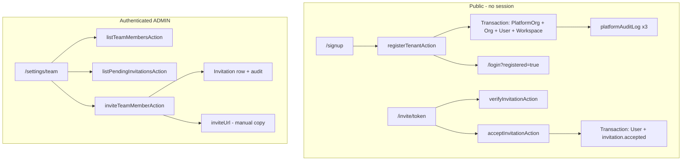

# AQLIYA Platform Readiness Audit

**Date:** 2026-06-05  
**Mission:** Platform Stabilization & Readiness Program (analysis only)  
**Baseline `main` HEAD:** `1dbfa075c31fcd935b813cc952a09c6d4d1f3516`  
**Working tree:** ~525 WIP paths (modified + untracked)  
**SalesOS Intelligence Hub:** Validated in working tree (Market, Proof, Memory, Knowledge Graph; `prisma-intelligence-all.test.ts` — 10 tests; build/TS clean per steward context)  
**Scope rule:** No architecture redesign, no new features, no schema redesign — stabilization and release preparation only.

**Related artifacts:** `WIP_CLUSTER_REPORT.md` (repo root, hygiene clusters), `docs/operations/execution-director-gap-register.md`, `docs/deployment/DEPLOYMENT_READINESS_REPORT.md`, `docs/operations/platform-action-guards.md`.

---

## Executive summary

| Dimension | `main` (committed) | Working tree (local) |
|-----------|-------------------|----------------------|
| Build / TS / tests | Green at `1dbfa07` (941+ tests after A1-02/LC/security commits) | SalesOS hub + broader WIP; do not assume `main` parity without re-run |
| Feature gaps (SalesOS hub) | Not the bottleneck | Intelligence hub validated locally |
| Operational readiness | **Primary bottleneck** | Staging pgvector, WIP hygiene, docs/code drift |
| Registration / onboarding | **Not on `main`** | Implemented but **untracked** |
| Commercial truthfulness | **At risk** | SoT docs claim L0-09 registration “done” while code is WIP |

**Verdict:** Pilot-ready **candidate on committed `main`** for core products (AuditOS, partial platform), with **conditional** release until WIP is clustered, registration is landed or docs corrected, and ops gates (pgvector staging, pen test, backup automation in target env) are executed.

---

## 1. Repository hygiene

### 1.1 WIP inventory

| Metric | Value |
|--------|------:|
| Total WIP paths | **525** |
| Modified (`M`) | **246** |
| Deleted (`D`) | **58** |
| Untracked (`??`) | **220** |
| Tracked line churn (approx.) | **+4,891 / −10,648** |

### 1.2 Categorization (modified + untracked)

| Category | Paths (approx.) | Risk | Notes |
|----------|----------------:|------|-------|
| **SalesOS** | 272 | CRITICAL | Mass `v02` deletions; `vnext` / `prisma-*` / services churn; isolate branch |
| **Platform** | 145 | HIGH | IC/AI, auth/MFA, CI, infra, middleware, scripts |
| **Docs** | 75 | MEDIUM (authority) | Official/SoT/validation drift vs `main` |
| **AuditOS** | 18 | HIGH | `audit-actions.ts` WIP beyond `e958494` |
| **Prisma** | 7 | HIGH | 3 untracked migrations + schema/seed edits |
| **LocalContentOS** | 5 | MEDIUM | Overlay on committed LC-01/LC-03 |
| **DecisionOS** | 2 | MEDIUM | Post–D3-01 diff review |
| **Auth** (cross-cut) | ~15 in Platform | HIGH | MFA, session, `tenant-actions` already fixed on `main` |
| **Experimental** | `docs/archive/code/sales-v02/**`, `src/lib/sales/_v02/**`, claude/* branches | LOW–MED | Archive or delete with Sales branch |

### 1.3 Committed baseline on `main` (stabilization wins)

| Commit | Area |
|--------|------|
| `1dbfa07` | Tenant-actions IDOR fix (platform org scoped) |
| `90fea4e` | Action-guard CI patterns + `platform-action-guards.md` |
| `9897212` | Workflow-gating test (16 tabs incl. sampling) |
| `e958494` | A1-02 audit sampling |
| `163fe5f` / `5cca20b` | LC-03 approval routing, LC-01 scoring |
| `d680396` | Edge rate limit / build stabilization |
| `bbc905e` | D3-01 DecisionOS outcome dashboard |

### 1.4 Dead code and duplication (prefer deletion over expansion)

| Item | Location | Recommendation |
|------|----------|----------------|
| SalesOS v02 tree | WIP deletes under `src/lib/sales/v02/**`; copy in `docs/archive/code/sales-v02/` | One branch: keep **vnext + prisma services** OR archive; delete duplicate tree |
| Proof effectiveness | `vnext/proof-effectiveness.ts`, `vnext/proof-effectiveness-wave-b.ts`, `services/proof-effectiveness-service.ts`, `prisma-proof-effectiveness.ts`, `_v02/**` tests | Consolidate to **single service + prisma adapter**; remove `_v02` after tests moved |
| Market intelligence | `vnext/market-intelligence`, `services/market-intelligence-service.ts`, `_v02/market-intelligence/**` | Same — one facade, one service |
| Institutional learning / knowledge graph | Parallel vnext vs `_v02` vs archived docs | Align with Intelligence Hub tabs; drop unused wave files |
| `*.full.bak` / local backups | Working tree | Delete after branch cut; never commit |
| Abandoned local branches | 8× `claude/*` at `591ee63`, `feature/salesos-*`, `eid-sprint-stabilization` | Archive or delete after confirming no unique commits needed |

### 1.5 Dangerous overlays (revert before any `main` merge)

| File | On `main` | WIP risk |
|------|-----------|----------|
| `src/actions/audit-actions.ts` | Sampling slice (`e958494`) | +auth refactor — can break A1-02 |
| `src/actions/localcontent-actions.ts` | LC-03 routing only (`163fe5f`) | Extra guards / dual-write |
| `src/lib/local-content/audit-events.ts` | Unchanged | Platform dual-write WIP |
| `package.json` / lockfile | Known good | Dependency drift |

---

## 2. WIP reduction plan

### 2.1 Orphaned / untracked product surfaces

| Path | Status | Issue |
|------|--------|-------|
| `src/actions/registration-actions.ts` | `??` | Required by signup/invite/team UI; **not on `main`** |
| `src/app/signup/**` | `??` | Public route missing from `main` |
| `src/app/invite/**` | `??` | Public route missing from `main` |
| `src/app/(dashboard)/settings/team/**` | `??` | Team management missing from `main` |
| `src/app/login/page.tsx` | `M` | WIP adds `/signup` link — **broken on `main` if merged without signup** |
| Prisma migrations `20260603000001_*`, `20260603220000_*`, `20260605000001_ic01_*` | `??` | Not on `main`; IC/pgvector blocked until landed |

### 2.2 Stale migrations

| Migration | On `main` | WIP | Notes |
|-----------|-----------|-----|-------|
| `20260605000001_ic01_pgvector_document_chunk` | No | Untracked | Ops: failed state possible on dev DB (`DRY_RUN_REPORT`); staging uses pgvector image |
| `20260603000001_add_platform_secret_and_notification` | No | Untracked | Platform secrets / notifications |
| `20260603220000_add_notification_preferences` | No | Untracked | Depends on prior |
| `20260601180000_salesos_l5_governance` | Yes | **Modified** | Coordinate with SalesOS branch only |

**Rule:** Land Prisma in **one** branch (`platform/prisma-ic-notifications`) with CI `db push` + pgvector job — not mixed with SalesOS deletes.

### 2.3 Obsolete / inconsistent feature flags

| Flag | Registry default | Env | Assessment |
|------|------------------|-----|------------|
| `tenant.self-service` | on | `FF_TENANT_SELF_SERVICE=false` → off | Registration WIP depends on this — document in pilot env |
| `tenant.lifecycle` | off | `FF_TENANT_LIFECYCLE` | Admin tenant CRUD separate from self-service |
| `ai.rag` | off | `FF_AI_RAG` | Correct until pgvector staging proven |
| `queue.enabled` | off | `FF_QUEUE_ENABLED` | Staging compose sets `true` — verify workers before prod |
| `ai.real-providers` | off | `FF_AI_REAL_PROVIDERS` | Staging pilot only per activation runbook |

No removal recommended without env audit; prefer **documented staging profile** over new flags.

### 2.4 Abandoned branches (local)

| Branch | Tip | Action |
|--------|-----|--------|
| `claude/*` (6 branches) | `591ee63` | Stale; delete or archive if merged to WIP |
| `feature/salesos-reintegration-main` | `98820d1` | Review once; likely superseded by WIP |
| `feature/salesos-l6-unblock` | `3ea008d` | Review once |
| `eid-sprint-stabilization-2026-05-29` | `6a36d8d` | Historical |
| `website-soft-launch-release` | `1df4a3a` | Marketing-only; do not mix with platform stabilization |

### 2.5 Recommended hygiene sequence

1. **Freeze `main`** at `1dbfa07` — no monolithic WIP commit.
2. **Branch or stash** full WIP: `wip/2026-06-05-full` or per-cluster branches (see §6).
3. **Revert overlays** on `audit-actions.ts`, `localcontent-actions.ts` to match HEAD unless opening dedicated PRs.
4. **Land registration** as smallest platform commit (§6.1).
5. **Land Prisma + IC** before enabling `FF_AI_RAG` in any environment.
6. **SalesOS last** — largest cluster; requires full `build` + test cycle.
7. **Docs authority pass** — align PRODUCT_STATUS_MATRIX / ROUTE_STRATEGY with what is actually on `main`.

---

## 3. Readiness audit

Legend: **Ready** = evidenced on `main` or documented procedure exists; **Partial** = code exists, ops not proven; **Not ready** = blocker.

### 3.1 Staging readiness

| Check | Status | Evidence / gap |
|-------|--------|----------------|
| `docker-compose.staging.yml` (pgvector image) | Partial | File in WIP/untracked area — verify on branch before staging deploy |
| Migrations on staging DB | Not ready | OPS-01: `migrate deploy` + resolve `ic01_pgvector` state |
| pgvector verify script | Partial | `scripts/verify-pgvector-staging.ts` + runbook exist |
| Live IC smoke | Not ready | OPS-02/03 — `ai-intelligence-activation.md` staging log empty |
| Registration on staging | Not ready | Flow not on `main`; env `NEXT_PUBLIC_APP_URL` required for invite URLs |
| Redis + queue in staging compose | Partial | Enabled in compose — validate workers and `FF_QUEUE_ENABLED` |

### 3.2 Deployment readiness

| Check | Status | Evidence / gap |
|-------|--------|----------------|
| `npm run build` / `tsc` on `main` | Ready | Reported green post–`d680396` / Phase 2 |
| GitHub Actions CI | Ready | `ci.yml` — tests, tsc, lint |
| `deploy.yml` (AWS ECR) | Partial | Exists; requires secrets, staging branch discipline |
| Terraform modules | Partial | L0-01 review done; **no apply** in repo evidence |
| Production secrets | Not ready | `AUTH_SECRET`, `DOWNLOAD_TOKEN_SECRET` must be set per deployment report |
| E2E in CI | Not ready | Accepted gap |
| SAST/DAST in CI | Not ready | Accepted gap; L0-04 pen test open |

### 3.3 Monitoring readiness

| Check | Status | Evidence / gap |
|-------|--------|----------------|
| `/api/health` | Ready | DB, Redis, queue checks |
| System monitor + queue API | Ready | `system-monitor.ts`, retry endpoints |
| HTTP request/error metrics | Not ready | P0 gap — observability audit |
| External alerting (PagerDuty/Slack) | Not ready | In-memory alerts only |
| AI spend / governance dashboards | Ready | `/monitoring/ai`, APIs |

### 3.4 Backup readiness

| Check | Status | Evidence / gap |
|-------|--------|----------------|
| Backup scripts | Ready | `db-backup.ts`, scheduler, verify, restore drill |
| `backup.yml` workflow | Partial | Requires `DATABASE_URL` secret; not proven in this audit run |
| Automated backup in pilot env | Not ready | READINESS_GATES: manual/cron guidance — must be configured per host |
| CI backup test | Not ready | Accepted gap |

### 3.5 Recovery readiness

| Check | Status | Evidence / gap |
|-------|--------|----------------|
| Restore procedure | Ready | `docs/operations/backup-restore-procedure.md`, `CONFIRM_RESTORE` |
| Restore drill script | Ready | `npm run db:restore:drill` |
| Documented RTO/RPO | Partial | HA/DR docs in WIP — ops review |
| Failed migration recovery | Partial | `migrate resolve` documented for pgvector |

### 3.6 pgvector readiness

| Check | Status | Evidence / gap |
|-------|--------|----------------|
| Migration SQL | Partial | Untracked `20260605000001_ic01_pgvector_document_chunk` |
| Extension on Windows dev | Not ready | Deployment report: use Docker pgvector image |
| Staging activation | Not ready | OPS-01–03 open |
| `FF_AI_RAG` default | Ready (safe) | Off until ops proof |
| Health check for pgvector | Partial | Fixed in observability audit 2026-06-04 |

### 3.7 Observability readiness

| Check | Status | Evidence / gap |
|-------|--------|----------------|
| AI observability API | Ready | `src/lib/ai/observability.ts` |
| Platform audit trail for AI | Ready | GOV-01 closed per gap register |
| Centralized error tracking | Not ready | Scattered; no Sentry-equivalent |
| Disk / upload storage health | Partial | Stubs in system monitor |
| Migration status in health | Not ready | Medium gap per observability audit |

---

## 4. Registration flow review

**Files audited:** `src/actions/registration-actions.ts`, `src/app/signup/page.tsx`, `src/app/invite/[token]/page.tsx`, `src/app/(dashboard)/settings/team/page.tsx`, `src/app/login/page.tsx` (WIP link), `prisma/schema.prisma` (`Invitation` model on disk), `src/lib/platform/feature-flags/registry.ts`.

**Critical:** None of the registration **routes, actions, or Prisma `Invitation` model** are in `main` HEAD (`git show HEAD:prisma/schema.prisma` has no `Invitation`). The working-tree schema adds `Invitation` plus related platform models in the same WIP diff. Documentation (`PRODUCT_STATUS_MATRIX`, `ROUTE_STRATEGY`, `L6_COMPLETION_PROGRAM`) describes L0-09 as **complete** — this is **authority drift** until schema + migration + app code land together.

### 4.1 Flow map

### 4.2 `registration-actions.ts` — controls

| Action | Guard | Audit | Notes |
|--------|-------|-------|-------|
| `registerTenantAction` | `requireEnabled("tenant.self-service")` | `tenant.created`, `user.registered`, `workspace.created` | No session; bcrypt cost 12; slug Latin-only |
| `inviteTeamMemberAction` | `requireUserContext("ADMIN")` | `invitation.sent` via `writePlatformAuditLog` | Returns URL; **no email send** |
| `verifyInvitationAction` | Public (token hash) | None | Returns org name/email/role |
| `acceptInvitationAction` | Public (token hash) | `invitation.accepted` | Single-use `acceptedAt` |
| `listTeamMembersAction` | `requireUserContext()` | None | Org-scoped via user |
| `listPendingInvitationsAction` | `requireUserContext("ADMIN")` | None | Org-scoped |

**CI:** Local `node scripts/audit-action-guards.mjs` sees `registration-actions.ts` when file exists; **will not run on `main`** until committed.

### 4.3 Gaps and risks (registration)

| ID | Severity | Finding |
|----|----------|---------|
| REG-01 | **Critical** | Registration stack not on `main` — docs overclaim vs deployable `main` |
| REG-01b | **Critical** | `Invitation` Prisma model only in WIP schema — C1 must include migration |
| REG-02 | **Critical** | WIP login links to `/signup` without signup on `main` if login merged alone |
| REG-03 | **Medium** | Invite delivery is copy-paste URL only — no SMTP/notification integration |
| REG-04 | **Medium** | `existingInvite` check is global by email, not per-organization |
| REG-05 | **Medium** | `toSlug()` rejects Arabic-only org names (Latin alphanumeric only) |
| REG-06 | **Low** | `verifyInvitationAction` / accept — no rate limiting documented |
| REG-07 | **Low** | Team UI shows placeholder invite URL pattern `[token]` for copy hint |
| REG-08 | **Low** | New tenants `pending_setup` — no automated provisioning checklist in UI |

### 4.4 Onboarding vs team creation

| Step | Implemented | On `main` |
|------|-------------|-----------|
| Self-service tenant signup | Yes (WIP) | No |
| Default workspace creation | Yes (WIP) | No |
| Admin invites member | Yes (WIP) | No |
| Member accepts invite | Yes (WIP) | No |
| Sidebar “Team” nav (4 modules) | Documented in SoT | Verify in WIP only |
| `tenant.lifecycle` admin CRUD | `tenant-actions.ts` on `main`, flag default off | Partial |

**Recommendation:** Land registration as **one atomic commit** (actions + signup + invite + team + login link + route docs), or **remove login signup link** until landed.

---

## 5. SalesOS Intelligence Hub (context)

Per mission context, hub validation is **complete in the working tree** (not a feature-gap blocker):

| Tab | Test / module signal |
|-----|----------------------|
| Market | `prisma-intelligence-all.test.ts` |
| Proof | `prisma-intelligence-all.test.ts` + `proof-effectiveness.test.ts` |
| Memory | Covered in hub integration tests |
| Graph | `prisma-intelligence-all.test.ts` |
| Cross-tab | **10** `it()` blocks in `prisma-intelligence-all.test.ts` |

**Stabilization note:** Duplicated implementations (`v02` / `_v02` / `vnext` / `prisma-*`) remain a **maintainability** risk, not a functional blocker for the hub slice. Consolidate on the SalesOS hygiene branch.

---

## 6. Required commits (commit plan)

Ordered for minimal blast radius. Each branch should run: `npx tsc --noEmit`, `node scripts/audit-action-guards.mjs`, targeted `npm test`, then `npm run build` when approved.

| # | Branch | Contents | Priority |
|---|--------|----------|----------|
| C1 | `platform/registration-l0-09` | `Invitation` schema + migration, `registration-actions.ts`, `signup/`, `invite/`, `settings/team/`, login signup link, SoT route lines | **P0** |
| C2 | `platform/revert-action-overlays` | Restore `audit-actions.ts`, `localcontent-actions.ts` to HEAD (or discard WIP) | **P0** |
| C3 | `platform/prisma-ic-notifications` | Untracked migrations + schema/seed deltas; **exclude** Sales governance migration edit unless required | **P0** |
| C4 | `docs/program-reports-2026-06` | Validation, operations, execution backlog — authority review | **P1** |
| C5 | `wip/auditos-loading-boundaries` | Untracked `error.tsx` / `loading.tsx` only | **P2** |
| C6 | `wip/salesos-vnext-consolidation` | Full SalesOS cluster + archive policy for `v02` | **P2** (last) |
| C7 | `platform/infra-cicd` | `.github/workflows`, terraform, docker-compose staging | **P2** |

**Do not:** Single commit of 525 paths. **Do not:** Mix C1 with C6.

### Already on `main` (no redo)

- `90fea4e`, `1dbfa07` — platform security  
- `e958494`, `163fe5f`, `5cca20b`, `9897212` — product slices  
- `d680396` — build/edge  

---

## 7. Blockers

### 7.1 Critical

| ID | Blocker | Mitigation |
|----|---------|------------|
| B-C1 | **525-path WIP** blocks clean release tagging and truthful CI from local tree | Cluster per §6; revert overlays (C2) |
| B-C2 | **Registration + `Invitation` schema not on `main`** while docs claim L0-09 complete | C1 (schema+migration+code) or correct docs downward |
| B-C3 | **Staging pgvector not activated** (OPS-01–03) | Run `pgvector-staging-validation-runbook.md` |
| B-C4 | **Prisma IC migrations not on `main`** | C3 before `FF_AI_RAG=true` in any env |
| B-C5 | **External penetration test not executed** (L0-04) | Vendor engagement — Commercial Ready gate |

### 7.2 Medium

| ID | Blocker | Mitigation |
|----|---------|------------|
| B-M1 | Login `/signup` link without signup route on `main` | Ship C1 atomically |
| B-M2 | SalesOS duplicate modules (`v02`/`vnext`/`prisma-*`) | C6 consolidation |
| B-M3 | HTTP metrics / centralized errors missing | Observability phase — not release-blocking for pilot if health OK |
| B-M4 | Backup automation not proven in target pilot host | Cron + `backup.yml` secrets |
| B-M5 | `audit-actions` / `localcontent-actions` WIP overlay | C2 |
| B-M6 | Global invitation duplicate check (REG-04) | Scope query by `organizationId` in follow-up fix |

### 7.3 Low

| ID | Blocker | Mitigation |
|----|---------|------------|
| B-L1 | Invite email not automated (REG-03) | Pilot runbook: manual URL copy |
| B-L2 | Arabic slug limitation (REG-05) | Document or transliteration helper (future) |
| B-L3 | Stale local `claude/*` branches | Delete after review |
| B-L4 | E2E / SAST not in CI | Track in L6 program |
| B-L5 | Malware scanner for uploads (READINESS_GATES) | Pilot policy |

---

## 8. Release recommendations

### 8.1 Pilot release (AuditOS / LocalContentOS / DecisionOS on `main`)

| Recommendation | Detail |
|----------------|--------|
| **Go (conditional)** | Tag from **`main` at green CI`**, not from full WIP tree |
| **Pre-flight** | `npx tsc --noEmit`, `npm test`, `npm run build`, `node scripts/audit-action-guards.mjs`, `npm run audit:health` |
| **Exclude** | SalesOS mass WIP, IC RAG until C3 + OPS-01–03 |
| **Registration** | Either ship C1 before pilot self-service OR disable `tenant.self-service` and remove signup CTA |
| **AI** | Keep `FF_AI_RAG=false`, `FF_AI_REAL_PROVIDERS` per org until staging log filled |

### 8.2 Staging / IC-enabled pilot

| Step | Action |
|------|--------|
| 1 | Merge C3 (migrations) to staging branch |
| 2 | `docker-compose.staging.yml` up with pgvector image |
| 3 | `migrate deploy` + `verify-pgvector-staging.ts` |
| 4 | `scripts/staging-ic01-activate.ps1` + smoke log |
| 5 | Enable `FF_AI_RAG` only after OPS-03 pass |

### 8.3 Commercial / production

| Gate | Status |
|------|--------|
| READINESS_GATES “Commercial Ready” | **No-go** until B-C5, SSO, automated backup proof, monitoring |
| SalesOS as product | Remains **L3 prototype** on `main`; hub validation does not raise commercial level |
| Documentation | Run docs authority pass after C1/C3 so matrices match `main` |

### 8.4 Deletion-first stabilization (no expansion)

1. Delete `src/lib/sales/v02` remnants and `_v02` after test port.  
2. Remove `*.full.bak` and duplicate proof/market modules.  
3. Do not add new feature flags or schema models in stabilization window.  
4. Prefer **revert** of action-file overlays over forward-merge of 500+ files.

---

## 9. Validation performed for this audit

| Command | Result |
|---------|--------|
| `git log --oneline -12` | Executed |
| `git status --porcelain` | ~525 paths |
| File reads (deployment, gap register, registration, flags, WIP report) | Executed |
| `git show HEAD:` for signup/registration | **Not in HEAD** |
| `node scripts/audit-action-guards.mjs` | Pass locally (includes untracked `registration-actions.ts`) |
| `npm run build` / full `npm test` | **Not run** for this doc-only audit |

---

## 10. References

- `WIP_CLUSTER_REPORT.md`
- `docs/operations/execution-director-gap-register.md` — OPS-01–03
- `docs/deployment/DEPLOYMENT_READINESS_REPORT.md`
- `docs/operations/pgvector-staging-validation-runbook.md`
- `docs/operations/backup-restore-procedure.md`
- `docs/operations/observability-audit-report.md`
- `docs/operations/platform-action-guards.md`
- `docs/source-of-truth/READINESS_GATES.md`
- `docs/release-blocking-assessment-cycle5.md`

---

## 11. Post-execution update (2026-06-05)

| Action | Status |
|--------|--------|
| C2 — Revert `audit-actions.ts` / `localcontent-actions.ts` overlays | ✅ Done (`git checkout HEAD`) |
| REG-04 — Org-scoped pending invite check | ✅ Fixed in `registration-actions.ts` |
| Invitation-only migration | ✅ Added `prisma/migrations/20260605100000_add_invitation/` |
| Arabic comprehensive summary | ✅ `docs/reports/PLATFORM_STABILIZATION_FINAL_REPORT_AR.md` |
| C1 `1ae23be` registration | ✅ Merged to `main` |
| C3 `c5dd1de` Prisma IC/notifications/pgvector | ✅ Merged to `main` |
| Local `migrate deploy` | ✅ Invitation applied; ic01 marked applied on Windows (no pgvector extension) |
| `git push` | ❌ No GitHub credentials in agent environment |
| C4–C7 (docs bulk, SalesOS WIP) | ⏳ Pending |

---

*Generated for AQLIYA Platform Stabilization & Readiness Program. Initial pass: analysis only; follow-up: targeted stabilization (revert overlays, registration fix, invitation migration file).*
