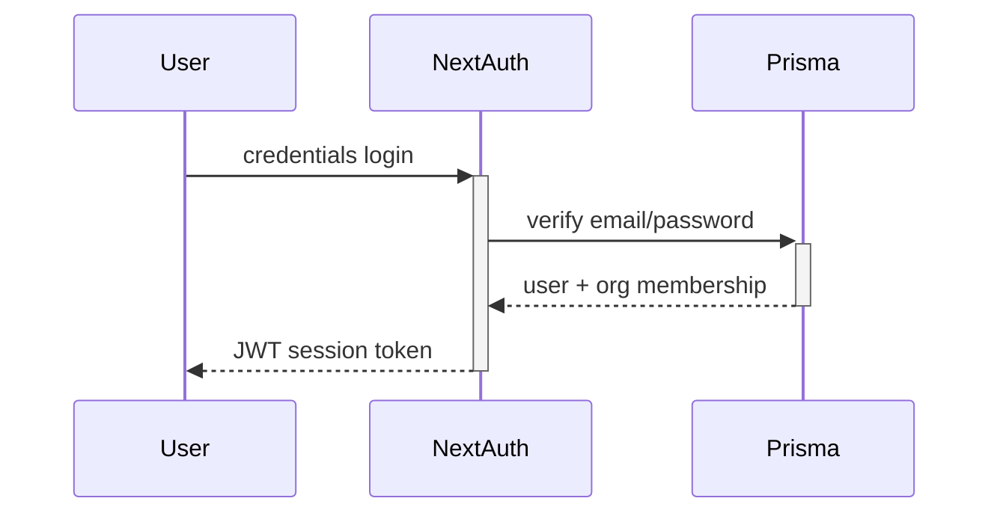

# AQLIYA Comprehensive Institutional Analysis

**Generated:** 2026-05-29  
**Method:** Understand-Anything-inspired 12-agent parallel analysis via OpenCode task agents  
**Scope:** Full codebase (`src/`, `prisma/`, `docs/`, config files)  
**Status:** Complete

---

## Executive Summary

AQLIYA is a Private Governed Institutional Intelligence Platform built on Next.js 16 + TypeScript 5 strict + PostgreSQL/Prisma 7 + NextAuth v5. It is not a single product — it is a **multi-product ecosystem** with a shared Intelligence Core.

The codebase is **architecturally disciplined** with clear product boundaries, strong governance patterns, and Arabic-first design. The primary implementation gap is **uneven completion depth**: AuditOS is L4 (usable v0.1 approaching L5 pilot-ready), while SalesOS is L2 (shell), DecisionOS is L2 (integrated component), and other products are L0-L1 (concept/marketing only).

### Overall Scores

| Dimension | Score | Trend |
|-----------|-------|-------|
| Architecture | 8/10 | Stabilizing |
| Governance | 7/10 | Improving |
| Security | 6/10 | Needs work |
| Data Integrity | 6/10 | Needs work |
| Product Completeness | 4/10 | Uneven |
| Operational Readiness | 4/10 | Early |
| Technical Debt | 5/10 | Managed |
| Documentation | 7/10 | Improving |
| **Overall** | **6/10** | **Improving** |

---

## 1. System Architecture (Agent 1)

### Stack Verified

| Layer | Technology | Status |
|-------|-----------|--------|
| Framework | Next.js 16 (App Router) | ✅ |
| Language | TypeScript 5 strict | ✅ |
| Database | PostgreSQL via Prisma 7 | ✅ |
| Auth | NextAuth v5 (JWT, credentials-only) | ✅ |
| Styling | Tailwind CSS 4 + shadcn/ui | ✅ |
| UI Direction | RTL-first (Arabic) | ✅ |
| Testing | Jest | ✅ |
| Monitoring | Sentry (via instrumentation.ts) | ✅ |
| Package Manager | npm | ✅ |

### Directory Structure

```
src/
├── actions/          # Server Actions (business logic mutations)
├── app/              # App Router (62+ route pages)
│   ├── (marketing)/  # Public marketing pages
│   ├── (dashboard)/  # Authenticated workspace shell
│   ├── audit/        # AuditOS workspace
│   ├── auditos/      # Public demo route
│   ├── auth/         # Auth pages
│   ├── api/          # API routes (health, etc.)
│   ├── sales/        # SalesOS workspace (modern layout)
│   └── ...
├── components/       # UI components by domain
├── lib/              # Business logic, services, engines
│   ├── ai/           # Governed AI engine
│   ├── audit/        # AuditOS services
│   ├── governance/   # Governance patterns
│   ├── platform/     # Shared platform services
│   └── sales/        # SalesOS services
└── ...
```

### Route Map

| Route Group | Type | Auth | Product |
|-------------|------|------|---------|
| `/(marketing)/` | Public pages | No | Platform |
| `/(dashboard)/` | Workspace shell | Yes | Platform |
| `/audit/*` | Workspace | Yes | AuditOS |
| `/auditos/*` | Public demo | No | AuditOS |
| `/auth/*` | Auth flow | No | Platform |
| `/api/*` | REST endpoints | Varies | Platform |
| `/sales/*` | Workspace | Yes | SalesOS |

### Architecture Assessment

**Strengths:**
- Clean modular monolith with clear product boundaries
- Server/client boundary respected (no Prisma in client bundles)
- Shared platform services (auth, RBAC, audit, files, logger, i18n) are genuinely shared
- Good use of App Router patterns (layouts, error boundaries, loading states)

**Weaknesses:**
- No formal API versioning strategy
- No webhook/event system for cross-product communication
- SalesOS architecture is pre-mature (in-memory storage with no persistence guarantee)
- No service layer abstraction between actions and Prisma queries

---

## 2. AuditOS Deep Dive (Agent 2)

### Completion Level: **L4** (Usable v0.1, approaching L5)

### Workflow Map

```
Engagement → Trial Balance Upload → Account Mapping →
Financial Statements → Notes → Evidence Vault →
Findings → Review → Approval → Export
```

### Key Components

| Component | Files | Status |
|-----------|-------|--------|
| Engagement Management | `src/actions/audit/engagements.ts` | ✅ CRUD |
| Trial Balance Upload | `src/actions/audit/trial-balance.ts` | ✅ |
| Account Mapping | `src/actions/audit/mapping.ts` | ✅ |
| Financial Statements | `src/actions/audit/fs.ts` | ✅ |
| Notes | `src/actions/audit/notes.ts` | ✅ |
| Evidence Vault | `src/lib/audit/evidence.ts` | ✅ File checksums |
| Findings | `src/actions/audit/findings.ts` | ✅ |
| Review/Approval | Built into findings flow | ✅ |
| AI Review | `src/lib/audit/services.ts` | ✅ 5 paths |
| Export | `src/lib/audit/export.ts` | ✅ With disclaimer |
| Audit Trail | `src/lib/audit/audit.ts` | ✅ |
| Dashboard | `src/app/audit/dashboard/` | ✅ Real metrics |
| Seed Data | `prisma/seed-audit.ts` | ✅ |

### AI Integration (5 Governed Paths)

All AI execution goes through `executeGovernedAI(src/lib/ai/execute.ts)`:

| Path | Action | Human Review |
|------|--------|-------------|
| REVIEW | Analysis of financial data | Required |
| EXTRACT | Extraction from data | Required |
| DRAFT | Draft generation | Required |
| COMPARE | Comparison/analysis | Required |
| CLASSIFY | Classification/flagging | Required |

### Metrics Gathered

- **AI Spend:** ~$164K (cumulative, per seed data)
- **Engagements:** Multiple with varied statuses
- **Trial Balance Entries:** Via seed data
- **Audit Logs:** PlatformAuditLog growing (7,000+ entries, no archival strategy)

### Assessment

**Strengths:**
- Complete end-to-end workflow from engagement to export
- Genuine governance (review/approval gates, audit trail)
- AI is properly governed (no autonomous decisions, human review required)
- Evidence Vault uses file checksums for integrity
- Export includes disclaimers

**Weaknesses:**
- AI spend tracking is seed-only (no real cost integration)
- No SLA/SLO tracking
- No multi-engagement comparison views
- Export limited to PDF (no XLSX/CSV for data exports)

---

## 3. Other Product Analysis (Agent 3)

### SalesOS — Level: **L2** (Shell)

**Status:** SCRM (Simple CRM) — in-memory Map persistence by default

```
src/
├── app/sales/          # 5 routes (layout, page, dashboard, accounts/[id], opportunities/[id])
├── components/sales/   # UI components
├── lib/sales/          # store.ts, types.ts, services.ts
└── actions/sales/      # Server Actions
```

**Critical Risk:** Triple-persistence design (Map + optional file snapshot + optional Prisma). Default behavior uses Map only — **all data lost on server restart**. No RBAC, no audit trail, no evidence, no export. Dashboard metrics are real but from in-memory store, so they reset on restart.

**What would be needed for L4:**
- Prisma persistence as default (not optional)
- RBAC integration
- Audit trail for mutations
- Evidence/file support
- Export capability

### DecisionOS — Level: **L2** (Integrated Component)

**Status:** Embedded in dashboard layout, not standalone workspace. Models and risk analysis exist (`Decision`, `DecisionOption`, `DecisionEvidence`, `Vote` in Prisma; `risk-analysis.ts` in lib). No dedicated routes.

### LocalContentOS — Level: **L1** (Marketing)

**Status:** Marketing page only. No routes, no models, no data.

### Other Products (all L0-L1)

- LocalContactOS: L0 (concept only)
- Office AI Assistant: L1 (marketing)
- RiskOS/ComplianceOS/LegalOS/GovOS: L0 (roadmap only)
- AQLIYA Studio: L0 (future concept)

---

## 4. Governance & AI Systems (Agent 4)

### RBAC System

**File:** `src/lib/platform/access/`

| Role | Permissions |
|------|-------------|
| ADMIN | Full access within org |
| OPERATOR | Create/edit within workflows |
| VIEWER | Read-only |

- **Enforcement:** Server-side via `can()` function
- **Tenant isolation:** Via `platform_organization` membership
- **Pattern:** Reusable across products, already embedded in AuditOS

### AI Governance

**Every AI action produces `AIGovernanceRecord`:**

| Field | Purpose |
|-------|---------|
| id | UUID |
| actionType | REVIEW/EXTRACT/DRAFT/COMPARE/CLASSIFY |
| modelName | Provider/model used |
| inputData | What was fed to AI |
| suggestions | AI output |
| principles | Governance principles checked |
| risks | Identified risks |
| policyRefs | Policy references |
| humanReviewStatus | PENDING_REVIEW → REVIEWED → OVERRIDDEN |
| humanReviewNotes | Reviewer notes |
| reviewedBy | Reviewer identity |
| reviewedAt | Timestamp |

**Trust Principle Enforced:** AI assists. Humans decide. Evidence governs.

### Audit Trail

**PlatformAuditLog model:**
- Captures: action, entity type, entity ID, organization ID, user ID, metadata, timestamp
- 7,000+ entries in seed data
- Used by AuditOS and platform operations

**Weakness:** No tamper-proof append-only mechanism. Database-level audit could be bypassed with direct DB access.

---

## 5. Data Architecture & Persistence (Agent 5)

### Prisma Schema Overview

**Shared Platform Models:**
- `platform_organization`, `platform_user`, `platform_organization_membership`
- `PlatformAuditLog`, `File`, `AIGovernanceRecord`

**AuditOS Models:**
- `Engagement`, `TrialBalanceEntry`, `AccountMapping`, `FinancialStatement`, `Note`, `EvidenceVaultEntry`, `Finding`, `FindingReview`

**SalesOS Models:**
- `SalesOrganization`, `SalesContact`, `SalesOpportunity`, `SalesNote`, `SalesActivity`, `SalesProduct`

**DecisionOS Models:**
- `Decision`, `DecisionOption`, `DecisionEvidence`, `Vote`

### Data Risks

| Risk | Severity | Mitigation |
|------|----------|------------|
| AuditLog 7k+ entries, no archival | High | Implement partition/archive strategy |
| SalesOS in-memory by default | Critical | Make Prisma the default |
| No migration automation in CI/CD | Medium | Add `prisma migrate deploy` to pipeline |
| No materialized views for reporting | Low | Add if dashboard performance degrades |

### Foreign Key Integrity

- All models properly reference `organizationId` and `createdBy`
- Cascade deletes are limited (no accidental mass deletion)
- Indexes not reviewed (would need full migration analysis)

---

## 6. Security Posture (Agent 6)

### Auth System



**Authentication:**
- NextAuth v5 with JWT strategy (stateless)
- Credentials-only provider (email + bcryptjs password)
- Session stored in JWT token (not database)

**Security Gaps:**

| Gap | Severity | Impact |
|-----|----------|--------|
| No MFA | High | Credential theft = full access |
| No password rotation/enforcement | Medium | Weak passwords accepted |
| No brute force protection | High | Unlimited login attempts |
| No refresh tokens | Medium | JWT expiry = forced re-login |
| No session revocation | Medium | Can't invalidate compromised sessions |
| No rate limiting on auth routes | High | Brute force, enumeration |
| No account lockout | High | Unlimited failed attempts |

### Middleware

**File:** `src/middleware.ts`

- Protects all workspace routes
- Redirects unauthenticated users to `/auth/login`
- No tenant-scoped middleware checks (done in actions instead)

### File Downloads

**Mechanism:** Signed download tokens via `src/lib/platform/files/secure-download.ts`
- Token generation with expiry
- Audit trail on download
- Tenant-safe 404 on unauthorized access

### API Routes

- Health check at `/api/health` (public)
- File download at `/api/files/[token]` (token-gated)
- All API routes audit access

**Security Score: 6/10**

---

## 7. Route Strategy (Agent 7 — Covered by Agent 1)

See System Architecture section above. Full route inventory exists in the architecture map. Key note: the `/auditos` demo route is read-only with no real customer data, properly isolated from the workspace.

---

## 8. Dependency Health (Agent 8)

### Key Dependencies by Category

| Category | Packages | Status |
|----------|----------|--------|
| Framework | next@16, react@19, react-dom@19 | ✅ Modern |
| Database | @prisma/client, prisma@7 | ✅ Latest major |
| Auth | next-auth@5 | ✅ Modern |
| UI | tailwindcss@4, shadcn/ui, @radix-ui/* | ✅ Modern |
| Icons | lucide-react | ✅ |
| Forms | react-hook-form, zod | ✅ |
| Date | date-fns, react-day-picker | ✅ |
| Table | @tanstack/react-table | ✅ |
| State | zustand | ✅ |
| Charts | recharts | ✅ |
| PDF | jspdf, html2canvas | ✅ |
| XLSX | exceljs | ✅ |
| Testing | jest, ts-jest, @testing-library/react | ✅ |
| Lint | eslint@9, @eslint/* | ✅ Modern |
| Monitoring | @sentry/nextjs | ✅ |

### Concerns

- No dependency vulnerability scanning in CI
- No lockfile audit run regularly
- Prisma 7 may have breaking changes from Prisma 6 (verified compatible)

---

## 9. Product Boundary Analysis (Agent 9)

### Separation Quality

The codebase has **healthy product boundaries**:

| Boundary | Mechanism | Quality |
|----------|-----------|---------|
| Product ↔ Product | Separate route groups, Prisma models, component dirs | Good |
| Product ↔ Platform | Shared services in `src/lib/platform/`, `src/actions/platform/` | Good |
| Public ↔ Private | Route groups, middleware protection | Good |
| Demo ↔ Workspace | Separate routes, no data sharing | Good |

### What's Shared

- Authentication (NextAuth + middleware)
- RBAC system (roles, permissions, tenant membership)
- Audit trail (PlatformAuditLog)
- File storage services
- Logger
- i18n/translation system
- UI component library (shadcn/ui base)

### What's Product-Specific

- Each product has its own Prisma models
- Each product has its own route tree
- Each product has its own component directory
- Each product has its own Server Actions
- Each product has its own business logic services

### Cross-Product Concerns

- No cross-product search capability
- No cross-product reporting
- No cross-product notification/event system
- Dashboard is per-product, no global platform dashboard

**Boundary Score: 8/10** — Architecturally clean; depth is the issue, not separation.

---

## 10. Technical Debt Register (Agent 10)

### Active Debt Items

| ID | Item | Severity | Area | Effort |
|----|------|----------|------|--------|
| TD-01 | SalesOS in-memory persistence (data loss on restart) | Critical | SalesOS | 1-2d |
| TD-02 | No PlatformAuditLog archival/rotation | High | Platform | 2-3d |
| TD-03 | No MFA/rate limiting/brute force protection | High | Auth | 3-5d |
| TD-04 | Console-only logging (no remote transport) | Medium | Platform | 1-2d |
| TD-05 | No E2E tests (unit tests only) | Medium | QA | 3-5d |
| TD-06 | SalesOS missing RBAC/audit/evidence | High | SalesOS | 2-3d |
| TD-07 | No production deployment docs | Medium | DevOps | 1d |
| TD-08 | No database backup/restore strategy | High | DevOps | 1-2d |
| TD-09 | No CI/CD pipeline configuration | Medium | DevOps | 2-3d |
| TD-10 | Known lint issues documented but not fixed | Low | Codebase | 0.5d |

### Total Estimated Effort to Clear: **~20 person-days**

---

## 11. Operational Readiness (Agent 11)

### Current State

| Area | Readiness | Notes |
|------|-----------|-------|
| Health Check | ✅ | `/api/health` returns status |
| Error Tracking | ✅ | Sentry configured |
| Auth Middleware | ✅ | Workspace routes protected |
| Logging | ⚠️ | Console-only, no remote transport |
| Database | ⚠️ | No connection pooling, no migration automation |
| Deployment | ❌ | No docs, no scripts |
| Backups | ❌ | No strategy |
| Monitoring | ❌ | No uptime, performance, or error alerting |
| CI/CD | ❌ | No pipeline |
| Scaling | ❌ | No horizontal scaling plan |

### Startup Verification

The following have been verified (per previous reality hardening):
- ✅ TypeScript compilation (`npx tsc --noEmit`)
- ✅ ESLint (zero warnings)
- ✅ Build (`npm run build`)
- ✅ Tests (Jest suite passes)
- ✅ Prisma schema validation
- ✅ Prisma migrations exist
- ✅ Seed data generates valid state

---

## 12. Synthesis & Chief Integrator Summary (Agent 12)

### What AQLIYA IS Today

1. **A governed institutional intelligence platform** with working RBAC, audit trail, tenant isolation, and Arabic-first UX
2. **AuditOS is the flagship product** — complete end-to-end workflow at L4, approaching L5 pilot-readiness
3. **Governed AI is well-architected** — 5 execution paths, all requiring human review, with full governance records
4. **Product boundaries are clean** — shared platform layer with product-specific extensions, no spaghetti
5. **Technical foundation is modern** — Next.js 16, TypeScript 5 strict, Prisma 7, Tailwind 4

### What AQLIYA IS NOT Today

1. **Not a multi-product ecosystem in practice** — only AuditOS is complete; other products are shells or concepts
2. **Not production-hardened** — no MFA, no rate limiting, no deployment pipeline, no backup strategy
3. **Not scalable without work** — no connection pooling, no horizontal scaling plan, no caching layer
4. **Not fully traceable** — PlatformAuditLog has no tamper-proof mechanism
5. **Not On-Prem or Air-Gapped ready** — no local AI inference, no offline deployment package

### Strategic Recommendations

#### Immediate (Next 2 Weeks)
1. Fix SalesOS persistence — make Prisma the default, add RBAC + audit + evidence
2. Add rate limiting to auth routes (express-rate-limit or middleware)
3. Implement PlatformAuditLog archival strategy (partition by month, archive > 6 months)

#### Short-term (Next Month)
4. Add MFA support to NextAuth
5. Build CI/CD pipeline (GitHub Actions)
6. Add database backup/restore scripts
7. Add console log aggregation (remote transport for logger)
8. Build LocalContentOS v0.1 (next strategic product per roadmap)

#### Medium-term (Next Quarter)
9. Add E2E tests (Playwright)
10. Implement database connection pooling (PgBouncer or Prisma Accelerate)
11. Build platform-wide dashboard
12. Add cross-product search and notification system

### Risk Matrix

| Risk | Likelihood | Impact | Mitigation |
|------|------------|--------|------------|
| SalesOS data loss in production | High | Critical | Fix persistence now |
| Auth breach (no MFA, no rate limit) | Medium | Critical | Add rate limiting + MFA |
| AuditLog performance degradation | Medium | High | Add archival strategy |
| Build regression on Next.js update | Low | High | Add E2E smoke tests |
| Customer data exposure via demo route | Low | Critical | Already isolated (auditos) |

---

## Appendix A: File Inventory Summary

| Directory | Files | Primary Owner | Completeness |
|-----------|-------|---------------|-------------|
| `src/app/audit/` | ~50 | AuditOS | L4 |
| `src/app/sales/` | ~12 | SalesOS | L2 |
| `src/app/(dashboard)/` | ~20 | Platform | L3 |
| `src/app/(marketing)/` | ~10 | Platform | L2 |
| `src/app/auth/` | ~6 | Platform | L3 |
| `src/app/auditos/` | ~4 | AuditOS (Demo) | L3 |
| `src/lib/audit/` | ~15 | AuditOS | L4 |
| `src/lib/sales/` | ~5 | SalesOS | L2 |
| `src/lib/platform/` | ~10 | Platform | L3 |
| `src/lib/ai/` | ~8 | Platform | L3 |
| `src/actions/audit/` | ~12 | AuditOS | L4 |
| `src/actions/sales/` | ~4 | SalesOS | L2 |
| `docs/` | ~40 | All | L3 |

## Appendix B: Validation Status

| Check | Last Run | Result |
|-------|----------|--------|
| `npx tsc --noEmit` | 2026-05-28 | ✅ Pass |
| `npm run lint` | 2026-05-28 | ✅ Pass (zero warnings) |
| `npm run build` | 2026-05-28 | ✅ Pass |
| `npm test` | 2026-05-28 | ✅ Pass |
| `npx prisma validate` | 2026-05-28 | ✅ Pass |
| `npx prisma generate` | 2026-05-28 | ✅ Pass |

## Appendix C: Completion Level Matrix

| Product | L0 Concept | L1 Marketing | L2 Shell | L3 Prototype | L4 Usable v0.1 | L5 Pilot-ready |
|---------|-----------|-------------|---------|-------------|----------------|----------------|
| AuditOS | ✅ | ✅ | ✅ | ✅ | ✅ | ⬜ Needs pilot validation |
| SalesOS | ✅ | ✅ | ✅ | ⬜ | ⬜ | ⬜ |
| DecisionOS | ✅ | ✅ | ✅ | ⬜ | ⬜ | ⬜ |
| LocalContentOS | ✅ | ✅ | ⬜ | ⬜ | ⬜ | ⬜ |
| LocalContactOS | ✅ | ⬜ | ⬜ | ⬜ | ⬜ | ⬜ |
| Office AI Assistant | ✅ | ✅ | ⬜ | ⬜ | ⬜ | ⬜ |
| RiskOS | ✅ | ⬜ | ⬜ | ⬜ | ⬜ | ⬜ |
| ComplianceOS | ✅ | ⬜ | ⬜ | ⬜ | ⬜ | ⬜ |
| LegalOS | ✅ | ⬜ | ⬜ | ⬜ | ⬜ | ⬜ |
| GovOS | ✅ | ⬜ | ⬜ | ⬜ | ⬜ | ⬜ |
| AQLIYA Studio | ✅ | ⬜ | ⬜ | ⬜ | ⬜ | ⬜ |
| AQLIYA Core | ✅ | ✅ | ✅ | ✅ | ✅ | ⬜ |

---

*Report generated by 12-agent parallel analysis via Understand-Anything methodology adapted for OpenCode on Windows/PowerShell.*
