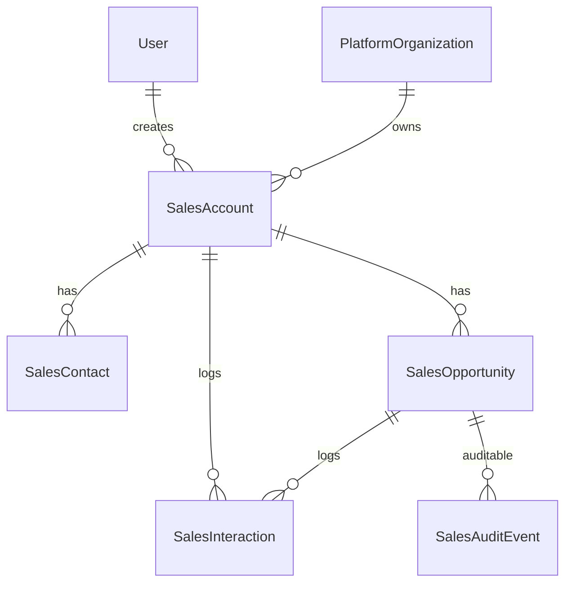

# 02 — SalesOS Data Model Map

**Date:** 2026-06-01  
**Baseline schema:** `prisma/schema.prisma` (no SalesOS models today)

---

## CRM vs SalesOS Entity Comparison

| Generic CRM (Twenty-style) | SalesOS governed entity | AQLIYA twist |
|---------------------------|------------------------|--------------|
| Company | **SalesAccount** | Links to `PlatformOrganization`, optional `ClientWorkspace` |
| Person / Contact | **SalesContact** | Stakeholder with sensitivity level |
| Deal / Opportunity | **SalesOpportunity** | Stage + governance state, not just pipeline |
| Activity / Task | **SalesInteraction** | Typed log with evidence refs |
| Note | **SalesNote** | Permissioned, auditable |
| Email thread | **SalesInteraction** (type=email) | Defer native sync to P2 |
| Product | N/A (v0.3) | Use metadata JSON if needed |
| Quote / Proposal | **SalesProposal** | Evidence-backed, review gate |
| Lead | **SalesLead** (optional) | Merge into Opportunity for v0.3 minimal scope |
| Pipeline | **SalesPipelineStage** config | Tenant-scoped stage definitions |
| — | **SalesMemory** | Institutional learning record (differentiator) |
| — | **SalesAuditEvent** | Product-scoped audit (like LocalContentAuditEvent) |

---

## Reuse Existing Prisma Models

| Existing model | Reuse for SalesOS | Notes |
|----------------|-------------------|-------|
| `PlatformOrganization` | Tenant root | Required on all SalesOS models |
| `ClientWorkspace` | Optional account workspace link | `workspaceType` could include `sales` later |
| `User` | Actor, owner, reviewer | Via `createdById`, assignment fields |
| `PlatformAuditLog` | Cross-product operator audit | `productKey: "salesos"` |
| `OfficeAiTask` / `OfficeAiOutput` | AI draft generation | Reuse pattern, not CRM-specific storage |
| `Decision` | Link high-stakes commercial decisions | Optional relation on Opportunity |
| `Organization` | Legacy org table | Prefer PlatformOrganization for new work |

**Do not reuse:** `AuditClient`, `LocalContent*` models directly — different domain boundaries.

---

## Proposed Schema Map (v0.3 Target)

### P0 — First slice (minimal L4)

```
SalesAccount
├── id, platformOrganizationId, createdById
├── name, nameAr, industry, status
├── icpScore (Int?), metadata (Json?)
└── relations: contacts[], opportunities[], interactions[]

SalesContact
├── id, platformOrganizationId, salesAccountId, createdById
├── fullName, email, phone, role, sensitivityLevel
└── status, metadata

SalesOpportunity
├── id, platformOrganizationId, salesAccountId, createdById
├── title, stage, amount, currency, probability
├── status (draft|active|won|lost|archived)
├── nextActionAt, nextActionNote
└── relations: interactions[], auditEvents[]

SalesInteraction
├── id, platformOrganizationId, salesOpportunityId?, salesAccountId
├── type (call|meeting|email|note|ai_suggestion)
├── summary, occurredAt, createdById
└── evidenceLinks (Json?) — refs to files/URLs

SalesAuditEvent
├── id, platformOrganizationId, entityType, entityId
├── action, actorId, payload (Json?), createdAt
└── mirrors LocalContentAuditEvent pattern
```

### P1 — Governance + memory

```
SalesProposal
├── id, salesOpportunityId, version, status (draft|review|approved|sent)
├── content (Json/Text), evidenceIds (Json)
├── reviewedById, approvedById, timestamps

SalesReview
├── id, entityType, entityId, reviewerId, status, comment

SalesMemory
├── id, platformOrganizationId, salesAccountId?
├── memoryType (win_pattern|loss_reason|objection|icp_signal)
├── content, confidence, sourceInteractionIds (Json)
├── humanVerified (Boolean), verifiedById?
```

### P2 — Intelligence + integration

```
SalesPipelineStage — tenant-configurable stages
SalesQualificationScore — rule/AI scores with provenance
SalesForecastSnapshot — point-in-time pipeline analytics
SalesExternalSync — webhook/email sync cursor (if ever)
```

---

## Migration Slices (Safe Order)

| Slice | Migration name (suggested) | Risk |
|-------|---------------------------|------|
| 0 | **Reconcile drift** — restore or baseline SalesOS migrations | High — blocks `migrate dev` |
| 1 | P0 core tables (Account, Contact, Opportunity, Interaction, AuditEvent) | Low — additive |
| 2 | Indexes + tenant scoping constraints | Low |
| 3 | P1 Proposal + Review | Medium — workflow |
| 4 | P1 SalesMemory | Low — additive |
| 5 | P2 config/intelligence tables | Low — optional |

### Drift remediation (prerequisite)

Per `agent-01-migration-drift-assessment.md`, these migrations exist in some DBs but not repo:

- `20260529120000_salesos_v1_persistence`
- `20260530114715_add_core_tables`
- `20260531143000_salesos_tier_a_intelligence`
- `20260531150000_salesos_tier_b1_commercial`
- `20260531153000_salesos_tier_b2_institutional`
- `20260531160000_salesos_tier_b3_knowledge_graph`

**Options:**

1. Restore SQL from backup branch (preferred if tables still needed)
2. `prisma migrate diff` baseline from DB → new migration files (review required)
3. Drop orphan tables on dev DB + clean `_prisma_migrations` (destructive — needs approval)

**Do not** proceed with new SalesOS migrations until drift strategy is chosen.

---

## File Placement (Implementation)

| Concern | Path |
|---------|------|
| Schema | `prisma/schema.prisma` |
| Migrations | `prisma/migrations/YYYYMMDDHHMMSS_salesos_p0_core/` |
| Seed | `prisma/seed.ts` + optional `prisma/seed-sales.ts` |
| Types | `src/lib/sales/types.ts` |
| Services | `src/lib/sales/services.ts` |
| Permissions | `src/lib/sales/permissions.ts` |
| Audit | `src/lib/sales/audit-events.ts` |
| Repository | `src/lib/sales/prisma-repository.ts` |
| Actions | `src/actions/sales-workspace-actions.ts` |
| Tests | `src/lib/sales/__tests__/services.test.ts` |

Follow LocalContentOS conventions in `src/lib/local-content/`.

---

## Entity Relationship (P0)



---

## Indexing Requirements

All SalesOS models:

- `@@index([platformOrganizationId])`
- `@@index([platformOrganizationId, status])` where status exists
- `@@index([createdAt])` on audit/interaction tables

---

## Validation

| Check | Status |
|-------|--------|
| Schema inspection | ✅ No SalesOS models today |
| Migration folder scan | ✅ No SalesOS migrations in repo |
| Drift documentation | ✅ Referenced from release reports |

**Not run:** `prisma validate`, `migrate dev` (low-load + drift blocker).
