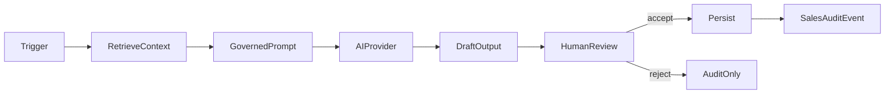

# 05 — SalesOS AI Agents Map

**Date:** 2026-06-01  
**Boundary:** All agents produce **drafts/suggestions** — never final commercial decisions.

---

## Seven Governed Agents

### 1. ICP Fit Scorer

| Dimension | Detail |
|-----------|--------|
| **Trigger** | Account created or updated; manual "score" action |
| **Input** | Account metadata, industry, size, region, past interactions |
| **Output** | `icpScore` (0–100) + rationale JSON |
| **Storage** | `SalesAccount.icpScore`, `SalesAuditEvent` |
| **Review** | Rep confirms/adjusts before persisting AI score |
| **Audit** | `sales.ai.icp_scored` |
| **Failure mode** | Return null score + "insufficient data"; no blocking |

### 2. Next Action Recommender

| Dimension | Detail |
|-----------|--------|
| **Trigger** | Daily job or dashboard load for stale opportunities |
| **Input** | Opportunity stage, last interaction date, pipeline rules |
| **Output** | Suggested action text + priority |
| **Storage** | Transient UI + optional `SalesInteraction` type=`ai_suggestion` if accepted |
| **Review** | Rep accepts → creates real task/interaction |
| **Audit** | `sales.ai.next_action.suggested` / `.accepted` |
| **Failure mode** | Silent skip if no opps; log error without user-facing crash |

### 3. Pipeline Forecast Drafter

| Dimension | Detail |
|-----------|--------|
| **Trigger** | Dashboard "refresh forecast" |
| **Input** | Open opportunities, amounts, probabilities, stage history |
| **Output** | Arabic forecast paragraph + confidence (0–1) |
| **Storage** | `OfficeAiOutput` or Sales-specific AI table; display via `AIInsightCard` |
| **Review** | Display only as draft; no export without manager ack |
| **Audit** | `sales.ai.forecast.drafted` |
| **Failure mode** | Show "التوقّع غير متاح" empty state |

### 4. Proposal Draft Assistant

| Dimension | Detail |
|-----------|--------|
| **Trigger** | User clicks "draft proposal" on opportunity |
| **Input** | Account brief, interactions, product taxonomy docs (retrieval-router) |
| **Output** | `SalesProposal` status=`draft`, content JSON |
| **Storage** | `SalesProposal` model |
| **Review** | **Required** — submit → review queue → approve |
| **Audit** | Full proposal lifecycle events |
| **Failure mode** | Draft stays empty; user notified; no auto-submit |

### 5. Commercial Claim Reviewer

| Dimension | Detail |
|-----------|--------|
| **Trigger** | Proposal/marketing text contains capability claims |
| **Input** | Claim text + `retrieval-router` `commercial_claim_review` context |
| **Output** | Pass/fail + flagged phrases + suggested rewrite |
| **Storage** | Review record linked to proposal or account metadata |
| **Review** | **Human commercial reviewer** required for fail→pass |
| **Audit** | `sales.commercial_claim.reviewed` |
| **Failure mode** | Default to **block export** if review unavailable |

### 6. Sales Memory Extractor

| Dimension | Detail |
|-----------|--------|
| **Trigger** | Opportunity closed (won/lost) |
| **Input** | Full opportunity thread, outcome, interactions |
| **Output** | `SalesMemory` entries (win_pattern, loss_reason, objection) |
| **Storage** | `SalesMemory` with `humanVerified=false` initially |
| **Review** | Manager verifies memory before use in future AI context |
| **Audit** | `sales.memory.extracted`, `.verified` |
| **Failure mode** | Skip extraction; manual memory entry still allowed |

### 7. Account Brief Generator

| Dimension | Detail |
|-----------|--------|
| **Trigger** | Export / "generate brief" action |
| **Input** | Account + contacts + opps + verified memories only |
| **Output** | PDF/Markdown brief |
| **Storage** | File storage + export audit |
| **Review** | If includes AI sections: requires approved proposal or manager sign-off |
| **Audit** | `sales.export.brief_generated` |
| **Failure mode** | Export denied with governance message |

---

## Shared Agent Infrastructure

| Concern | Reuse from AQLIYA |
|---------|---------------------|
| AI execution | `executeGovernedAI` pattern in `src/lib/local-content/content/services.ts` |
| Task routing | `src/lib/governance/retrieval-router.ts` |
| Prompt layers | `src/lib/governance/prompt-framework.ts` |
| Output display | `AIIndicator`, `AIInsightCard`, provenance UI |
| Provider calls | Existing AI abstraction (server-only) |

---

## Agent Orchestration Flow

---

## Failure Mode Summary

| Agent | User impact | Ops impact |
|-------|-------------|------------|
| ICP Scorer | No score shown | Log + alert if provider down |
| Next Action | No suggestions | Degraded dashboard OK |
| Forecast | Empty insight card | Non-blocking |
| Proposal draft | Manual entry | Block feature, not pipeline |
| Commercial review | **Block export** | Escalate to reviewer queue |
| Memory extractor | Manual memory | Non-blocking |
| Brief generator | Export disabled | Clear Arabic error message |

---

## Current State

**Zero agents implemented** for SalesOS. Dashboard `AIInsightCard` is hardcoded mock text in `src/app/sales/page.tsx`.

**Validation:** Design document only.
