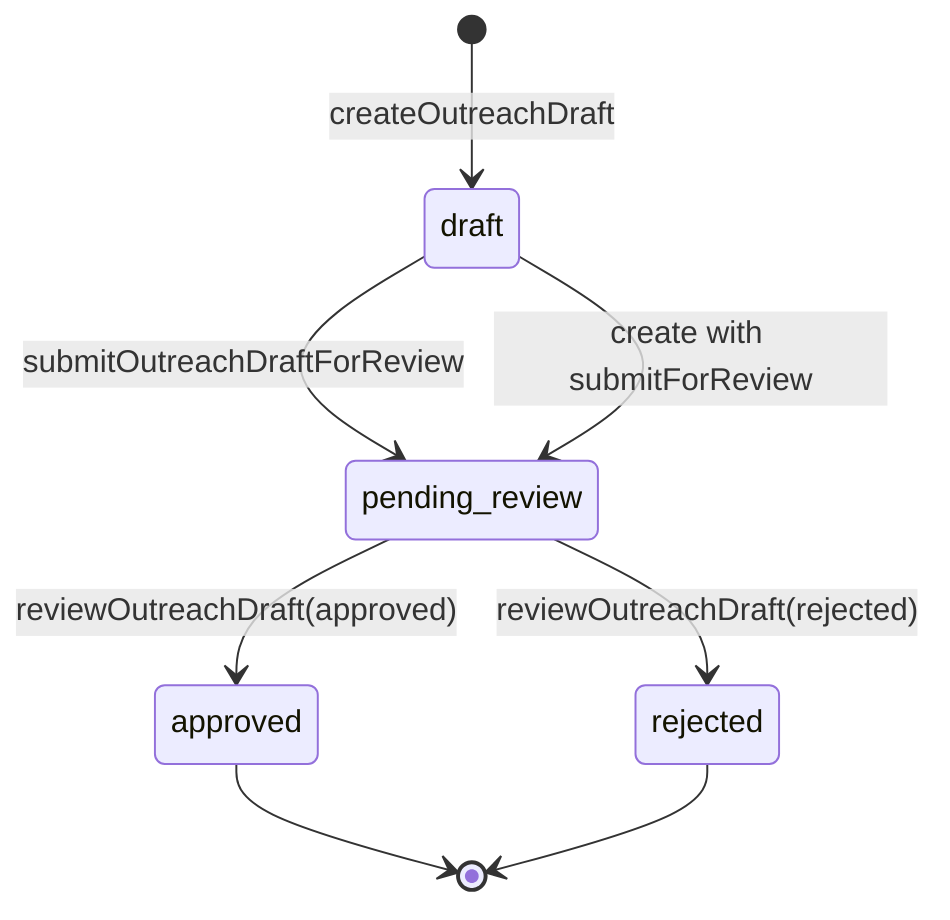

# SalesOS v0.3 PR-9 — Governed Outreach Review Stub

**Status:** light validated (unit tests on lib)  
**Product:** SalesOS on AQLIYA Core  
**Classification:** pilot-ready with conditions — no external send

---

## Summary

PR-9 adds **governed outreach draft review** without email integration or auto-send. Drafts live in `SalesDeal.metadata.outreachDrafts[]`. Humans create drafts (OPERATOR+), submit for review, and approve/reject (OPERATOR or ADMIN via `salesos:update`). There is **no send API**.

---

## Scope delivered

| Area | Path | Notes |
|------|------|-------|
| Lib | `src/lib/sales/outreach.ts` | Types, CRUD on metadata, queue |
| Actions | `src/actions/sales-actions.ts` | Server actions + revalidation |
| Deal UI | `src/components/sales/deal-outreach-panel.tsx` | Create / submit / approve / reject |
| Queue | `src/app/sales/outreach/page.tsx` | Org-scoped `pending_review` list |
| Alias | `src/app/sales/review/page.tsx` | Re-exports outreach queue |
| Deal detail | `src/app/sales/deals/[id]/page.tsx` | Outreach panel |
| Audit | `sales.outreach.draft_created`, `sales.outreach.reviewed` | SalesAuditEvent + platform logger |
| Tests | `src/lib/sales/__tests__/sales-outreach.test.ts` | Unit coverage |

---

## Data model (metadata)

```json
{
  "outreachDrafts": [
    {
      "id": "uuid",
      "subject": "string",
      "body": "string",
      "channel": "email|linkedin|other|null",
      "status": "draft|pending_review|approved|rejected",
      "createdById": "userId",
      "createdByName": "string|null",
      "createdAt": "ISO8601",
      "submittedAt": "ISO8601|null",
      "reviewedById": "userId|null",
      "reviewedByName": "string|null",
      "reviewedAt": "ISO8601|null",
      "reviewNote": "string|null"
    }
  ]
}
```

**No migration** — metadata-only stub (same pattern as deal next-action).

---

## RBAC matrix

| Action | VIEWER | OPERATOR | ADMIN |
|--------|--------|----------|-------|
| View drafts / queue | read | read | read |
| Create draft | — | create | create |
| Submit for review | — | update | update |
| Approve / reject | — | update | update |
| Send email | — | — | — |

Permissions map to existing SalesOS keys: `salesos:read`, `salesos:create`, `salesos:update`.

---

## Workflow



`assertNoOutreachSend()` exists as an explicit guard — send is not implemented by design.

---

## Routes

- `/sales/outreach` — review queue (primary)
- `/sales/review` — alias to same queue
- `/sales/deals/[id]` — per-deal outreach panel

Nav link added in `SalesNavLinks` (مراجعة outreach).

---

## Audit events

| Action | When |
|--------|------|
| `sales.outreach.draft_created` | New draft persisted on deal |
| `sales.outreach.reviewed` | Approve or reject on `pending_review` |

Dual-write: `recordSalesAuditEvent` (product table) + `auditLogger` in server actions.

---

## Explicit non-goals (PR-9)

- No SMTP / SendGrid / Outlook integration
- No auto-send or sequences
- No outbound webhook
- No new Prisma models

---

## Validation

```bash
npm test -- src/lib/sales/__tests__/sales-outreach.test.ts
```

**Result:** not run in this session (low-load protocol). Unit tests authored; run locally to confirm.

---

## Known limitations

1. Queue scans all org deals in memory — acceptable for pilot stub; index/table if volume grows.
2. Review from queue does not capture free-text `reviewNote` in UI (deal panel supports audit metadata via lib).
3. Approved drafts are records only — operator must send outside SalesOS manually if needed.

---

## Arabic one-liner

**مسودات outreach محكومة على الصفقة — مراجعة بشرية (اعتماد/رفض) مع سجل تدقيق، بدون إرسال تلقائي أو بريد.**
