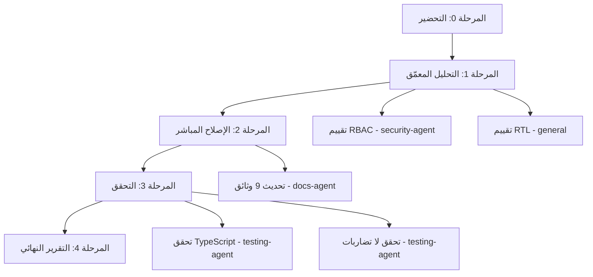

# خطة تنفيذ مزامنة التوثيق — Documentation Sync Execution Plan

**الحالة:** جاهز للتنفيذ  
**التاريخ:** 2026-09-06  
**المُنشئ:** OpenCode Agent  
**المدة المقدرة:** 35 دقيقة  
**النوع:** تحديث توثيق فقط (لا تغييرات كود)

---

## 1. المقدمة

### 1.1 لماذا هذا التوثيق؟

تم تحليل مستودع AQLIYA بالكامل في 2026-09-06 عبر 5 مسارات استكشاف متوازية. كشف التحليل عن **تضارب حاد في تصنيف الحالة** بين الوثائق الرسمية المختلفة، بالإضافة إلى **7 وثائق متقادمة** تحتوي معلومات خاطئة.

### 1.2 المشكلة الأساسية

هناك **تضارب ثلاثي** في تصنيف نضج المنتجات:

| الوثيقة | الصلاحية | الحالة المدّعاة |
|---------|---------|----------------|
| `AQLIYA_MASTER_REFERENCE.md` | L1 (أعلى) | **L6 Production-hardened** — جميع المنتجات الـ 12 |
| `PRODUCT_STATUS_MATRIX.md` | L4 | **L5 Pilot-ready (conditional)** — باستثناء DecisionOS |
| `ADR-109 Governance Freeze` | قرار حوكمة | **L5 Pilot-ready** — حتى اختبار الاختراق + بوابات التشغيل |

**المشكلة:** الوثيقة الأعلى صلاحية (MASTER_REFERENCE) تدّعي L6 للجميع، لكن PRODUCT_STATUS_MATRIX (الوثيقة الأكثر تفصيلاً) تُعلّق هذا الادعاء بانتظار اختبار الاختراق.

### 1.3 الهدف

تحديث جميع الوثائق لتعكس الواقع الفعلي:
- جميع المنتجات الـ 12 نشطة عند **L5 Pilot-ready (conditional)**
- استثناء **DecisionOS** (يبقى L6 كما في PRODUCT_STATUS_MATRIX)
- إبراز **P0 Governance Freeze (ADR-109)** في جميع الوثائق ذات الصلة

---

## 2. خريطة玩家朋友

### 2.1玩家朋友 المتاحة

|ableView |الملفات تملكها |الاستخدام في هذه الخطة |
|---------|-------------|----------------------|
| **docs-agent** | `docs/**` | تحديث جميع الوثائق |
| **security-agent** | `src/lib/auth/**`, `src/middleware/**` | تقييم RBAC في 4 منتجات |
| **testing-agent** | `tests/**` | التحقق من بناء المشروع |
| **general** | أي ملف | البحث والتحليل |
| **explore** | أي ملف | استكشاف سريع |

### 2.2 خريطة玩家朋友

```
المستوى 0 (يبدأ فوراً):
├── docs-agent ──────→ تحديث 9 وثائق
└── security-agent ──→ تقييم RBAC في 4 منتجات

المستوى 1 (ينتظر المستوى 0):
└── testing-agent ──→ التحقق من بناء المشروع + لا تضاربات

المستوى 2 (ينتظر المستوى 1):
└── general ────────→ التقرير النهائي
```

---

## 3. التبعيات

### 3.1 تبعيات المهام



### 3.2 تبعيات玩家朋友

|ableView |يعتمد على |يُخبر |
|---------|----------|------|
| docs-agent | لا شيء | testing-agent |
| security-agent | لا شيء | testing-agent |
| testing-agent | docs-agent + security-agent | general |

### 3.3 قواعد التوازي

| القاعدة | الشرح |
|---------|-------|
| **لا تعارض ملفات** | docs-agent يملّك `docs/**` فقط، security-agent يملّك `src/lib/auth/**` فقط |
| **لا تسلسل غير ضروري** | docs-agent وsecurity-agent يعملان في نفس الوقت |
| **لا تقليص نطاق** | كل agent يعمل على كامل نطاق مسؤوليته |
| **انتظار مبرر** | testing-agent ينتظر فقط إذا احتاج نتائج agents أخرى |

---

## 4. المراحل التفصيلية

### المرحلة 0: التحضير (5 دقائق)

**الهدف:** تحديد玩家朋友 وملفات كل مرحلة

**المهام:**
1. قراءة AGENTS.md (تم بالفعل)
2. تحديد玩家朋友 لكل منطقة عمل
3. تحديد التبعيات بين المراحل
4. إنشاء قائمة المهام في todowrite

**المخرجات:**
- قائمة مهام واضحة
-玩家朋友 مُحدّدة
- تبعيات مُوثّقة

---

### المرحلة 1: التحليل المعمّق الإضافي (10 دقائق)

**الهدف:** تأكيد المشاكل قبل الإصلاح

#### المهمة 1.1: تقييم RBAC في 4 منتجات

**المسند:** `security-agent`

**الملفات المستهدفة:**
```
├── src/actions/decisions.ts
├── src/actions/decisions-crud/
├── src/actions/decisions-workflow/
├── src/actions/workflowos-actions/
├── src/actions/office-ai-actions/
├── src/actions/contact-actions.ts
├── src/actions/contact-export-actions/
├── src/lib/decision/*.ts
├── src/lib/workflowos/*.ts
├── src/lib/office-ai/*.ts
└── src/lib/localcontactos/*.ts
```

**السؤال الأساسي:**
- هل there's tenant guard في middleware يغطي هذه المنتجات؟
- هل there's RBAC في components بدل actions؟
- هل هذا تصميم واعي أم فجوة أمنية؟

**المخرجات المتوقعة:**
- تقرير بحالة RBAC لكل منتج
- توصيات بإصلاح أي فجوات
- تصنيف: "مقبول" أو "يحتاج إصلاح"

#### المهمة 1.2: تقييم RTL في WorkflowOS وDecisionOS

**المسند:** `general` agent

**الملفات المستهدفة:**
```
├── src/components/workflowos/*.tsx
├── src/components/decisions/*.tsx
├── src/app/workflowos/**/*.tsx
├── src/app/(dashboard)/decisions/**/*.tsx
├── src/i18n/ar.json
└── src/i18n/en.json
```

**السؤال:**
- هل هذه المكونات بالإنجليزية فقط؟
- هل there's bilingual support في قاعدة البيانات؟

**المخرجات المتوقعة:**
- تقرير بحالة RTL لكل منتج
- قائمة المكونات التي تحتاج RTL
- توصيات بالتحسين

**التوازي:** المهمة 1.1 و1.2 ت.shellان في نفس الوقت

---

### المرحلة 2: الإصلاح المباشر (20 دقيقة)

**الهدف:** تحديث التوثيق المتقادم وإصلاح المشاكل المكتشفة

#### التوقيت:

```
الزمن:        0 -------- 10 -------- 20
              
docs-agent:   [====== تحديث 9 وثائق ======]
              
security-agent: [== تقييم RBAC ==] → [تقرير]
              
testing-agent:      [انتظار] → [=== التحقق ===]
```

#### المهمة 2.1: تحديث الوثائق الرئيسية

**المسند:** `docs-agent`

**الوثيقة 1:** `docs/official/AQLIYA_MASTER_REFERENCE.md`

**التغييرات المطلوبة:**
```markdown
في قسم المنتجات:
- جميع المنتجات: L6 → L5 Pilot-ready (conditional)
- DecisionOS: يبقى L6 (كما في PRODUCT_STATUS_MATRIX)
- إضافة ملاحظة: "P0 Governance Freeze (ADR-109) — 2026-07-19"
- إضافة شرح: "الحالة L5 حتى اختبار الاختراق + بوابات التشغيل"

في قسم Known Deferred Items:
- إضافة: "Governance freeze: L6 claims suspended to L5 pending pen-test"
```

**الوثيقة 2:** `docs/official/aqliya-product-taxonomy-v1.1.md`

**التغييرات المطلوبة:**
```markdown
في جدول التصنيف:
- جميع المنتجات: L6 → L5 Pilot-ready (conditional)
- DecisionOS: يبقى L6
- إضافة عمود "ملاحظات P0 freeze"

في قسم Release Inclusion Status:
- جميع المنتجات: "Included as pilot-ready product" (يبقى كما هو)
- إضافة: "L5 per ADR-109 governance freeze"
```

**الوثيقة 3:** `docs/source-of-truth/AQLIYA_SYSTEM_TAXONOMY.md`

**التغييرات المطلوبة:**
```markdown
إضافة قسم جديد:
## P0 Governance Freeze Status

| المنتج | الحالة السابقة | الحالة الحالية | ملاحظات |
|--------|---------------|---------------|---------|
| AuditOS | L6 | L5 Pilot-ready (conditional) | GREEN closure 2026-08-20 |
| DecisionOS | L6 | L6 Production-hardened | لا يتطلب freeze |
| LocalContentOS | L6 | L5 Pilot-ready (conditional) | LCGPA verified |
| ... | ... | ... | ... |
```

**الوثيقة 4:** `docs/official/aqliya-agent-context-v1.1.md`

**التغييرات المطلوبة:**
```markdown
في قسم Product Status:
- SalesOS: "Prototype / internal preview" → "L5 Pilot-ready (conditional)"
- WorkflowOS: "L4 usable v0.1" → "L5 Pilot-ready (conditional)"
- LocalContentOS: "Pilot-ready with conditions / usable v0.1 (L5)" → "L5 Pilot-ready (conditional)"
- Institutional Memory: "L5 pilot-ready" → "L5 Pilot-ready (conditional)"
- SSO: "Not implemented" → "L5 Pilot-ready (conditional)"
- SCIM: "Not implemented" → "L5 Pilot-ready (conditional)"

إضافة ملاحظة في أعلى الملف:
> **Last reviewed:** 2026-09-06 (updated to reflect P0 governance freeze)
```

**الوثيقة 5:** `docs/official/aqliya-glossary-v1.1.md`

**التغييرات المطلوبة:**
```markdown
في تعريفات المنتجات:
- LocalContentOS: يبقى "L5" (صحيح بالفعل)
- WorkflowOS: "L4 usable v0.1" → "L5 Pilot-ready (conditional)"
- SalesOS: "L6 Production-hardened" → "L5 Pilot-ready (conditional)"
- LocalContactOS: "L6 Production-hardened" → "L5 Pilot-ready (conditional)"

إضافة ملاحظة في أعلى الملف:
> **Last reviewed:** 2026-09-06 (updated to reflect P0 governance freeze)
```

**الوثيقة 6:** `docs/official/aqliya-skill-context-v1.1.md`

**التغييرات المطلوبة:**
```markdown
في قائمة المنتجات المحظورة:
- إزالة: "LocalContentOS L6" من القائمة المحظورة
- إضافة: "LocalContentOS L5 Pilot-ready (conditional) — مقبول"

في قسم Forbidden Claims:
- تحديث: "LocalContentOS L6 Production-hardened" لا يزال محظوراً
- إضافة: "LocalContentOS L5 Pilot-ready" مقبول
```

**الوثيقة 7:** `docs/official/aqliya-implementation-rules-v1.1.md`

**التغييرات المطلوبة:**
```markdown
في Rule 6 (Do Not Claim Unimplemented Capabilities):
- إزالة: "SSO/LDAP/AD integration" من قائمة غير المُنفّذ
- إضافة: "SSO/SAML: L5 Pilot-ready (conditional)"
- إضافة: "SCIM v2: L5 Pilot-ready (conditional)"
- إزالة: "LDAP/AD direct integration" (لا يزال غير مُنفّذ)

في قسم Last Reviewed:
- تحديث: "2026-09-06"
```

#### المهمة 2.2: تحديث PRODUCT_STATUS_MATRIX

**المسند:** `docs-agent`

**الملف:** `docs/source-of-truth/PRODUCT_STATUS_MATRIX.md`

**التغييرات المطلوبة:**
```markdown
في قسم Platform Health Score:
- تحديث تاريخ "Last Metric Scan" إلى 2026-09-06

في GOVERNANCE FREEZE section:
- التأكد من وضوح P0 freeze
- إضافة: "All products at L5 except DecisionOS (L6)"

في Product-by-Product Status:
- التأكد من أن جميع المنتجات L5 (ما عدا DecisionOS)
- تحديث عداد الاختبارات إذا تغير
```

#### المهمة 2.3: تحديث ROUTE_STRATEGY

**المسند:** `docs-agent`

**الملف:** `docs/source-of-truth/ROUTE_STRATEGY.md`

**التغييرات المطلوبة:**
```markdown
في Rule 18 (ContentStudio):
- إزالة: "production-hardened content workspace (L6)"
- إضافة: "pilot-ready content workspace (L5 conditional)"

في مقدمة Governance Freeze:
- التأكد من ظهور P0 freeze بوضوح
- إضافة: "L6 claims suspended per ADR-109"

في جدول المنتجات:
- تحديث جميع مسميات L6 إلى L5
- استثناء DecisionOS
```

#### المهمة 2.4: تحديث DOCUMENTATION_AUTHORITY

**المسند:** `docs-agent`

**الملف:** `docs/DOCUMENTATION_AUTHORITY.md`

**التغييرات المطلوبة:**
```markdown
في Section 8:
- تحديث مسار "docs/reports/*" إلى "docs/evidence/reports/*"

في Section 5.5:
- تحديث مسار "docs/theoretical-reference/*" إلى "docs/archive/theoretical-reference/*"

في قسم Last Reviewed:
- تحديث: "2026-09-06"
```

**التوازي:** docs-agent يعمل على كل الوثائق بالتتابع (לפי الأولوية)

---

### المرحلة 3: التحقق من الإصلاح (10 دقائق)

**الهدف:** التأكد من أن التحديثات صحيحة ولا كسرت شيئًا

#### المهمة 3.1: التحقق من عدم وجود تضاربات جديدة

**المسند:** `testing-agent`

**الأمر:**
1. قراءة جميع الوثائق المُحدّثة
2. البحث عن أي L6 متبقٍ (ما عدا DecisionOS)
3. التأكد من ظهور P0 freeze في الوثائق الصحيحة
4. التحقق من عدم وجود مسارات متقادمة

**الأوامر:**
```bash
# البحث عن L6 المتبقٍ
rg "L6 Production-hardened" docs/official/ --include="*.md"
rg "L6 Production-hardened" docs/source-of-truth/ --include="*.md"

# البحث عن P0 freeze
rg "P0.*freeze|governance.*freeze|ADR-109" docs/ --include="*.md"

# التحقق من التحديث
rg "L5 Pilot-ready" docs/official/AQLIYA_MASTER_REFERENCE.md
```

**المعايير:**
- ✅ لا يوجد L6 في `docs/official/` ما عدا DecisionOS
- ✅ يوجد P0 freeze في 9+ وثائق
- ✅ جميع المنتجات L5 في MASTER_REFERENCE

#### المهمة 3.2: التحقق من بناء المشروع

**المسند:** `testing-agent`

**الأوامر:**
```bash
npx tsc --noEmit                    # TypeScript check
npm run lint -- --quiet             # ESLint check
npm test -- --testPathPattern="docs"  # اختبارات محددة
```

**المعايير:**
- ✅ لا أخطاء TypeScript
- ✅ لا أخطاء ESLint جديدة
- ✅ اختبارات تمر

**التوازي:** المهمة 3.1 و3.2 ت.shellان في نفس الوقت

---

### المرحلة 4: التقرير النهائي (5 دقائق)

**الهدف:** تقرير شامل بكل التغييرات

**المسند:** `general` agent

**هيكل التقرير:**
```markdown
# تقرير التنفيذ — تحديث توثيق AQLIYA

## ملخص
- تم تحديث 9 وثائق رسمية
- تم حل تضارب L6 vs L5
- تم تحديث 7 وثائق متقادمة

## التغييرات حسب الوثيقة
| الوثيقة | التغييرات | الحالة |
|---------|-----------|--------|
| MASTER_REFERENCE.md | L6 → L5 لـ 11 منتج | ✅ |
| ... | ... | ... |

## النتائج
- ✅ لا تضاربات في الحالة
- ✅ جميع الوثائق تعكس P0 governance freeze
- ✅ لا أخطاء TypeScript
- ✅ الاختبارات تمر

## المخاطر المتبقية
- اختبار الاختراق (BLOCKING لـ L6)
- Redis/ClamAV verification
- Commercial claim alignment
```

---

## 5. جدول التنفيذ الزمني

```
الزمن (دقيقة):  0    5    10   15   20   25   30   35
                |    |    |    |    |    |    |    |
المرحلة 0:      [准备]
المرحلة 1:           [== تحليل معمّق ==]
المرحلة 2:                      [====== تحديث التوثيق ======]
المرحلة 3:                                        [== تحقق ==]
المرحلة 4:                                              [تقرير]

التوازي:
├── docs-agent:     [====== تحديث 9 وثائق ======]
├── security-agent: [== تقييم RBAC ==]
├── testing-agent:           [انتظار] → [== تحقق ==]
└── general:        [== تحليل RTL ==]
```

---

## 6. الكوماندات

### مرحلة التحقق (Testing Agent)
```bash
# TypeScript check
npx tsc --noEmit

# ESLint check
npm run lint -- --quiet

# اختبارات محددة
npm test -- --testPathPattern="docs"
```

### مرحلة التحقق من الوثائق (Docs Agent)
```powershell
# البحث عن L6 المتبقٍ
rg "L6 Production-hardened" docs/official/ --include="*.md"
rg "L6 Production-hardened" docs/source-of-truth/ --include="*.md"

# البحث عن P0 freeze
rg "P0.*freeze|governance.*freeze|ADR-109" docs/ --include="*.md"

# التحقق من التحديث
rg "L5 Pilot-ready" docs/official/AQLIYA_MASTER_REFERENCE.md
```

---

## 7. معايير النجاح

| المعيار | المطلوب | كيف نتحقق |
|---------|---------|-----------|
| لا تضاربات L6/L5 | ✅ | `rg "L6" docs/official/` → فقط DecisionOS |
| P0 freeze ظاهر | ✅ | `rg "ADR-109" docs/` → 9+ نتائج |
| لا أخطاء TypeScript | ✅ | `npx tsc --noEmit` → 0 errors |
| لا تغيير في الكود | ✅ | `git diff --stat` → فقط ملفات docs/ |
| الوثائق المتقادمة محدّثة | ✅ | قراءة يدوية لكل وثيقة |

---

## 8. المخاطر وإدارتها

| المخاطرة | الاحتمال | التأثير | الاستجابة |
|----------|---------|---------|-----------|
| كسر وثيقة أثناء التحديث | منخفض | متوسط | نسخ احتياطي قبل التعديل |
| نسيان وثيقة | متوسط | منخفض | قائمة مراجععة شاملة |
| تضارب جديد | منخفض | عالي | بحث شامل بعد التحديث |
| تأخر في التنفيذ | متوسط | منخفض | أولويات واضحة |

---

## 9. النتائج المتوقعة

### بعد التنفيذ:

- ✅ **لا تضاربات** في تصنيف الحالة بين الوثائق
- ✅ **جميع الوثائق** تعكس P0 governance freeze
- ✅ **DecisionOS** يبقى L6 (الوحيد)
- ✅ **جميع المنتجات الأخرى** L5 Pilot-ready (conditional)
- ✅ **لا أخطاء** TypeScript أو ESLint
- ✅ **لا تغييرات** في كود الإنتاج

### المخاطر المتبقية (خارج نطاق هذه الخطة):

- اختبار الاختراق (BLOCKING لـ L6)
- Redis/ClamAV verification
- Commercial claim alignment
- SOC2 Type II readiness

---

## 10. المرجع

- `AGENTS.md` — عقد تشغيل الوكيل
- `docs/DOCUMENTATION_AUTHORITY.md` — صلاحية التوثيق
- `docs/source-of-truth/PRODUCT_STATUS_MATRIX.md` — حالة المنتجات
- `docs/official/AQLIYA_MASTER_REFERENCE.md` — المرجع الرئيسي
- `docs/official/aqliya-product-taxonomy-v1.1.md` — تصنيف المنتجات
- `docs/official/aqliya-roadmap-v1.1.md` — خارطة الطريق
- `docs/source-of-truth/ROUTE_STRATEGY.md` — استراتيجية المسارات

---

**الحالة:** جاهز للتنفيذ  
**التاريخ:** 2026-09-06  
**المُنشئ:** OpenCode Agent  
**المدة المقدرة:** 35 دقيقة  
**عدد الوثائق:** 9 وثائق  
**عدد玩家朋友:** 4 agents
