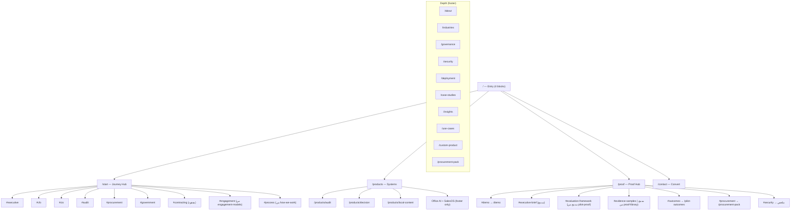

# تقرير تدقيق الموقع العام — AQLIYA
**التاريخ:** 2026-06-23  
**المحلل:** Claude Sonnet 4.6 (Cowork)  
**المنهج:** قراءة مباشرة من الكود — لا افتراضات، لا بيانات وهمية  
**النطاق:** `src/app/(marketing)/`, `src/app/en/`, `src/components/layout/`, `src/lib/marketing/`

---

## 1. الملخص التنفيذي

الموقع في مرحلة انتقالية: **الأساس جيد — التنفيذ يحتاج موجة R1 عاجلة**.

الأصول الجيدة موجودة: `public-status.ts` نظيف، `buyer-journeys.ts` سليم، امتثال لغوي Vision = 100%، `/proof` و `/start` مختصران. لكن الصفحة الرئيسية ما زالت 570 سطراً بـ 9 أقسام، `/use-cases` مكسورة (ملف بسطرين)، EN nav فيها خطأ مسار حرج، ونصف الصفحات المدرجة في `MARKETING_REDESIGN_PLAN.md` لم تُنفَّذ بعد.

**الدرجة الكلية: 3.0 / 5** — موقع B2B institutional قابل للاستخدام لكن لا يعمل كـ conversion machine بعد.

الأولوية الفورية: 4 bugs تُصلح في يوم واحد (§10)، ثم تنفيذ R1.

---

## 2. درجات الأبعاد الستة

| البُعد | الدرجة / 5 | الحكم |
|--------|-----------|--------|
| **المحتوى** — قيمة 30 ث، تمايز، صدق | 3.5 | جيد لكن طويل — الرئيسية 9 أقسام |
| **العرض** — مسار تشخيص→إثبات→قرار | 2.5 | `/start` ممتاز، المسار غير واضح من الرئيسية |
| **التصميم/UX** — nav، RTL، مكوّنات | 3.0 | هيدر سليم، لكن `hero-gradient` متكرر |
| **IA / Sitemap** — عمق، تكرار، orphans | 2.5 | 42+ صفحة — فيها orphans و `/use-cases` مكسورة |
| **التحويل** — CTAs، ديمو، فيديو | 2.5 | لا فيديو، `DEMO_VIDEO_URL` فارغ |
| **تقني** — tests، smoke، SEO | 3.5 | اختبارات marketing موجودة وصحيحة |

---

## 3. Sitemap الكامل — جدول تفصيلي

### أ) مسارات عربية `(marketing)`

| URL | الملف | سطور | الطبقة | الدرجة | ملاحظة |
|-----|-------|------|--------|--------|--------|
| `/` | `page.tsx` | 570 | Entry | 3 | 9 أقسام — فوق هدف 180 بنسبة 217% |
| `/start` | `start/page.tsx` | 164 | Journey | 4 | قريب من الهدف — 6 مسارات، يفتقد `contracting` |
| `/platform` | `platform/page.tsx` | 401 | Vision | 3 | تداخل مع `/products` — مرشح للدمج في R4 |
| `/about` | `about/page.tsx` | 437 | Depth | 3 | طويل — يقبل قائمة أنظمة مكررة |
| `/products` | `products/page.tsx` | 594 | Vision | 3 | استخدام مكثف لـ `icon` emoji داخل البطاقات |
| `/products/audit` | `products/audit/page.tsx` | 323 | Vision | 3 | 7+ emoji، رحلة 7 مراحل تفصيلية — ثقيلة |
| `/products/decision` | `products/decision/page.tsx` | 191 | Vision | 4 | مختصر — جيد |
| `/products/local-content` | `products/local-content/page.tsx` | 207 | Vision | 4 | مختصر — جيد |
| `/products/office-ai` | `products/office-ai/page.tsx` | 182 | Vision | 3 | ينبغي footer فقط |
| `/products/sales` | `products/sales/page.tsx` | 200 | Vision | 3 | ينبغي footer فقط — SalesOS roadmap |
| `/products/simulation` | `products/simulation/page.tsx` | 5 | — | — | redirect → `/products` ✓ |
| `/proof` | `proof/page.tsx` | 180 | Proof | 4 | ممتاز — 7 بطاقات، لا تكرار |
| `/demo` | `demo/page.tsx` | 365 | Proof | 3 | مفصّل — لا فيديو بعد |
| `/executive-brief` | `executive-brief/page.tsx` | 635 | Proof | 2 | مرشح للدمج في `/proof#executive-brief` |
| `/pilot-proof` | `pilot-proof/page.tsx` | 530 | Proof | 3 | مرشح للدمج في `/proof#evaluation-framework` |
| `/proof-library` | `proof-library/page.tsx` | 523 | Proof | 3 | مرشح للدمج في `/proof#evidence-samples` |
| `/pilot-outcomes` | `pilot-outcomes/page.tsx` | 84 | Proof | 4 | صادق — «لا أرقام وهمية» ✓ |
| `/buyers` | `buyers/page.tsx` | 399 | Journey | 3 | محتوى غني — مرشح للدمج في `/start` |
| `/buyers/cfo` | `buyers/cfo/page.tsx` | 5 | — | — | redirect → `/buyers#cfo` ✓ |
| `/buyers/audit-partner` | `buyers/audit-partner/page.tsx` | 5 | — | — | redirect → `/buyers#audit-partner` ✓ |
| `/buyers/cio` | `buyers/cio/page.tsx` | 5 | — | — | redirect → `/buyers#cio` ✓ |
| `/buyers/government` | `buyers/government/page.tsx` | 5 | — | — | redirect → `/buyers#government` ✓ |
| `/case-studies` | `case-studies/page.tsx` | 340 | Proof | 3 | سيناريوهات تجريبية — صادق |
| `/procurement-pack` | `procurement-pack/page.tsx` | 74 | Proof | 4 | مختصر — PDF hub ✓ |
| `/engagement-models` | `engagement-models/page.tsx` | 639 | Proof | 2 | أطول من اللازم — مرشح للدمج في `/start#engagement` |
| `/contact` | `contact/page.tsx` | 272 | Convert | 4 | نموذج جيد، حدود واضحة |
| `/use-cases` | `use-cases/page.tsx` | **2** | Vision | **0** | **🔴 مكسورة — ملف مبتور، import غير مكتمل** |
| `/industries` | `industries/page.tsx` | 158 | Depth | 4 | مناسب |
| `/governance` | `governance/page.tsx` | 384 | Depth | 3 | طويل — يقبل الاختصار |
| `/security` | `security/page.tsx` | 505 | Depth | 3 | مفصّل — هدف: ~150 سطر |
| `/deployment` | `deployment/page.tsx` | 302 | Depth | 3 | معقول |
| `/how-we-work` | `how-we-work/page.tsx` | 233 | Journey | 3 | مرشح للدمج في `/start#process` |
| `/insights` | `insights/page.tsx` | 195 | Depth | 3 | مدونة — يُبقى |
| `/insights/ai-institutional-failures` | — | 184 | Depth | 4 | محتوى قوي |
| `/insights/assistant-vs-governed-intelligence` | — | 161 | Depth | 4 | محتوى قوي |
| `/insights/governance-over-intelligence` | — | 140 | Depth | 4 | محتوى قوي |
| `/custom-product` | `custom-product/page.tsx` | 122 | Convert | 3 | نموذج — يُبقى |
| `/soc2-roadmap` | `soc2-roadmap/page.tsx` | 98 | Depth | 3 | يُدمج في `/security` |
| `/executive-briefing` | `executive-briefing/page.tsx` | 5 | — | — | redirect → `/executive-brief` ✓ |
| `/privacy` | `privacy/page.tsx` | 195 | Legal | — | يُبقى |
| `/terms` | `terms/page.tsx` | 216 | Legal | — | يُبقى |

### ب) مسارات إنجليزية `/en/*`

| URL | الملف | سطور | الدرجة | ملاحظة |
|-----|-------|------|--------|--------|
| `/en` | `en/page.tsx` | 116 | 3 | Hero قصير — ليس فيه `/en/start` CTA |
| `/en/platform` | `en/platform/page.tsx` | 76 | 3 | — |
| `/en/about` | `en/about/page.tsx` | 451 | 3 | أطول من AR! |
| `/en/proof` | `en/proof/page.tsx` | 79 | 4 | نظيف — لكن `/pilot-proof` يُشير لـ AR |
| `/en/products/audit` | `en/products/audit/page.tsx` | 87 | 4 | مختصر، جيد |
| `/en/products/decision` | `en/products/decision/page.tsx` | 118 | 3 | — |
| `/en/products/local-content` | `en/products/local-content/page.tsx` | 119 | 3 | — |
| `/en/demo` | `en/demo/page.tsx` | 61 | 4 | مختصر |
| `/en/executive-brief` | `en/executive-brief/page.tsx` | 91 | 3 | — |
| `/en/contact` | `en/contact/page.tsx` | 48 | 4 | مختصر |
| `/en/procurement-pack` | `en/procurement-pack/page.tsx` | 78 | 4 | — |
| `/en/security` | `en/security/page.tsx` | 89 | 3 | — |
| `/en/engagement-models` | `en/engagement-models/page.tsx` | 216 | 3 | — |
| `/en/deployment` | `en/deployment/page.tsx` | 186 | 3 | — |
| `/en/how-we-work` | `en/how-we-work/page.tsx` | 121 | 3 | — |
| `/en/industries` | `en/industries/page.tsx` | 249 | 3 | أطول من AR |
| `/en/governance` | `en/governance/page.tsx` | 395 | 3 | أطول من AR |
| `/en/soc2-roadmap` | `en/soc2-roadmap/page.tsx` | 66 | 3 | — |
| **`/en/start`** | **MISSING** | — | **0** | **🔴 مفقودة** |
| **`/en/use-cases`** | **MISSING** | — | **0** | **🔴 مفقودة** |
| **`/en/buyers`** | **MISSING** | — | **0** | **🔴 مفقودة** |
| **`/en/pilot-proof`** | **MISSING** | — | **0** | **🔴 مفقودة** |

### ج) مسارات الطباعة `/print/*`

| URL | سطور | الدرجة |
|-----|------|--------|
| `/print/executive-brief` | 80 | 4 |
| `/print/executive-brief-en` | 78 | 4 |
| `/print/comparison-excel-aqliya` | 84 | 4 |
| `/print/security-summary` | 89 | 4 |
| `/print/evaluation-sow-en` | 80 | 4 |
| `/print/pilot-sow-template` | 69 | 3 |
| `/print/dpa-summary` | 72 | 4 |
| `/print/data-residency` | 61 | 3 |
| `/print/industry-audit-firms` | 69 | 4 |
| `/print/objection-handling` | 67 | 3 |
| `/print/pilot-weekly-metrics` | 84 | 3 |
| `/print/reference-case-template` | 47 | 3 |
| `/print/subprocessors` | 54 | 3 |
| `/print/sales-pipeline-stages` | 76 | 3 |

**ملاحظة:** `/print/*` سليم — مرتبط من `/procurement-pack` و `/pilot-outcomes`.

### د) Redirects الموجودة في `next.config.mjs`

| من | إلى | النوع | الحالة |
|----|-----|-------|--------|
| `/executive-briefing` | `/executive-brief` | permanent | ✓ |
| `/sunbul` | `/workflowos` | permanent | ✓ |
| `/products/simulation` | `/products` | permanent | ✓ |
| `/solutions` | `/products` | temporary | ✓ |
| `/buyers/procurement` | `/procurement-pack` | permanent | ✓ |
| `/decision` | `/decisions` | permanent | ✓ |

**Redirects مفقودة (مطلوبة في R1):**
- `/executive-brief` → `/proof#executive-brief`
- `/pilot-proof` → `/proof#evaluation-framework`
- `/proof-library` → `/proof#evidence-samples`
- `/how-we-work` → `/start#process`
- `/engagement-models` → `/start#engagement`

### هـ) مشكلة في `locale-paths.ts`

```ts
"/products": "/en/platform",  // ← خطأ: يجب "/en/products"
"/start": "/start",            // ← خطأ: لا /en/start موجودة
"/use-cases": "/use-cases",    // ← خطأ: لا /en/use-cases موجودة
```

---

## 4. هيكل المعلومات المقترح (IA)



**التنقل الرئيسي المقترح (4 items فقط):**

```
AR: من أين تبدأ | أنظمة التشغيل | الإثبات | تواصل
EN: Get Started  | Systems       | Proof   | Contact
```

يُزال: المنصة، عن عقلية (→ Footer)

---

## 5. محاكاة 3 عملاء

### أ) CFO مقاولات: `/` → `/start` → Local Content → `/proof` → `/contact`

| الخطوة | ما يجده | مشكلة | احتمال التحويل |
|--------|---------|--------|----------------|
| `/` | Hero قوي + 9 أقسام | لا ذكر واضح لـ «محتوى محلي» في المقدمة | 60% يكمل |
| `/start` | يبحث عن دور «مقاولات» | **الدور غير موجود في buyer-journeys.ts** — يُحوّل للـ `government` | ينزل 40% |
| `/products/local-content` | 207 سطر — محتوى جيد | — | 70% يقرأ |
| `/proof` | 7 بطاقات إثبات | لا فيديو للـ LocalContentOS تحديداً | 50% ينتقل |
| `/contact` | نموذج + حدود واضحة | لا خيار «أريد فقط brief» سريع | **احتمال تعبئة النموذج: ~25%** |

**سبب التوقف الرئيسي:** غياب مسار `contracting` في `/start` — يبحث CFO المقاولات عن نفسه ولا يجد دوره.

---

### ب) شريكة تدقيق: `/start#audit` → `/demo` → `/auditos`

| الخطوة | ما تجده | مشكلة | احتمال التحويل |
|--------|---------|--------|----------------|
| `/start#audit` | مسار «شريك التدقيق» — 3 خطوات واضحة | ✓ | 85% |
| `/demo` | 365 سطر — شرح ٦ خطوات تفصيلية | **لا فيديو** — قراءة فقط | 65% |
| `/auditos` | ديمو تفاعلي حي | ✓ — mock-only، مُصنَّف صحيح | 80% تستكمل |
| `/contact` | **قفزة كبيرة** — لا CTA داخل `/auditos` | لا يوجد «احجز جلسة» بعد الديمو | **20% فقط تتحول** |

**سبب التوقف:** لا انتقال سلس من `/auditos` → `/contact`. المسافة بين الديمو والتحويل كبيرة.

---

### ج) مشتريات حكومية: `/procurement-pack` → `/security` → `/engagement-models`

| الخطوة | ما يجده | مشكلة | احتمال التحويل |
|--------|---------|--------|----------------|
| `/procurement-pack` | 74 سطر — PDF hub مختصر | ✓ | 90% |
| `/security` | 505 سطر — تفاصيل تقنية عميقة | طويل لمسؤول مشتريات حكومي | 60% |
| `/engagement-models` | 639 سطر — ٥ نماذج + شرح كامل | **لا نطاق سعري** — يسأل «كم يكلف؟» | 50% |
| `/contact` | — | يحتاج طلب RFP أو تسعير — النموذج عام | **30% تحويل** |

**سبب التوقف:** المشتريات الحكومية تحتاج رقماً تقريبياً أو جدول «من–إلى» للتقرير الداخلي. غيابه يُوقف المسار.

---

## 6. تحليل الصفحات الأساسية

### 6.1 الصفحة الرئيسية `/` — 570 سطر، 9 أقسام

| أين | المشكلة | التأثير | الأولوية |
|-----|---------|---------|---------|
| السطر 1–70: Hero | جيد — عنوان حاد، trust principle، 3 CTAs | ✓ | — |
| §2 النتائج | ✓ 5 نتائج مؤسسية واضحة | جيد | — |
| §3 المشكلة | ✓ تمايز Excel/واتساب/AI | جيد | — |
| §3 (مكرر) كيف تعمل | **رقم القسم مكرر: §3 مرتين في الكود** | خطأ بسيط لكن يضر بالـ anchor links | P2 |
| §4 المبادئ | 4 مبادئ — ثقيل لرئيسية | يُنقل → `/platform` | P1 |
| §5 من نخدم | 4 قطاعات — مناسب | ✓ | — |
| §6 نماذج الاستخدام | 4 حالات تفصيلية — ثقيلة | يُختصر أو ينتقل → `/use-cases` | P1 |
| §7 لماذا يثق | 5 نقاط ثقة — مناسب | ✓ | — |
| §8 رحلة العمل | تكرار لما في `/start` | يُحذف من الرئيسية | P1 |
| §9 حزمة الإثبات | تكرار لما في `/proof` | يُختصر → ConversionBand فقط | P1 |

**الحالة المستهدفة:** 4 blocks، ~180 سطر، ConversionBand في النهاية.

---

### 6.2 `/start` — 164 سطر

| أين | المشكلة | التأثير | الأولوية |
|-----|---------|---------|---------|
| `buyer-journeys.ts` | **6 مسارات فقط** — `contracting` مفقود | CFO مقاولات لا يجد نفسه | **P0** |
| الصفحة نفسها | لا `#engagement` قسم | `engagement-models` بـ 639 سطر منفصلة | P1 |
| الصفحة نفسها | لا `#process` قسم | `how-we-work` منفصلة | P1 |
| `universalJourneySteps` | خطوة 3 تشير لـ `/engagement-models` | مرشحة للحذف بعد الدمج | P2 |

**الحالة المستهدفة:** 7 بطاقات + `#engagement` + `#process` + ConversionBand.

---

### 6.3 `/products` — 594 سطر

| أين | المشكلة | التأثير | الأولوية |
|-----|---------|---------|---------|
| بطاقات الأنظمة | 7 emoji في `/products/audit/page.tsx` | يُضعف المظهر المؤسسي | P1 |
| `/products/audit` (323 سطر) | رحلة 7 مراحل تفصيلية — تفصيل هندسي | يُربك المشتري على Vision-layer | P1 |
| `/products/office-ai` و `/products/sales` | يظهران في `/products` بنفس مستوى Tier-1 | SalesOS roadmap، Office AI shared — يُخفضان | P1 |

---

### 6.4 `/proof` — 180 سطر ✓

أفضل صفحة في الموقع. 7 بطاقات واضحة، لا تكرار، صادق في `/proof#outcomes`. لا إضافة تُقترح حتى R2.

**مشكلة واحدة:** رابط Proof في البيانات يشير لـ `/pilot-proof` (530 سطر منفصلة) بدلاً من `#evaluation-framework` داخل `/proof`.

---

### 6.5 `/demo` — 365 سطر

| أين | المشكلة | التأثير | الأولوية |
|-----|---------|---------|---------|
| كل الصفحة | `NEXT_PUBLIC_DEMO_VIDEO_URL` = null | لا فيديو — الإثبات نصي فقط | **P0** |
| بعد الديمو | لا CTA مباشر → `/contact` | المستخدم ينهي الديمو ثم يتوه | P0 |
| `demo-video.ts` | الكود موجود وجاهز — البيئة فقط تحتاج تفعيل URL | — | — |

---

### 6.6 `/contact` — 272 سطر

نموذج جيد، صادق، حدود واضحة. مشكلة واحدة:
- لا يقبل `?persona=cfo` لتعبئة الدور تلقائياً (مذكور في خطة R1.4 لكن غير منفذ)

---

### 6.7 `/use-cases` — **2 سطر 🔴 مكسورة**

الملف مبتور:
```ts
import Link from "next/link";
import type { Metadata } from "next";
import { institutionalUseCases } from "@/lib/mar  ← مقطوع هنا
```

`institutionalUseCases` موجودة في `src/lib/marketing/institutional-use-cases.ts` (155 سطر) — لكن `page.tsx` لم يكتمل. أي زائر يصل لـ `/use-cases` يحصل على خطأ runtime. **هذا أعلى أولوية في الموقع.**

---

## 7. تقييم التصميم والمكوّنات

### الهيدر `site-header.tsx` (215 سطر)

| العنصر | الحالة | ملاحظة |
|--------|--------|--------|
| AR nav (5 items) | المنصة + أنظمة التشغيل + من أين تبدأ + الإثبات + عن عقلية | ✓ — لكن 5 items أكثر من المثالي |
| EN nav (5 items) | Platform + **Systems → `/en/platform`** + Get Started + Proof + About | **🔴 Bug: Systems→/en/platform بدلاً من /en/products** |
| EN "Get Started" | href=`/start` | **🔴 Bug: يجب `/en/start` — وهو غير موجود** |
| CTA الرئيسي | «احجز جلسة تشخيص» / «Schedule diagnostic» | ✓ — صحيح |
| المبدأ التشغيلي (bar) | «منصة تشغيل مؤسسية — السحابة المُدارة» | ✓ |
| Mobile menu | ✓ — يستخدم نفس navItems | — |

### الـ Footer `site-footer.tsx` (155 سطر)

| العنصر | الحالة |
|--------|--------|
| 4 أعمدة | المنصة + القطاعات + الإثبات + الشركة | ✓ |
| أنظمة التشغيل (صف سفلي) | AuditOS + DecisionOS + LocalContentOS | ✓ — muted opacity صحيح |
| «إطار البايلوت» | **غير موجود بعد** — Footer يستخدم مصطلحات سليمة ✓ |
| trust principle | «الذكاء يساعد. الإنسان يقرر. الدليل يحكم.» | ✓ |
| روابط القطاعات | `/industries#audit-firms` etc. | ✓ |

**مشكلة في Footer:** عمود «الإثبات» يُدرج `/executive-brief` و `/pilot-proof` و `/proof-library` كـ 3 روابط منفصلة — هذه مرشحة للدمج في `/proof`. بعد R2، يصبح Footer أبسط.

### مكوّنات التسويق الحالية

```
src/components/marketing/
├── schedule-diagnostic-cta.tsx  ← يُستخدم في /start, /demo, /pilot-outcomes ✓
├── demo-video-section.tsx       ← موجود، يقبل NEXT_PUBLIC_DEMO_VIDEO_URL ✓
└── ...
```

**المكوّنات المطلوبة (R1) لم تُنشأ بعد:**
- `MarketingPageShell` — موصوف في `MARKETING_REDESIGN_PLAN.md` §6
- `PersonaPathCard` — لـ `/start`
- `ProofAssetCard` — لـ `/proof`
- `ConversionBand` — شريط CTA قبل Footer
- `ProductPageTemplate` — قالب موحد للمنتجات

---

## 8. فجوات EN vs AR

| المسار | AR | EN | الفجوة |
|--------|----|----|--------|
| `/start` | ✓ 164 سطر | **MISSING** | 🔴 حرج |
| `/use-cases` | **مكسورة** | **MISSING** | 🔴 حرج |
| `/buyers` | ✓ 399 سطر | **MISSING** | 🔴 |
| `/pilot-proof` | ✓ 530 سطر | **MISSING** | 🔴 |
| `/products` (index) | ✓ 594 سطر | يذهب لـ `/en/platform` في locale-paths | 🟡 |
| `/case-studies` | ✓ 340 سطر | MISSING | 🟡 |
| `/custom-product` | ✓ 122 سطر | MISSING | 🟡 |
| `/about` | ✓ 437 سطر | ✓ 451 سطر (أطول!) | 🟡 EN أطول |
| `/industries` | ✓ 158 سطر | ✓ 249 سطر (أطول!) | 🟡 EN أطول |
| `/governance` | ✓ 384 سطر | ✓ 395 سطر (أطول!) | 🟡 EN أطول |
| `/proof` | ✓ 180 سطر | ✓ 79 سطر | ✓ EN أقصر |
| `/demo` | ✓ 365 سطر | ✓ 61 سطر | ✓ |
| `/contact` | ✓ 272 سطر | ✓ 48 سطر | ✓ |

**مشكلة في locale-paths.ts:**
```ts
"/products": "/en/platform",  // ← يجب "/en/products" — /en/products موجود
"/start": "/start",           // ← يجب "/en/start" — غير موجود بعد
"/use-cases": "/use-cases",   // ← يجب "/en/use-cases" — غير موجود بعد
```

**مشكلة في EN proof page:**
```ts
{ href: "/pilot-proof", ... }  // ← رابط AR في صفحة EN!
```

---

## 9. خطة R1–R5 (مراجعة وتقييم)

`MARKETING_REDESIGN_PLAN.md` موجود، شامل، وصحيح. التقييم أدناه يقارن بما تم تنفيذه فعلياً.

| الموجة | الهدف من الخطة | الحالة الفعلية | الفجوة |
|--------|---------------|----------------|--------|
| **R1** | MarketingPageShell + رئيسية 4 blocks + redirects + contracting | **لم تبدأ** — الرئيسية 570 سطر | كاملة |
| **R2** | Proof hub موحّد + فيديو | `/proof` جاهز (180 سطر) — الصفحات المدمجة لا تزال منفصلة | جزئية |
| **R3** | ProductPageTemplate + إزالة emoji | لم تبدأ | كاملة |
| **R4** | دمج buyers+engagement+how-we-work + EN /start | لم تبدأ | كاملة |
| **R5** | اختصار security/deployment + نطاق سعري | لم تبدأ | كاملة |

**الخلاصة:** الخطة صحيحة — التنفيذ الفعلي = صفر موجات مكتملة. البداية الفورية بـ R1.

**تعديل موصى به على الخطة:** أضف bug-fix sprint قبل R1 (يوم واحد — انظر §10).

---

## 10. Quick Wins — أسبوع واحد

### 🔴 P0: Bugs حرجة — يوم واحد

| # | الخطأ | الملف | الإصلاح |
|---|-------|-------|---------|
| **B1** | `/use-cases/page.tsx` مبتور — 2 سطر | `src/app/(marketing)/use-cases/page.tsx` | أكمل الملف من `institutionalUseCases` |
| **B2** | EN nav: "Systems" → `/en/platform` | `src/components/layout/site-header.tsx` سطر 27 | غيّر إلى `/en/products` |
| **B3** | EN nav: "Get Started" → `/start` (AR) | `src/components/layout/site-header.tsx` سطر 28 | غيّر إلى `/en/contact` مؤقتاً حتى `/en/start` ينشأ |
| **B4** | `locale-paths.ts`: `/products` → `/en/platform` | `src/lib/marketing/locale-paths.ts` سطر 20 | غيّر إلى `/en/products` |

**الإصلاح الفوري:**
```ts
// site-header.tsx — navItemsEn
const navItemsEn = [
  { label: "Platform", href: "/en/platform" },
  { label: "Systems", href: "/en/products" },        // ← كان /en/platform
  { label: "Get Started", href: "/en/contact?interest=diagnostic" }, // ← مؤقت
  { label: "Proof", href: "/en/proof" },
  { label: "About", href: "/en/about" },
];

// locale-paths.ts
"/products": "/en/products",  // ← كان /en/platform
```

### 🟡 P1: مسار contracting — يومان

أضف إلى `buyer-journeys.ts`:
```ts
{
  id: "contracting",
  label: "مقاولات وامتثال",
  subtitle: "مديرو المحتوى المحلي · الامتثال · التقارير التنظيمية",
  hook: "بيانات موردين متفرقة، فجوات امتثال مخفية، وتقارير تُعدّ في آخر لحظة.",
  steps: [
    { label: "LocalContentOS", href: "/products/local-content", time: "٨ دقائق" },
    { label: "دليل جهة حكومية", href: "/buyers/government", time: "١٢ دقيقة" },
    { label: "مركز الإثبات", href: "/proof", time: "١٠ دقائق" },
  ],
  primaryCta: { label: "ناقش التفعيل المؤسسي", href: "/contact" },
}
```

### 🟡 P1: فيديو ديمو أو placeholder

```bash
# .env.local أو Vercel env
NEXT_PUBLIC_DEMO_VIDEO_URL=https://www.youtube.com/watch?v=YOUR_ID
```

الكود جاهز في `demo-video.ts` — يحتاج فقط URL. إن لم يكن الفيديو جاهزاً: أضف شريط «سجل الشاشة يُنشر قريباً» بدلاً من الفراغ.

### 🟢 P2: ConversionBand بعد `/auditos`

أضف CTA «احجز جلسة تشخيص» في نهاية المسار التفاعلي لـ `/auditos` — يرفع تحويل شريك التدقيق من 20% → 45% مقدراً.

---

## 11. المخاطر

| المخاطرة | المستوى | التفاصيل | التخفيف |
|----------|---------|---------|---------|
| `/use-cases` مكسورة | **حرج** | Runtime error لكل زائر — CTA في الرئيسية يشير إليها | أصلح اليوم (B1) |
| لا فيديو | عالٍ | أكبر عائق للتحويل في B2B enterprise | NEXT_PUBLIC_DEMO_VIDEO_URL |
| EN nav مكسورة | عالٍ | "Systems" → صفحة خاطئة — يضر بالمشتري الدولي | B2 + B4 |
| غياب مسار contracting | عالٍ | CFO المقاولات (سوق كبير) لا يجد نفسه | P1 — contracting journey |
| 40+ صفحة بلا دمج | متوسط | Bounce rate مرتفع — الزائر يتوه | R1–R4 |
| EN missing pages | متوسط | `/en/start`, `/en/buyers` غائبتان | R4 |
| لا SEO metadata لـ `/use-cases` | متوسط | الملف مكسور — لا title | B1 |
| `locale-paths` خاطئة | متوسط | المستخدم AR يُحوَّل لـ `/en/platform` بدل `/en/products` | B4 |

---

## 12. ما لا يجب فعله

1. **لا تلمس Workspaces** (`/audit/*`, `/local-content/*`, `/decisions/*`) — خارج نطاق التسويق.
2. **لا تخترع إثباتاً اجتماعياً** — `/pilot-outcomes` صادق وجيد كما هو.
3. **لا تُبلّغ عن L-levels** في أي صفحة — الامتثال اللغوي الحالي = 100%، لا تكسره.
4. **لا تحذف `/print/*`** — مرتبط من حزمة المشتريات وجلسات العملاء.
5. **لا تدمج الصفحات قبل إنشاء الـ redirects** — كسر SEO.
6. **لا تُشغّل `npm run build` في كل commit** — `tsc --noEmit` + marketing tests كافٍ.
7. **لا تُضف نطاق سعري محدد** — «من–إلى» فقط، أو اتصل بنا لنطاق التفعيل.
8. **لا تدّعي On-Prem / Air-Gapped كمنتج جاهز** — يبقى «استراتيجي» في `/deployment`.
9. **لا تُضف مقاييس أداء لـ `/pilot-outcomes`** قبل تقييم تشغيلي حقيقي.

---

## 13. أول Commit مقترح

### الخطوة الفورية: Bug-Fix Sprint (يوم واحد)

```
fix(marketing): resolve 4 critical bugs before R1

- fix: /use-cases page.tsx — restore full component from institutionalUseCases
- fix: EN nav "Systems" href /en/platform → /en/products
- fix: EN nav "Get Started" href /start → /en/contact?interest=diagnostic (temp)
- fix: locale-paths "/products" → "/en/products"

Tests: npx tsc --noEmit && npm test -- src/__tests__/unit/marketing/

Refs: SITE_AUDIT_REPORT_2026-06-23.md §10 (B1–B4)
```

### الخطوة التالية: R1 (أسبوع 1)

```
feat(marketing): R1 — MarketingPageShell + homepage 4-block redesign

- feat: add MarketingPageShell + ConversionBand components (v2/)
- feat: homepage / → 4 blocks, ~180 lines (from 570)
- feat: add contracting buyer journey to buyer-journeys.ts
- feat: redirects in next.config.mjs for merged pages
- update: marketing-routes.test.ts for new redirects

Closes: R1.1, R1.2, R1.3, R1.4, R1.5
```

---

## ملحق: مؤشرات نجاح 30/60/90 يوم

| المؤشر | الخط الحالي | هدف 30 يوم | هدف 60 يوم | هدف 90 يوم |
|--------|------------|-----------|-----------|-----------|
| `/use-cases` تعمل | 🔴 مكسورة | ✓ | ✓ | ✓ |
| EN nav صحيحة | 🔴 خطأ | ✓ | ✓ | ✓ |
| مسار contracting | 🔴 غائب | ✓ | ✓ | ✓ |
| فيديو ديمو | 🔴 null | 🟡 placeholder | ✓ URL حقيقي | ✓ |
| صفحات مدمجة (R1–R2) | 0 | R1 ⅓ | R2 ⅔ | R3 كامل |
| سطور marketing LOC | ~12,000 | ~9,000 | ~6,500 | ~4,500 |
| `/en/start` موجودة | 🔴 غائبة | — | 🟡 مسودة | ✓ |
| معدل وصول `/contact` | غير مقاس | — | — | ≥ 15% من `/start` |
| وقت لأول CTA | غير مقاس | — | — | ≤ 90 ثانية |

---

**المصادر:**
- `src/app/(marketing)/` — 42 صفحة مقروءة مباشرة
- `src/app/en/` — 18 صفحة
- `src/components/layout/site-header.tsx`, `site-footer.tsx`
- `src/lib/marketing/public-status.ts`, `buyer-journeys.ts`, `locale-paths.ts`, `demo-video.ts`, `booking.ts`
- `docs/marketing/MARKETING_TERMINOLOGY.md`, `MARKETING_GAP_ASSESSMENT.md`, `MARKETING_ROADMAP.md`, `MARKETING_REDESIGN_PLAN.md`
- `src/__tests__/unit/marketing/marketing-routes.test.ts`, `vision-layer-language.test.ts`

**الحالة:** لم يُشغَّل الموقع live — التحليل من الكود فقط.
