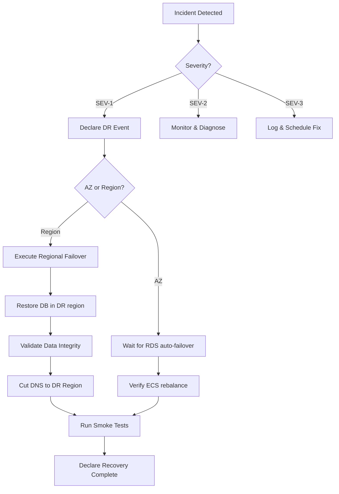

# AQLIYA High Availability & Disaster Recovery Plan

**Status:** L0-02 — HA/DR architecture  
**Target:** L6 (Production-hardened)  
**Date:** 2026-06-03  
**Authority:** L6_COMPLETION_PROGRAM.md, L0-01 Terraform IaC

---

## 1. RTO/RPO Definitions

| Metric | Target | Measurement | Verification |
|--------|--------|-------------|--------------|
| **RTO** (Recovery Time Objective) | < 30 minutes | Time from incident declaration to service restoration | Quarterly DR drill |
| **RPO** (Recovery Point Objective) | < 5 minutes | Maximum data loss in worst-case failure | Automated backup verification |
| **MTD** (Maximum Tolerable Downtime) | 4 hours | Business-defined maximum outage | Annual review |
| **Failover RTO** | < 2 minutes | Time for RDS automatic failover | Monitored via CloudWatch |

## 2. Component HA Architecture

### 2.1 Application Tier (ECS Fargate)

| Property | Configuration |
|----------|---------------|
| Compute | ECS Fargate, spread across 3 Availability Zones |
| Min/Max Tasks | Production: 3/12, Staging: 2/6, Dev: 1/3 |
| Auto-scaling triggers | CPU > 70%, Memory > 75% for 3 consecutive periods |
| Health check | `/api/health` endpoint, interval 30s, timeout 5s, threshold 2 |
| Deployment strategy | Rolling update with 100% min health, 200% max per deployment |

### 2.2 Database Tier (RDS PostgreSQL)

| Property | Configuration |
|----------|---------------|
| Engine | PostgreSQL 16 |
| Instance type | db.r6g.large (production), db.t4g.medium (dev/staging) |
| Multi-AZ | Production: enabled (synchronous standby), Dev/Staging: disabled |
| Read replica | Production: 1 read replica in same region |
| Auto-failover | Managed by RDS (< 2 min), synchronous commit |
| Maintenance window | Sunday 03:00-05:00 AST (auto-minor-version) |
| Backup window | Daily 01:00-03:00 AST |

### 2.3 Caching Tier (ElastiCache Redis)

| Property | Configuration |
|----------|---------------|
| Engine | Valkey 7.2 (ElastiCache Serverless or node-based) |
| Node type | Production: 2 nodes (Multi-AZ failover), Dev: 1 node |
| Cluster mode | Disabled (session caching only; not sharded) |
| Auto-failover | Production: enabled |
| Persistence | AOF every 1 second (appendfsync everysec) |

### 2.4 Load Balancer & CDN

| Component | Strategy |
|-----------|----------|
| ALB | Internet-facing, cross-zone load balancing, deletion protection |
| CloudFront | Global edge distribution, S3 OAI, WAF in front |
| SSL/TLS | ACM certificates in us-east-1 + me-south-1, auto-renewal |

## 3. Disaster Recovery Scenarios

### 3.1 Single AZ Failure

**Impact:** Degraded capacity, automatic recovery  
**RTO:** < 5 minutes  
**Procedure:**  
1. RDS detects AZ failure → automatic failover to standby in healthy AZ (< 2 min)
2. ECS service scheduler rebalances tasks to remaining healthy AZs
3. Redis auto-failover promotes replica in healthy AZ
4. ALB continues routing to healthy targets
5. CloudFront continues serving from edge caches

### 3.2 Multi-AZ Regional Failure (me-south-1)

**Impact:** Full region outage  
**RTO:** < 30 minutes  
**RPO:** < 5 minutes  
**DR Region:** eu-central-1 (Frankfurt)  

**Procedure — Promote DR:**  

1. **Declaration** (T-0): Incident response team declares DR event
2. **DNS cutover** (T-0 to T+2min): Update Route53 failover record to point to DR region ALB
3. **Database recovery** (T-0 to T+15min):
   a. Identify latest cross-region automated snapshot in eu-central-1
   b. Restore snapshot as new RDS instance
   c. Verify data integrity with checksum against last known good backup
   d. Update DR environment's DATABASE_URL secret
4. **ECS deployment** (T+5min to T+20min):
   a. ECS service in DR region auto-starts from latest image
   b. Health check probes `/api/health` until passing
5. **Redis recovery** (T+10min to T+20min):
   a. Restore from latest cross-region snapshot (AOF or backup)
   b. Update REDIS_URL secret in DR environment
6. **Validation** (T+20min to T+25min):
   a. Verify ALB target group health
   b. Run smoke tests (create engagement, upload evidence, download export)
   c. Verify CloudFront is serving from DR origin
7. **Communication** (T+25min to T+30min):
   a. Update status page
   b. Notify internal stakeholders
   c. Log incident in post-mortem queue

### 3.3 Database Corruption / Human Error

**Impact:** Data loss or logical corruption  
**RPO:** Point-in-time recovery granularity: 5 minutes  
**Procedure:**  
1. Identify approximate corruption time
2. Use RDS PITR to restore to just before corruption timestamp
3. Verify restored data against audit logs for consistency
4. Promote restored instance if data is clean
5. Audit the source of corruption (privileged access review, DDL audit)

### 3.4 Application Deployment Failure

**Impact:** Degraded application, no data loss  
**Procedure:**  
1. ECS service auto-rollback on failed health checks (configured in Terraform)
2. If auto-rollback fails: manual rollback via `aws ecs update-service --service <name> --task-definition <previous-version>`
3. Previous task definition is retained by ECR lifecycle policy (last 30 images)
4. Notify engineering team for root cause analysis

## 4. Backup & Restore

### 4.1 RDS Automated Backups

| Environment | Retention | Backup Window | Cross-Region Copy |
|-------------|-----------|---------------|-------------------|
| Production | 30 days | 01:00-03:00 AST | Yes (to eu-central-1) |
| Staging | 7 days | 01:00-03:00 AST | No |
| Development | 3 days | 01:00-03:00 AST | No |

### 4.2 AWS Backup (Long-Term)

| Frequency | Retention | Target | Description |
|-----------|-----------|--------|-------------|
| Daily | 30 days | RDS | Application-consistent snapshot |
| Weekly | 120 days | RDS + EFS | Weekly full snapshot |
| Monthly | 365 days | RDS + EFS | Monthly archival snapshot |

### 4.3 Application Data Backups

| Data | Method | Frequency | Retention |
|------|--------|-----------|-----------|
| File uploads | S3 cross-region replication | Continuous | Versioned indefinitely |
| Audit logs | Database-native retention | Daily export | 7 years (compliance) |
| Configuration (env vars) | AWS Secrets Manager | Manual export on change | Last 10 versions |

### 4.4 Restore Procedures

```bash
# RDS PITR to specific timestamp
aws rds restore-db-instance-to-point-in-time \
  --source-db-instance-identifier aqliya-production \
  --target-db-instance-identifier aqliya-production-restored \
  --restore-time "2026-06-03T14:00:00Z" \
  --db-instance-class db.r6g.large \
  --multi-az

# ECS rollback to previous task definition
aws ecs update-service \
  --cluster aqliya-production \
  --service aqliya-app \
  --task-definition aqliya-app:42

# S3 cross-region restore
aws s3 sync s3://aqliya-dr-eu-central-1/uploads s3://aqliya-production/uploads
```

## 5. Monitoring & Alarms

### 5.1 CloudWatch Alarms

| Alarm | Metric | Threshold | Action |
|-------|--------|-----------|--------|
| RDS High CPU | DBLoad > 70% > 5 min | Warning | Auto-scaling trigger, notify ops |
| RDS Failover | Database instance status | Any failover | Critical alert |
| ECS Service Health | HealthyTaskPercent < 100% > 2 checks | Critical | Auto-remediation, PagerDuty |
| ALB 5xx Rate | HTTPCode_ELB_5xx > 1% > 5 min | Warning | Auto-scaling review |
| Disk Space | FreeStorageSpace < 20% | Warning | Storage auto-scaling |
| Backup Failure | Backup job status = FAILED | Critical | Daily notification |
| DR Snapshot Age | Latest cross-region snapshot > 24h | Warning | Weekly report |

### 5.2 Automated Recovery

| Condition | Automatic Action | Escalation |
|-----------|-----------------|------------|
| ECS task crash | Container restart (Docker restart policy) | After 3 restarts in 5 min → notify |
| RDS primary failure | Multi-AZ automatic failover | Notify after failover completes |
| ALB unhealthy target | Remove target from rotation | After all targets unhealthy → critical |
| CloudWatch alarm breach | SNS topic → PagerDuty/OpsGenie | After 10 min without acknowledgement |

## 6. DR Drill Schedule

### 6.1 Quarterly DR Drill (Production)

| Quarter | Focus Area | Success Criteria |
|---------|-----------|------------------|
| Q1      | Database failover + restore from cross-region backup | RTO < 30 min, RPO < 5 min |
| Q2      | Multi-region failover (me-south-1 → eu-central-1) | Full application accessible from DR region within 30 min |
| Q3      | Data corruption recovery (PITR test) | Point-in-time restore to within 5 min of corruption time |
| Q4      | Full DR exercise (simultaneous failures) | All recovery procedures pass within aggregate RTO |

### 6.2 Weekly Backup Verification (Automated)

Run via GitHub Actions workflow: `.github/workflows/backup-verify.yml`

```yaml
steps:
  - name: Check latest cross-region snapshot age
    run: aws rds describe-db-cluster-snapshots --snapshot-type automated
  - name: Verify snapshot is within 24h
    run: test $(snapshot_age_hours) -lt 24
  - name: Restore snapshot to staging
    run: aws rds restore-db-instance-from-db-snapshot
  - name: Run integrity checks on restored data
    run: npm run backup:verify
  - name: Tear down restored instance
    run: aws rds delete-db-instance --skip-final-snapshot
```

## 7. Backup Automation (L0-03 Gateway)

L0-02 must be complete before L0-03 (Scheduled backup automation).  
Once this HA/DR plan is approved:

1. Configure cron in `infra/terraform/modules/monitoring/` for db-backup-scheduler
2. Wire CloudWatch Events → Lambda → RDS export / S3 copy
3. Add backup status dashboard to existing CloudWatch dashboard

See `docs/execution-backlog/v1.2-execution-backlog.md` — L0-03.

## 8. Communication Plan

### Incident Severity Levels

| Level | Description | Notification | Response Time |
|-------|-------------|-------------|---------------|
| SEV-1 | Full platform outage | PagerDuty, Email, Slack | 15 min |
| SEV-2 | Degraded performance / partial outage | Email, Slack | 1 hour |
| SEV-3 | Non-critical issue / cosmetic | Slack (business hours) | 8 hours |

### Status Page

- Internal: `/api/health` endpoint exposed via ALB
- External: Status page service (TBD — planned for L6)
- Post-mortem: Documented in `docs/post-mortems/` after any SEV-1/SEV-2

## 9. Maintenance Windows

| Type | Window | Notification | Approval |
|------|--------|-------------|----------|
| Database minor upgrade | Sunday 03:00-05:00 AST | 48h notice | Tech lead |
| Application deployment | Any time (rolling) | Deploy notification | CI/CD approval gates |
| Infrastructure change | Sunday 02:00-06:00 AST | 72h notice | Platform architect |
| Backup verification run | Daily 02:00-03:00 AST | Automated | N/A |

## 10. Appendices

### A. Recovery Runbook Quick Reference



### B. Key Contact List

| Role | Responsibility |
|------|---------------|
| Platform Architect | DR decision authority |
| Tech Lead | Recovery execution lead |
| Security Lead | Post-mortem security review |
| Ops Engineer | Runbook execution |

### C. Terraform Module References

- Networking: `infra/terraform/modules/networking/` — VPC, subnets, NAT, SGs
- Database: `infra/terraform/modules/database/` — RDS Multi-AZ, read replica, backups
- Compute: `infra/terraform/modules/compute/` — ECS Fargate, ALB, Redis
- Storage: `infra/terraform/modules/storage/` — S3 versioned, CloudFront
- Monitoring: `infra/terraform/modules/monitoring/` — CloudWatch, alarms, backup
