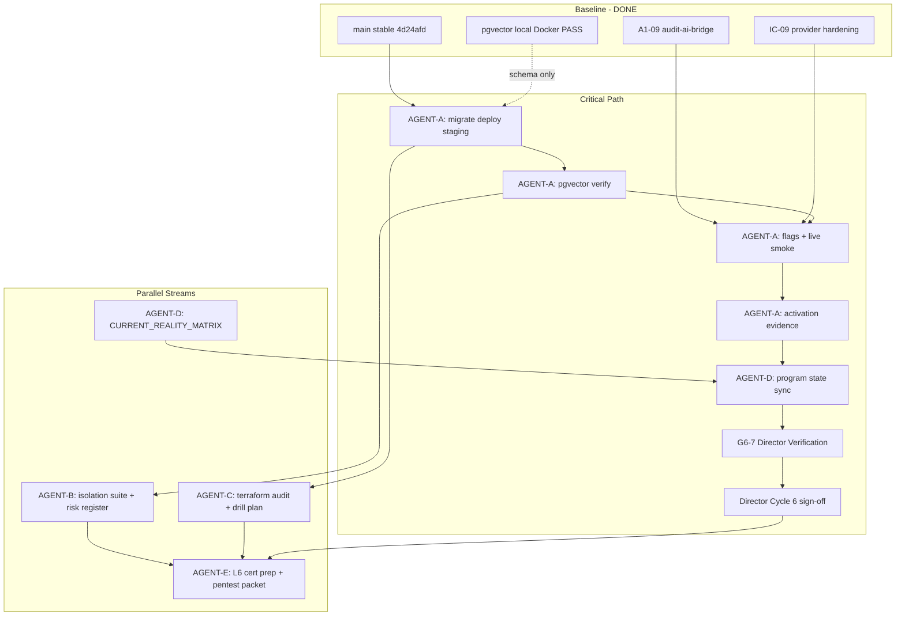

# AQLIYA Program Director — Cycle 6 Closure & Enterprise Readiness Plan

**Status:** Active plan (v1.1 — Program Director review incorporated)  
**Date:** 2026-06-06  
**Program review score:** 8.5/10 for Cycle 6 closure scope (program management, not product development)
**Branch policy:** `main` only — sequential commits, no feature branches  
**Mode:** Enterprise readiness — **no new product features**, **no architecture redesign**  
**Baseline (locked):** `main` @ `4d24afd` — tsc green, ~796 tests, build green, A1-09 bridge shipped

**Authority:** `docs/DOCUMENTATION_AUTHORITY.md` → `PRODUCT_STATUS_MATRIX.md` → `program-execution-state.md` → this plan

---

## Executive summary

Cycle 6 repo work is **complete** (A1-09 `audit-ai-bridge`). Cycle 6 **program closure** requires **operational proof** on staging plus **security/infra/docs/certification evidence**. Five parallel agents (A–E) run with minimal coupling; **AGENT-A is on the critical path** for commercial AI activation sign-off.

```text
Repo-stable ──► Staging proof (A) ──► Evidence bundle ──► G6-7 Director ──► Cycle 6 CLOSED
                                                              │
                                                              └──► Enterprise gates (B+C+E) ──► L6 certification
```

### Dual-track model (post-baseline)

Do not mix tracks. Cycle 6 lives entirely on **Track A**.

| Track | Owner | Purpose | Examples |
| ----- | ----- | ------- | -------- |
| **Track A — Enterprise Readiness** | Cursor / Program Director | Cycle 6 closure, staging proof, evidence, docs truth | This plan (AGENT-A–E) |
| **Track B — Product Completion** | OpenCode | Product L4→L5 depth, polish, Intelligence consumption | SalesOS, AuditOS polish, WorkflowOS L5, LocalContentOS L5, IC product wiring |

**Rule:** Track B work must **not** block or dilute Track A critical path.

---

## Global — Out of Scope (all agents)

Any agent that expands beyond this list must **STOP** and escalate to Program Director.

```text
Out of Scope (Cycle 6 / Track A)

- SalesOS work
- WorkflowOS upgrades (beyond evidence already on main)
- LocalContactOS upgrades (beyond evidence already on main)
- AuditOS feature work (tabs, sampling, new workflows)
- Bull / queue-runtime
- Terraform apply
- Production deployment
- Schema redesign
- RBAC / middleware redesign
- New platform features
- Architecture redesign
```

---

## 1. Critical Path

| Step | Owner | Activity | Exit criterion |
| ---- | ----- | -------- | -------------- |
| **CP-1** | AGENT-A | Staging DB up + `CREATE EXTENSION vector` + `prisma migrate deploy` | All migrations applied; no drift |
| **CP-2** | AGENT-A | `npm run db:pgvector-health` + `npm run db:verify-pgvector` on staging URL | Both exit 0; JSON shows `pgvector=true`, `tableExists=true` |
| **CP-3** | AGENT-A | Staging app env: `FF_AI_RAG=true`, `FF_AI_REAL_PROVIDERS=true` (staging only), API keys present | Health `/api/health` 200; flags documented |
| **CP-4** | AGENT-A | `npm run ic:smoke:cycle5:live` against staging base URL | Smoke log PASS; metrics captured |
| **CP-5** | AGENT-A | Governed AuditOS smoke: one engagement AI action (finding draft) with audit log | `auditos_ai_generation` in platform audit; human-review state visible |
| **CP-6** | AGENT-D | Update `program-execution-state.md` + activation log (draft only until G6-7) | Links to evidence bundle; status **pending Director** |
| **CP-7** | Director | **G6-7 Director Verification** (see §4) | All evidence artifacts present and reviewable |
| **CP-8** | Director | Cycle 6 sign-off report | Verdict **CLOSED** only after G6-7; else **BLOCKED** |

**Parallel off critical path (do not delay CP-1–CP-6):** AGENT-B (mock suite hardening), AGENT-C (terraform audit read-only), AGENT-E (pentest prep packet).

**Enterprise production (post–Cycle 6):** CP-8 pentest scheduled (AGENT-E), CP-9 terraform apply approved (AGENT-C), CP-10 backup restore drill PASS (AGENT-C).

---

## 2. Dependency Graph



| From | To | Relationship |
| ---- | -- | ------------ |
| AGENT-A CP-2 | AGENT-B DB integration tests | B needs staging `DATABASE_URL` (read-only tests) |
| AGENT-A CP-4 | `ai-intelligence-activation.md` | D fills smoke table from A logs |
| AGENT-B risk register | AGENT-E certification blockers | E cites TI-* items |
| AGENT-C drill evidence | AGENT-E L6 score | Infra dimension scored |
| AGENT-D | All agents | Docs must not claim live until A PASS |

---

## 3. Parallel Workstreams

### AGENT-A — Staging & AI Activation

**Mission:** Prove Intelligence Core + A1-09 path on **staging**, not localhost.

| Task ID | Task | Commands / artifacts |
| ------- | ---- | -------------------- |
| A-01 | Provision staging Postgres (pgvector image) | `docker compose -f docker-compose.staging.yml up -d db` or cloud RDS per runbook |
| A-02 | `CREATE EXTENSION IF NOT EXISTS vector` | SQL log snippet |
| A-03 | `npx prisma migrate deploy` | `prisma migrate status` screenshot/log |
| A-04 | `npm run db:pgvector-health` | stdout capture |
| A-05 | `npm run db:verify-pgvector` | stdout JSON |
| A-06 | Verify `FF_AI_RAG`, `FF_AI_REAL_PROVIDERS` on staging app only | env redacted screenshot / table |
| A-07 | `npm run ic:smoke:cycle5:live` | full JSON output |
| A-08 | Staging `/api/health` + optional `post-deploy-smoke.mjs` | curl logs |
| A-09 | One AuditOS governed AI action + platform audit row | audit log ID / query result |
| A-10 | Fill `docs/operations/ai-intelligence-activation.md` smoke table | dated PASS row |
| A-11 | Complete **Required Evidence** checklist (below) | no field blank or N/A without justification |

#### Required Evidence (AGENT-A — mandatory for G6-2 and G6-7)

PASS alone is insufficient. Each row must be populated in `LIVE_SMOKE_REPORT.md` (or linked artifact under `evidence/`).

| Field | Source / how to capture |
| ----- | ---------------------- |
| `smoke_execution_timestamp` | ISO-8601 UTC when `ic:smoke:cycle5:live` ran |
| `commit_sha` | `main` SHA under test (e.g. `4d24afd` or later) |
| `staging_base_url` | e.g. `https://staging.aqliya.ai` |
| `database_url_host` | host:port only — **no credentials in git** |
| `provider_used` | from smoke JSON / orchestrator result (`deterministic` \| `openai` \| `anthropic` \| fallback chain) |
| `tenant_id` | `platformOrganizationId` used for RAG / budget |
| `audit_organization_id` | AuditOS org linked to engagement |
| `engagement_id` | engagement used for governed AI action |
| `generated_audit_event_id` | AuditEvent or platform audit row ID for AI action |
| `platform_audit_log_id` | `auditos_ai_generation` row ID (if separate) |
| `audit_ai_bridge_record_ref` | reference to bridge invocation (action type + timestamp + actor) |
| `embedding_count` | DocumentChunk count for tenant (or `0` + reason) |
| `vector_search_result` | RAG retrieval summary: chunks returned, min similarity, query hash |
| `ic_smoke_metrics_json` | full `ic:smoke:cycle5:live` output attached |
| `pgvector_verify_json` | output of `db:verify-pgvector` |
| `flags_snapshot` | `FF_AI_RAG`, `FF_AI_REAL_PROVIDERS`, `FF_AI_BUDGET_QUOTAS` (redacted values) |
| `human_review_required` | must be `true` for AuditOS output |
| `screenshots_or_logs` | paths under `docs/validation/cycle-6/evidence/` |

**Deliverables:**

| File | Purpose |
| ---- | ------- |
| `docs/validation/cycle-6/STAGING_PGVECTOR_ACTIVATION_REPORT.md` | CP-1–CP-5 evidence |
| `docs/validation/cycle-6/LIVE_SMOKE_REPORT.md` | ic:smoke:cycle5:live + AuditOS action |
| `docs/validation/cycle-6/evidence/` | logs, redacted env tables (no secrets in git) |

**Ownership:** `docs/validation/cycle-6/**`, `docs/operations/ai-intelligence-activation.md` (table only). **Forbidden:** `src/**` product code, schema changes.

---

### AGENT-B — Security & Isolation

**Mission:** Close L0-07 **evidence gap** (guard tests exist; live DB leak tests weak).

| Task ID | Task | Notes |
| ------- | ---- | ----- |
| B-01 | Re-run `cross-tenant-isolation.test.ts` + `tenant-isolation-audit.test.ts` | Record count + commit hash |
| B-02 | Design DB integration isolation spec (read-only) | Two orgs, assert no cross-read on LocalContact, AuditEngagement, DocumentChunk |
| B-03 | Implement integration tests behind `describeIfDb` | `src/__tests__/integration/cross-tenant-db.integration.test.ts` — **only if staging/test DB available** |
| B-04 | ADMIN cross-tenant review | Map `RISK_ACCEPTANCE_REPORT.md` to current `server-action-guard` behavior |
| B-05 | Tenant boundary audit | Static scan: mutations without `organizationId` filter (grep + sample) |
| B-06 | Remediation proposals (docs only) | JIT elevation option; no code unless Director approves |

**Deliverables:**

| File | Purpose |
| ---- | ------- |
| `docs/validation/cycle-6/CROSS_TENANT_VALIDATION_REPORT.md` | extends phase-1c report with DB tier |
| `docs/validation/cycle-6/TENANT_ISOLATION_RISK_REGISTER.md` | TI-01..N with severity |
| `docs/validation/cycle-6/TENANT_REMEDIATION_PROPOSALS.md` | options, no scope creep |

**Ownership:** `src/__tests__/integration/**` (B only), `docs/validation/cycle-6/**`. **Forbidden:** RBAC redesign, middleware rewrites.

**Dependency:** B-03 blocked until AGENT-A provides staging/test `DATABASE_URL`.

---

### AGENT-C — Infrastructure Readiness

**Mission:** Prove deploy/restore/HA **readiness** — not production apply unless human approves.

| Task ID | Task | Notes |
| ------- | ---- | ----- |
| C-01 | Terraform static audit | `infra/terraform/**` — no `apply` |
| C-02 | Review `deploy.yml` / `promote.yml` / `backup.yml` vs runbooks | checklist from phase 1b |
| C-03 | Deployment readiness | `DEPLOYMENT_READINESS_REPORT.md` delta |
| C-04 | Backup restore drill (staging or local) | `npm run backup:verify` or documented manual drill |
| C-05 | HA/DR plan vs reality | `ha-dr-plan.md` — mark exercised vs theoretical |
| C-06 | Operational runbook gap list | backup, pgvector, promote rollback limitations |
| C-07 | **Rollback Readiness Assessment** | documented even if rollback **not executed** (see below) |

#### Rollback Readiness Assessment (AGENT-C — C-07)

Answer in `ROLLBACK_READINESS_ASSESSMENT.md` for enterprise buyers:

| Question | Required answer |
| -------- | ---------------- |
| How is previous image identified? | ECR tag / digest / commit SHA |
| Does `promote.yml` rollback restore prior image? | Honest: current limitation = `force-new-deployment` only unless task def pinned |
| Who approves rollback? | environment gate / human |
| RTO estimate for app rollback | minutes (assumption labeled) |
| Database rollback strategy | migrate forward-only vs restore from backup |
| Last known good verification | smoke command after rollback |
| Drill status | `executed` \| `simulated` \| `not_executed` + date |

**Deliverables:**

| File | Purpose |
| ---- | ------- |
| `docs/validation/cycle-6/INFRASTRUCTURE_READINESS_REPORT.md` | L0-01, L0-03, L0-13 status |
| `docs/validation/cycle-6/BACKUP_RESTORE_DRILL_EVIDENCE.md` | dated drill |
| `docs/validation/cycle-6/INFRA_GAP_LIST.md` | ranked gaps |
| `docs/validation/cycle-6/ROLLBACK_READINESS_ASSESSMENT.md` | C-07 buyer-facing rollback truth |

**Ownership:** `docs/validation/cycle-6/**`, `infra/terraform/**` (read-only audit comments in report only). **Forbidden:** `terraform apply`, production deploy.

---

### AGENT-D — Documentation Synchronization

**Mission:** Align doctrine with **proven** baseline (`4d24afd`).

| Task ID | Task | Target doc |
| ------- | ---- | ---------- |
| D-01 | Refresh maturity table | `docs/source-of-truth/CURRENT_REALITY_MATRIX.md` — RAG L5, cross-tenant L5, A1-09, AgentMemory |
| D-02 | Cycle 6 state transition | `docs/operations/program-execution-state.md` — A1-09 shipped; closure pending A |
| D-03 | Validate product claims | `docs/source-of-truth/PRODUCT_STATUS_MATRIX.md` — no L6 overclaim |
| D-04 | Route truth | `docs/source-of-truth/ROUTE_STRATEGY.md` |
| D-05 | Link validation bundle | `docs/validation/phase-1c/**` + cycle-6 reports index |
| D-06 | README / MASTER_REFERENCE delta | only if claims contradict matrix |

**Deliverables:** Single **documentation PR** (docs-only): `docs/validation/cycle-6/README.md` index + updated authority files.

**Ownership:** `docs/**` only. **Forbidden:** `src/**`, `prisma/**`.

**Can start:** **Day 0** (parallel with A, using “staging pending” qualifiers).

---

### AGENT-E — L6 Certification Preparation

**Mission:** Package evidence for **enterprise gate** — not achieve L6 in this cycle.

| Task ID | Task | Output |
| ------- | ---- | ------ |
| E-01 | Pentest prep scope doc | assets, URLs, auth model, data classification |
| E-02 | Evidence collector index | links to A/B/C/D deliverables |
| E-03 | Compliance checklist (SOC2-aligned lightweight) | control → evidence → gap |
| E-04 | L6 readiness scorecard | domain matrix + overall (template below) |
| E-05 | Certification blockers list | ranked; owner; target date |
| E-06 | Recommended next cycle | Track B priorities only — no execution in Track A |

#### L6 Scorecard structure (AGENT-E — mandatory template)

`L6_READINESS_SCORECARD.md` must include:

**Domain matrix (0–100 per domain, evidence link per cell):**

| Domain | Score (0–100) | Evidence link | Notes |
| ------ | ------------- | ------------- | ----- |
| Security | | TENANT_ISOLATION_RISK_REGISTER, pentest prep | |
| Infrastructure | | INFRASTRUCTURE_READINESS_REPORT | |
| Operations | | BACKUP_RESTORE_DRILL, activation reports | |
| AI Governance | | LIVE_SMOKE, bridge audit rows | |
| Tenant Isolation | | cross-tenant reports, DB tests | |
| Observability | | monitoring/ai, smoke metrics | |
| Disaster Recovery | | HA/DR plan, rollback assessment | |

**Summary block (required):**

```text
Overall Readiness:        <score>/100 — label: pilot-ready candidate | enterprise-prep | L6-certified>
Blocking Items:           <numbered list — Critical first>
Recommended Next Cycle:   <Track B items only; reference OpenCode plan>
Cycle 6 Status:           CLOSED | BLOCKED — tied to G6-7
```

**Deliverables:**

| File | Purpose |
| ---- | ------- |
| `docs/validation/cycle-6/L6_READINESS_SCORECARD.md` | |
| `docs/validation/cycle-6/CERTIFICATION_BLOCKERS.md` | |
| `docs/validation/cycle-6/PENTEST_PREP_PACKET.md` | vendor-ready |
| `docs/validation/cycle-6/COMPLIANCE_CHECKLIST.md` | |

**Dependency:** E-04 final scores **after** A (staging), B (security), C (infra) reports.

---

## 4. Acceptance Gates

### Gate G6-0 — Repository (PASSED)

| Criterion | Evidence |
| --------- | -------- |
| `npx tsc --noEmit` | Pass @ `4d24afd` |
| `npm test` | ≥796 pass |
| `npm run build` | Pass |
| A1-09 in repo | `src/lib/audit/audit-ai-bridge.ts` |

### Gate G6-1 — Staging pgvector (AGENT-A) — **BLOCKING Cycle 6**

| # | Criterion | Verifier |
| - | --------- | -------- |
| 1 | `prisma migrate deploy` on staging | log |
| 2 | `db:pgvector-health` → pass | stdout |
| 3 | `db:verify-pgvector` → pass | stdout |
| 4 | `DocumentChunk` + `vector` ext confirmed | verify JSON |

### Gate G6-2 — Live AI smoke (AGENT-A) — **BLOCKING Cycle 6**

| # | Criterion | Verifier |
| - | --------- | -------- |
| 1 | `ic:smoke:cycle5:live` exit 0 | JSON metrics |
| 2 | Staging flags documented | redacted env table |
| 3 | No autonomous approval in smoke path | manual review flag in logs |
| 4 | AuditOS one governed generation + audit row | platform audit query |

### Gate G6-3 — Security evidence (AGENT-B) — **BLOCKING enterprise, not Cycle 6**

| # | Criterion | Verifier |
| - | --------- | -------- |
| 1 | Guard suite ≥89 tests pass | CI log |
| 2 | Risk register published | TENANT_ISOLATION_RISK_REGISTER.md |
| 3 | DB integration tests pass **or** documented BLOCKED with reason | report |

### Gate G6-4 — Infrastructure evidence (AGENT-C) — **BLOCKING enterprise**

| # | Criterion | Verifier |
| - | --------- | -------- |
| 1 | Terraform audit complete | INFRASTRUCTURE_READINESS_REPORT.md |
| 2 | Backup restore drill PASS or scheduled | DRILL_EVIDENCE.md |
| 3 | Deploy workflow review PASS with known limitations | gap list |

### Gate G6-5 — Documentation truth (AGENT-D) — **BLOCKING Cycle 6 sign-off**

| # | Criterion | Verifier |
| - | --------- | -------- |
| 1 | CURRENT_REALITY_MATRIX matches code @ `4d24afd` | diff review |
| 2 | program-execution-state Cycle 6 = CLOSED only if G6-1+G6-2 pass | director |
| 3 | No product at L6 in PRODUCT_STATUS_MATRIX | matrix scan |

### Gate G6-6 — Certification package (AGENT-E) — **Advisory for Cycle 6**

| # | Criterion | Verifier |
| - | --------- | -------- |
| 1 | L6 scorecard published with **domain matrix** + summary block | L6_READINESS_SCORECARD.md |
| 2 | Pentest prep packet ready | PENTEST_PREP_PACKET.md |
| 3 | Top 5 blockers explicit | CERTIFICATION_BLOCKERS.md |
| 4 | `Recommended Next Cycle` references Track B only | scorecard |

### Gate G6-7 — Director Verification — **BLOCKING Cycle 6 CLOSED**

**Owner:** Program Director only. No agent may self-declare CLOSED.

| # | Criterion | Verifier |
| - | --------- | -------- |
| 1 | `STAGING_PGVECTOR_ACTIVATION_REPORT.md` exists | file + date |
| 2 | `LIVE_SMOKE_REPORT.md` exists with **all Required Evidence fields** populated | checklist § AGENT-A |
| 3 | `docs/validation/cycle-6/evidence/` contains logs (redacted) | directory listing |
| 4 | `ai-intelligence-activation.md` smoke table row filled | dated PASS |
| 5 | G6-1 and G6-2 independently verified (re-run or spot-check logs) | director notes |
| 6 | G6-5 documentation PR merged (M1) | commit on `main` |
| 7 | No **Out of Scope** work smuggled into Track A commits | `git diff` scan |
| 8 | `program-execution-state.md` updated **only after** rows 1–7 pass | M3 allowed |

**Output:** `docs/operations/parallel-execution-cycle-2026-06-06-cycle-6-close.md` with explicit **G6-7 PASS** section.

**Forbidden:** Announcing Cycle 6 CLOSED in chat, README, or matrix before G6-7 PASS.

---

## 5. Merge Order (main, sequential commits)

**Rule:** Evidence-first, docs-only merges; **no** parallel commits touching `src/` except AGENT-B integration tests (one commit).

| Order | Agent | Commit scope | Pre-merge check |
| ----- | ----- | ------------ | --------------- |
| **M1** | AGENT-D | Docs sync (qualified: staging pending) | `npx tsc` N/A (docs) |
| **M2** | AGENT-A | `docs/validation/cycle-6/*` activation + smoke reports | none |
| **M3** | AGENT-D | Docs qualified “staging pending” (G6-5 partial) | — |
| **M4** | AGENT-A | `docs/validation/cycle-6/*` activation + smoke + evidence | Required Evidence complete |
| **M5** | AGENT-B | security reports; optional integration tests | `npm test` if code |
| **M6** | AGENT-C | infra + **ROLLBACK_READINESS_ASSESSMENT** | — |
| **M7** | AGENT-E | L6 scorecard (domain matrix) + blockers + pentest prep | — |
| **M8** | Director | **G6-7 verification** + `cycle-6-close.md` | all gates |
| **M9** | AGENT-D | program-execution-state → Cycle 6 **CLOSED** | **only after M8 G6-7 PASS** |

**Do not merge:** product features, Bull/queue, schema changes, terraform apply.

---

## 6. Risks

| ID | Risk | Likelihood | Impact | Mitigation |
| -- | ---- | ---------- | ------ | ---------- |
| R1 | No staging `DATABASE_URL` / secrets in agent env | High | Blocks G6-1, G6-2 | Human provides secrets vault; AGENT-A runs locally with VPN only |
| R2 | `FF_AI_REAL_PROVIDERS` cost runaway on staging | Medium | High | Budget quotas on; low cap; deterministic fallback |
| R3 | Live smoke flaky (provider API) | Medium | Medium | Retry policy documented; fail → BLOCKED not fake PASS |
| R4 | Docs claim L6 before pentest | Medium | Critical | AGENT-D + E enforce “pilot-ready candidate” label |
| R5 | AGENT-B integration tests break CI | Low | Medium | `describeIfDb` skip without URL; separate job optional |
| R6 | promote.yml rollback limitation (force deploy only) | Known | High | Document in C gap list; no false rollback claim |
| R7 | CURRENT_REALITY_MATRIX queue/Bull overclaim | Known | Medium | D sets queue to “deferred / not in package.json” |
| R8 | Pentest delays enterprise sales | High | High | E prepares packet now; schedule vendor in parallel |

---

## 7. Completion Criteria

### Cycle 6 CLOSED (Program Director sign-off)

All must be true:

1. **G6-0** repository green (already true).
2. **G6-1** staging pgvector verified with archived logs.
3. **G6-2** live smoke PASS with **Required Evidence** checklist complete (not PASS-only).
4. **G6-5** documentation synchronized; no contradictory L6 claims.
5. **G6-7** Director Verification **PASS** (CP-7).
6. **M1–M4, M8–M9** merged on `main` per §5 order.
7. Director report: `parallel-execution-cycle-2026-06-06-cycle-6-close.md` status **DONE**.

**Does not require for Cycle 6 CLOSED:** G6-3, G6-4, G6-6 (enterprise / advisory).

### Enterprise production readiness (beyond Cycle 6)

| Dimension | Target | Owner |
| --------- | ------ | ----- |
| Staging AI operational | G6-1 + G6-2 | A |
| Tenant isolation evidence | G6-3 | B |
| Infra reproducibility + drills | G6-4 | C |
| External pentest | Scheduled + remediated | E |
| Terraform apply to staging/prod | Human-approved | C |
| L6 certification score | ≥85/100 with no Critical blocker open | E |

**Honest label until pentest + apply:** **Pilot-ready candidate (~62–68/100)** — not L6 production-certified.

---

## Timeline (suggested, parallel)

| Day | AGENT-A | AGENT-B | AGENT-C | AGENT-D | AGENT-E |
| --- | ------- | ------- | ------- | ------- | ------- |
| D0 | CP-1..2 start | B-01,04,05 | C-01,02,06 | D-01,02 draft | E-01 start |
| D1 | CP-3..5 | B-02,03 if DB ready | C-03,04 | D-03..05 | E-02 |
| D2 | A deliverables | B deliverables | C deliverables | M1+M3 docs PR | E-03..05 |
| D3 | — | M4 if tests | M5 | — | M6 + scorecard |

---

## Director checkpoints

| Checkpoint | Question |
| ---------- | -------- |
| CP-A | Does staging JSON prove pgvector + DocumentChunk? |
| CP-A2 | Is every **Required Evidence** field populated (not just exit 0)? |
| CP-B | Are ADMIN cross-tenant risks explicit and accepted? |
| CP-C | Is restore drill evidenced or honestly scheduled? |
| CP-C2 | Does **Rollback Readiness Assessment** answer buyer rollback questions honestly? |
| CP-D | Does any doc still say RAG L0 or “A1-09 pending”? |
| CP-E | Does L6 scorecard use **domain matrix** + Blocking Items + Recommended Next Cycle (Track B)? |
| CP-G67 | **G6-7:** evidence bundle complete before any CLOSED announcement? |
| CP-Track | Is Track B work excluded from Track A commits? |

---

## References

- `docs/operations/parallel-execution-cycle-6-plan.md`
- `docs/operations/pgvector-staging-validation-runbook.md`
- `docs/operations/ai-intelligence-activation.md`
- `docs/validation/phase-1c/`
- `docs/source-of-truth/READINESS_GATES.md`
- `docs/source-of-truth/L6_COMPLETION_PROGRAM.md`

---

**Plan status:** ACTIVE  
**Next human action:** Provide staging `DATABASE_URL` + deploy staging app for AGENT-A Day 0.
