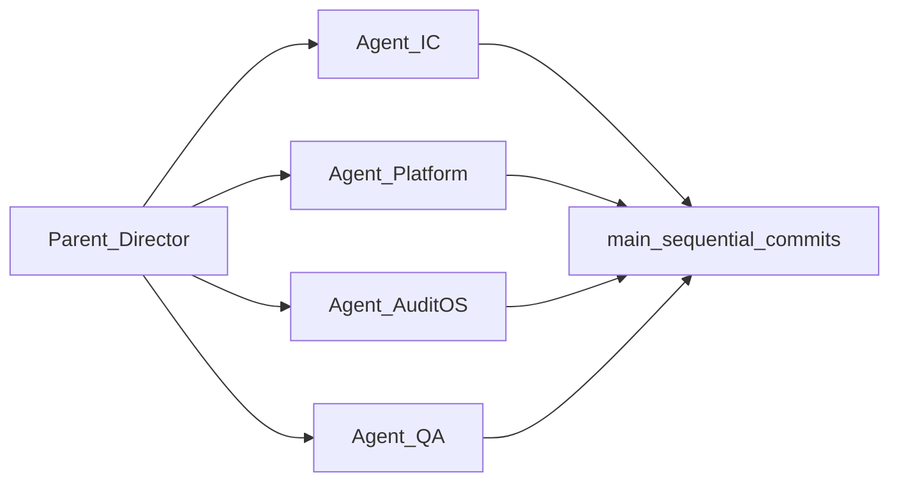

# AQLIYA Parallel Execution Director

**Status:** Active operational playbook  
**Purpose:** Run multi-agent work on AQLIYA without file conflicts or roadmap drift.  
**Skill:** `.skills/aqliya/aqliya-parallel-director.md`  
**Cursor rule:** `.cursor/rules/aqliya-parallel-director.mdc` (invoke with `@parallel-director`)

---

## 1. Overview

Cursor has no file-level mutex between subagents. This playbook uses:

1. A **Parent Director** that reads source-of-truth docs and assigns tasks.
2. **Four named agents** with exclusive directory ownership.
3. **Sequential writes on `main`** (parallel planning, serial implementation).

---

## 2. Authority and backlog

| Order | Document |
| ----- | -------- |
| 1 | `docs/source-of-truth/PRODUCT_STATUS_MATRIX.md` |
| 2 | `docs/source-of-truth/READINESS_GATES.md` |
| 3 | `docs/source-of-truth/EXECUTION_DEPENDENCY_GRAPH.md` |
| 4 | `docs/official/AQLIYA_MASTER_REFERENCE.md` |
| 5 | `docs/source-of-truth/ROUTE_STRATEGY.md` |
| 6+ | See skill for full list |

**Backlog:** `docs/execution-backlog/v1.2-execution-backlog.md`  
**Gaps:** `docs/source-of-truth/L6_COMPLETION_PROGRAM.md`  
**Program state:** `docs/operations/program-execution-state.md` (gates, transitions, IC L5 priority)  
**pgvector staging:** `docs/operations/pgvector-staging-runbook.md`  
**Cycle 6 (blocked):** `docs/operations/parallel-execution-cycle-6-plan.md`

On conflict: **PRODUCT_STATUS_MATRIX wins.**

---

## 3. Branch policy (Director mode)

- All work on **current `main`** — no feature, experimental, or architecture branches.
- Subagents must not create branches.
- Commits are ordered: Agent-IC → Agent-Platform → Agent-AuditOS → Agent-QA.
- Normal PR workflow is **outside** Director mode unless the human explicitly switches modes.

---

## 4. Agent names vs dependency streams

`EXECUTION_DEPENDENCY_GRAPH.md` uses **Streams A–F** (Security, IaC, AI, Product UX, etc.).  
**Do not** use those letters for Cursor agents.

| Cursor agent | Maps to streams (approx.) |
| ------------ | ------------------------- |
| **Agent-IC** | Stream C (AI readiness) |
| **Agent-Platform** | Stream A (security) + parts of B (ops) |
| **Agent-AuditOS** | Stream D/E for L1 only |
| **Agent-QA** | Tests + CI + validation scripts |

---

## 5. File ownership matrix (corrected paths)

### Agent-IC

| Allowed | Forbidden |
| ------- | --------- |
| `src/lib/ai/**` | Product UIs, `prisma/**` |
| `src/lib/governance/**` (AI metrics) | `src/middleware.ts` |
| `src/app/api/ai/**` | `src/app/audit/**` |

**Note:** There is no `src/lib/intelligence/` or `src/lib/observability/` directory. Intelligence lives under `src/lib/ai/`. Platform monitoring UI is **Agent-Platform** (`src/app/(dashboard)/monitoring/**`).

### Agent-Platform

| Allowed | Forbidden |
| ------- | --------- |
| `src/lib/auth/**`, `src/middleware.ts` | `src/lib/ai/**` (orchestration) |
| `src/lib/platform/**`, `src/lib/security/**` | `src/app/audit/**` |
| `src/app/api/health/**`, `src/app/api/metrics/**` | Marketing routes |
| `src/app/(dashboard)/monitoring/**` | New product features |

### Agent-AuditOS

| Allowed | Forbidden |
| ------- | --------- |
| `src/app/audit/**` | Auth system, AI core |
| `src/actions/audit-*.ts` (flat files, not `audit/` folder) | `prisma/**` in parallel cycles |
| `src/lib/audit/**`, `src/components/audit/**` | |

**Note:** Path `src/lib/auditos/**` does **not** exist. Use `src/lib/audit/**`.

### Agent-QA

| Allowed | Forbidden |
| ------- | --------- |
| `src/__tests__/**`, `**/__tests__/**`, `e2e/**` | Business logic changes |
| `scripts/**`, `.github/**` | `prisma/schema.prisma` unless Director assigns |
| `package.json` when CI requires | Feature creation |

### Director-only (sequential, not parallel)

- `prisma/schema.prisma`, migrations, seeds
- `docs/official/**`
- `docs/source-of-truth/**` updates after cycle review

### Shared file arbitration

| Path | Owner |
| ---- | ----- |
| `package.json` | Agent-QA or Director |
| `src/middleware.ts` | Agent-Platform |
| `.github/workflows/ci.yml` | Agent-QA wires steps; Agent-IC owns eval logic under `src/lib/ai` |
| `src/lib/governance/**` | Agent-IC default; Platform needs Director approval |

---

## 6. Product investment rules

**Priority:** L0 Platform → L0.5 Intelligence Core → L1 AuditOS.

**Frozen (no expansion; bugfix-only):**

- SalesOS, WorkflowOS, Organizations, Office AI expansion, future products.

**PRODUCT_STATUS_MATRIX** documents SalesOS at L4 — Director mode does not contradict that; it **stops new feature work** on frozen surfaces unless the backlog marks a bugfix.

---

## 7. Dependency gates (quick reference)

From `EXECUTION_DEPENDENCY_GRAPH.md`:

| Gate | Unlocks | Blocked by |
| ---- | ------- | ---------- |
| G0 | Foundation L6 work | L0-01 + L0-07 |
| G1 | IC-02, IC-09, IC-01 | IC-04 + IC-06 |
| G2 | IC-01 RAG | IC-02 in staging |
| G3 | Product AI (A1-09, etc.) | IC-01 operational |

Director must mark **blocked** and not start dependent tasks (e.g. IC-02 before G1).

---

## 8. Running a cycle

1. Activate: `@parallel-director` in Cursor.
2. Copy or fill `parallel-execution-cycle-template.md`.
3. Pick tasks from v1.2 backlog with satisfied dependencies.
4. Dispatch Task subagents **serially** for edits (see skill §8).
5. After each agent: `npx tsc --noEmit` minimum.
6. Agent-QA runs full validation only with human approval.
7. Director updates `PARALLEL_REMEDIATION_GATES.md` snapshot when gates are verified.

---

## 9. Cycle 1 reference tasks

| Step | Agent | Task ID | Typical paths |
| ---- | ----- | ------- | ------------- |
| 1 | Agent-IC | IC-04, IC-06 | `src/lib/ai/eval*`, `scripts/ic/ai-eval-runner.ts`, budget in `src/lib/ai/budget-manager.ts` |
| 2 | Agent-Platform | L0-07 | `src/__tests__/cross-tenant-isolation.test.ts`, tenant guards |
| 3 | Agent-AuditOS | A1-01 | Six engagement tabs: loading + error boundaries |
| 4 | Agent-QA | validation | CI, tests, gate snapshot |

**Excluded from cycle 1:** IC-02, IC-01, L0-01, schema migrations.

---

## 10. Related documents

- `docs/operations/PARALLEL_REMEDIATION_GATES.md` — gate validation snapshots
- `docs/execution-backlog/v1.2-execution-backlog.md` — task IDs
- `docs/archive/historical-strategy/aqliya-eid-expansion-program-plan.md` — older 8-agent model (archived pattern)

---

## 11. Cycle priority after green gate

| Priority | Gate |
| -------- | ---- |
| 1 | Repository Green (Cycle 2) — **complete 2026-06-04** |
| 2 | IC-02 / IC-01 (G1+) |
| 3 | L0-01 IaC |
| 4 | L0-07 / IC-04 hardening |
| 5 | Remaining AuditOS L6 |

See `parallel-execution-cycle-2026-06-04-cycle-2.md`.

---

## 12. Changelog

| Date | Change |
| ---- | ------ |
| 2026-06-04 | Initial Director playbook: 4 agents, main-only, corrected ownership paths |
| 2026-06-04 | Cycle 2 Repository Green Gate completed — tsc/lint/test/build pass |
