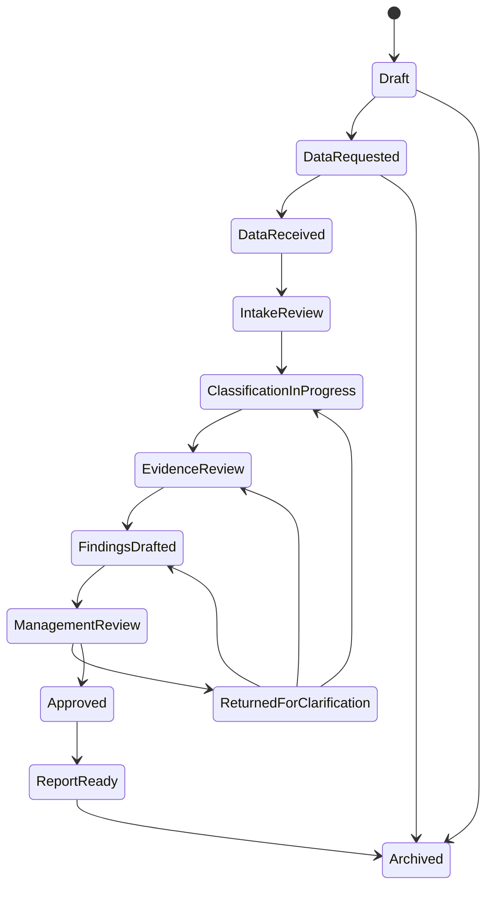

# LocalContentOS — Workflow State Machine

**Status:** Specification only — not implemented
**Version:** 1.0
**Reference:** Aligned with AQLIYA Workflow Engine (Draft → Prepared → Reviewed → Returned → Approved → Locked → Exported → Archived)

---

## State Diagram

---

## State Definitions

### Draft

| Field                   | Detail                                   |
| ----------------------- | ---------------------------------------- |
| **Entry Condition**     | Engagement created, reporting period set |
| **Allowed Transitions** | DataRequested, Archived                  |
| **Required Role**       | Engagement Owner, Admin                  |
| **Required Evidence**   | None                                     |
| **Audit Log Event**     | `ENGAGEMENT_DRAFTED`                     |
| **Blocking Conditions** | None                                     |

---

### Data Requested

| Field                   | Detail                                             |
| ----------------------- | -------------------------------------------------- |
| **Entry Condition**     | Templates sent to customer, data request initiated |
| **Allowed Transitions** | DataReceived, Archived                             |
| **Required Role**       | Engagement Owner                                   |
| **Required Evidence**   | Communication record of data request               |
| **Audit Log Event**     | `DATA_REQUESTED`                                   |
| **Blocking Conditions** | —                                                  |

---

### Data Received

| Field                   | Detail                                                       |
| ----------------------- | ------------------------------------------------------------ |
| **Entry Condition**     | Customer submits data files (vendor master, spend, evidence) |
| **Allowed Transitions** | IntakeReview, Archived                                       |
| **Required Role**       | Data Owner (confirms receipt), System (automated)            |
| **Required Evidence**   | File inventory log                                           |
| **Audit Log Event**     | `DATA_RECEIVED` — {file_count, total_size}                   |
| **Blocking Conditions** | If no files received after deadline, escalate                |

---

### Intake Review

| Field                   | Detail                                                   |
| ----------------------- | -------------------------------------------------------- |
| **Entry Condition**     | Data files received, completeness check started          |
| **Allowed Transitions** | ClassificationInProgress, Archived                       |
| **Required Role**       | Analyst                                                  |
| **Required Evidence**   | Completeness review log                                  |
| **Audit Log Event**     | `INTAKE_REVIEWED` — {completeness_score, issues_flagged} |
| **Blocking Conditions** | Completeness score < 70% — must return for clarification |

---

### Classification In Progress

| Field                   | Detail                                           |
| ----------------------- | ------------------------------------------------ |
| **Entry Condition**     | Data passes intake review, classification begins |
| **Allowed Transitions** | EvidenceReview, ReturnedForClarification         |
| **Required Role**       | Analyst                                          |
| **Required Evidence**   | Vendor master, spend data linked                 |
| **Audit Log Event**     | `CLASSIFICATION_STARTED`                         |
| **Blocking Conditions** | Missing vendor master — cannot proceed           |

---

### Evidence Review

| Field                   | Detail                                                                 |
| ----------------------- | ---------------------------------------------------------------------- |
| **Entry Condition**     | Classification proposed, evidence review needed                        |
| **Allowed Transitions** | FindingsDrafted, ReturnedForClarification                              |
| **Required Role**       | Analyst, Reviewer                                                      |
| **Required Evidence**   | Evidence records linked to classifications                             |
| **Audit Log Event**     | `EVIDENCE_REVIEWED` — {evidence_coverage_pct, confidence_distribution} |
| **Blocking Conditions** | Critical classification without any evidence — must be flagged         |

---

### Findings Drafted

| Field                   | Detail                                                            |
| ----------------------- | ----------------------------------------------------------------- |
| **Entry Condition**     | Evidence review complete, findings need documentation             |
| **Allowed Transitions** | ManagementReview, ReturnedForClarification                        |
| **Required Role**       | Analyst                                                           |
| **Required Evidence**   | Classification log, evidence review log, exception log            |
| **Audit Log Event**     | `FINDINGS_DRAFTED` — {critical_count, high_count, total_findings} |
| **Blocking Conditions** | All findings must have severity, description, and recommendation  |

---

### Management Review

| Field                   | Detail                                                        |
| ----------------------- | ------------------------------------------------------------- |
| **Entry Condition**     | Findings drafted, ready for management decision               |
| **Allowed Transitions** | Approved, ReturnedForClarification                            |
| **Required Role**       | Reviewer (prepares), Approver (reviews)                       |
| **Required Evidence**   | Full findings report, classification summary, evidence report |
| **Audit Log Event**     | `MANAGEMENT_REVIEW_STARTED` — {reviewer_id}                   |
| **Blocking Conditions** | Findings with Critical severity must be reviewed first        |

---

### Returned for Clarification

| Field                   | Detail                                                             |
| ----------------------- | ------------------------------------------------------------------ |
| **Entry Condition**     | Management or reviewer returns findings for additional work        |
| **Allowed Transitions** | ClassificationInProgress, EvidenceReview, FindingsDrafted          |
| **Required Role**       | Analyst (action), Reviewer/Approver (decision to return)           |
| **Required Evidence**   | Return reason, specific items requiring clarification              |
| **Audit Log Event**     | `RETURNED_FOR_CLARIFICATION` — {reason, returned_by, target_state} |
| **Blocking Conditions** | Return reason must be documented                                   |

---

### Approved

| Field                   | Detail                                              |
| ----------------------- | --------------------------------------------------- |
| **Entry Condition**     | Management approves the report                      |
| **Allowed Transitions** | ReportReady                                         |
| **Required Role**       | Approver                                            |
| **Required Evidence**   | Executive summary, key metrics, findings summary    |
| **Audit Log Event**     | `REPORT_APPROVED` — {approver_id, approval_date}    |
| **Blocking Conditions** | All critical findings must have management response |

---

### Report Ready

| Field                   | Detail                                           |
| ----------------------- | ------------------------------------------------ |
| **Entry Condition**     | Approved report, export package generated        |
| **Allowed Transitions** | Archived                                         |
| **Required Role**       | Any authorized user triggers export              |
| **Required Evidence**   | Approved report, export log                      |
| **Audit Log Event**     | `REPORT_EXPORTED` — {export_format, exported_by} |
| **Blocking Conditions** | Report must be in Approved state before export   |

---

### Archived

| Field                   | Detail                                                  |
| ----------------------- | ------------------------------------------------------- |
| **Entry Condition**     | Report exported and period closed                       |
| **Allowed Transitions** | None (terminal state)                                   |
| **Required Role**       | System (automated) or Admin                             |
| **Required Evidence**   | Complete audit trail of engagement                      |
| **Audit Log Event**     | `ENGAGEMENT_ARCHIVED` — {engagement_id, archive_reason} |
| **Blocking Conditions** | Cannot archive if report not exported                   |
